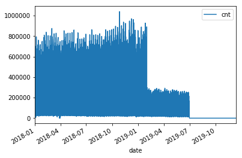

Data Discover and Transformation
================================

in this section of the lab, we’ll use Glue to discover new
transportation data. From there, we’ll use Athena to query and start
looking into the dataset to understand the data we are dealing with.

We’ve also setup a set of ETLs using Glue to create the fields into a
canonical form, since all the fields call names different things.

After understanding the data, and cleaning it a little, we’ll go into
another notebook to perform feature engineering and time series
modeling.

What are Databases and Tables in Glue:
~~~~~~~~~~~~~~~~~~~~~~~~~~~~~~~~~~~~~~

When you define a table in the AWS Glue Data Catalog, you add it to a
database. A database is used to organize tables in AWS Glue. You can
organize your tables using a crawler or using the AWS Glue console. A
table can be in only one database at a time.

Your database can contain tables that define data from many different
data stores.

A table in the AWS Glue Data Catalog is the metadata definition that
represents the data in a data store. You create tables when you run a
crawler, or you can create a table manually in the AWS Glue console. The
Tables list in the AWS Glue console displays values of your table’s
metadata. You use table definitions to specify sources and targets when
you create ETL (extract, transform, and load) jobs.

.. code:: ipython3

    import boto3
    
    database_name = '2019reinventWorkshop'
    
    ## lets first create a namespace for the tables:
    glue_client = boto3.client('glue')
    create_database_resp = glue_client.create_database(
        DatabaseInput={
            'Name': database_name,
            'Description': 'This database will contain the tables discovered through both crawling and the ETL processes'
        }
    )

This will create a new database, or namespace, that can hold the
collection of tables

https://console.aws.amazon.com/glue/home?region=us-east-1#catalog:tab=databases

.. figure:: images/createdatabaseresponse.png
   :alt: create db response

   create db response

You can use a crawler to populate the AWS Glue Data Catalog with tables.
This is the primary method used by most AWS Glue users. A crawler can
crawl multiple data stores in a single run. Upon completion, the crawler
creates or updates one or more tables in your Data Catalog. Extract,
transform, and load (ETL) jobs that you define in AWS Glue use these
Data Catalog tables as sources and targets. The ETL job reads from and
writes to the data stores that are specified in the source and target
Data Catalog tables.

.. code:: ipython3

    crawler_name = '2019reinventworkshopcrawler'
    create_crawler_resp = glue_client.create_crawler(
        Name=crawler_name,
        Role='GlueRole',
        DatabaseName=database_name,
        Description='Crawler to discover the base tables for the workshop',
        Targets={
            'S3Targets': [
                {
                    'Path': 's3://serverless-analytics/reinvent-2019/taxi_data/',
                },
            ]
        }
    )
    response = glue_client.start_crawler(
        Name=crawler_name
    )

After starting the crawler, you can go to the glue console if you’d like
to see it running.

https://console.aws.amazon.com/glue/home?region=us-east-1#catalog:tab=crawlers
|startcrawlerui|

After it finishes crawling, you can see the datasets (represeted as
“tables”) it automatically discovered. |crawler_discovered|

.. |startcrawlerui| image:: images/startcrawlerui.png
.. |crawler_discovered| image:: images/crawler_discovered.png

Waiting for the Crawler to finish
~~~~~~~~~~~~~~~~~~~~~~~~~~~~~~~~~

.. code:: ipython3

    import time
     
    response = glue_client.get_crawler(
        Name=crawler_name
    )
    while (response['Crawler']['State'] == 'RUNNING') | (response['Crawler']['State'] == 'STOPPING'):
        print(response['Crawler']['State'])
        # Wait for 40 seconds
        time.sleep(40)
        
        response = glue_client.get_crawler(
            Name=crawler_name
        )
    
    print('finished running', response['Crawler']['State'])

.. parsed-literal::

    RUNNING
    RUNNING
    STOPPING
    STOPPING
    finished running

Quering the data
----------------

We’ll use Athena to query the data. Athena allows us to perform SQL
queries against datasets on S3, without having to transform them, load
them into a traditional sql datastore, and allows rapid ad-hoc
investigation.

Later we’ll use Spark to do ETL and feature engineering.

.. code:: ipython3

    !pip install --upgrade pip > /dev/null
    !pip install PyAthena > /dev/null

Athena uses S3 to store results to allow different types of clients to
read it and so you can go back and see the results of previous queries.
We can set that up next:

.. code:: ipython3

    import sagemaker
    sagemaker_session = sagemaker.Session()
    athena_data_bucket = sagemaker_session.default_bucket()

Next we’ll create an Athena connection we can use, much like a standard
JDBC/ODBC connection

.. code:: ipython3

    from pyathena import connect
    import pandas as pd
    
    sagemaker_session = sagemaker.Session()
    
    conn = connect(s3_staging_dir="s3://" + athena_data_bucket,
                   region_name=sagemaker_session.boto_region_name)
    
    df = pd.read_sql('SELECT \'yellow\' type, count(*) ride_count FROM "' + database_name + '"."yellow" ' + 
                     'UNION ALL SELECT \'green\' type, count(*) ride_count FROM "' + database_name + '"."green"' +
                     'UNION ALL SELECT \'fhv\' type, count(*) ride_count FROM "' + database_name + '"."fhv"', conn)
    print(df)
    df.plot.bar(x='type', y='ride_count')

.. parsed-literal::

         type  ride_count
    0   green    12105351
    1  yellow   147263398
    2     fhv   292722358

.. parsed-literal::

    <matplotlib.axes._subplots.AxesSubplot at 0x7fbb8b72cd68>

.. image:: output_14_2.png

.. code:: ipython3

    green_etl = '2019reinvent_green'
    yellow_etl = '2019reinvent_yellow'
    fhv_etl = '2019reinvent_fhv'
    
    response = glue_client.start_job_run(
        JobName=green_etl,
        WorkerType='Standard', # other options include: 'G.1X'|'G.2X',
        NumberOfWorkers=5
    )
    print('response from starting green')
    print(response)
    
    response = glue_client.start_job_run(
        JobName=yellow_etl,
        WorkerType='Standard', # other options include: 'G.1X'|'G.2X',
        NumberOfWorkers=5
    )
    print('response from starting yellow')
    print(response)
    
    response = glue_client.start_job_run(
        JobName=fhv_etl,
        WorkerType='Standard', # other options include: 'G.1X'|'G.2X',
        NumberOfWorkers=5
    )
    print('response from starting fhv')
    print(response)

after kicking it off, you can see it running in the console too:

Let’s now wait until the jobs finish
------------------------------------

Now let’s look at the total counts for the aggregated information

.. code:: ipython3

    normalized_df = pd.read_sql('SELECT type, count(*) ride_count FROM "reinvent19"."canonical" group by type', conn)
    print(normalized_df)
    normalized_df.plot.bar(x='type', y='ride_count')
    #
    #     type  ride_count
    #0     fhv    31956302
    #1  yellow    44459136
    #2   green     3298036

.. parsed-literal::

         type  ride_count
    0   green     3298036
    1     fhv    31956302
    2  yellow    44459136

.. parsed-literal::

    <matplotlib.axes._subplots.AxesSubplot at 0x7f8df5522e80>

.. image:: output_19_2.png

.. code:: ipython3

    query = "select type, date_trunc('day', pickup_datetime) date, count(*) cnt from reinvent19.canonical where pickup_datetime < timestamp '2099-12-31' group by type, date_trunc('day', pickup_datetime) "
    typeperday_df = pd.read_sql(query, conn)
    typeperday_df.plot(x='date', y='cnt')

.. parsed-literal::

    <matplotlib.axes._subplots.AxesSubplot at 0x7f8dec5f9748>

.. image:: output_20_1.png

We see some bad data here…
--------------------------

We are expecting only 2018 and 2019 datasets here, but can see there are
records far into the future and in the past. This represents bad data
that we want to eliminate before we build our model.

.. code:: ipython3

    # Only reason we put this conditional here is so you can execute the cell multiple times
    # if you don't check, it won't find the 'date' column again and makes interacting w/ the notebook more seemless
    if type(typeperday_df.index) != pd.core.indexes.datetimes.DatetimeIndex:
        print('setting index to date')
        typeperday_df = typeperday_df.set_index('date', drop=True)
        
    typeperday_df.head()

.. raw:: html

    

    
    <table border="1" class="dataframe">
      <thead>
        <tr style="text-align: right;">
          <th></th>
          <th>type</th>
          <th>cnt</th>
        </tr>
        <tr>
          <th>date</th>
          <th></th>
          <th></th>
        </tr>
      </thead>
      <tbody>
        <tr>
          <th>2019-06-19</th>
          <td>yellow</td>
          <td>246680</td>
        </tr>
        <tr>
          <th>2018-05-01</th>
          <td>green</td>
          <td>25151</td>
        </tr>
        <tr>
          <th>2018-07-28</th>
          <td>green</td>
          <td>24194</td>
        </tr>
        <tr>
          <th>2019-03-09</th>
          <td>fhv</td>
          <td>38356</td>
        </tr>
        <tr>
          <th>2019-06-05</th>
          <td>fhv</td>
          <td>67823</td>
        </tr>
      </tbody>
    </table>
    

.. code:: ipython3

    typeperday_df.loc['2018-01-01':'2019-12-31'].plot(y='cnt')

.. parsed-literal::

    <matplotlib.axes._subplots.AxesSubplot at 0x7f8dec2c1198>

.. image:: output_23_1.png

Let’s look at some of the bad data now:

All the bad data, at least the bad data in the future, is coming from
the yellow taxi license type.

Note, we are querying the transformed data.
~~~~~~~~~~~~~~~~~~~~~~~~~~~~~~~~~~~~~~~~~~~

We should check the raw dataset to see if it’s also bad or something
happened in the ETL process

Let’s find the 2 2088 records to make sure they are in the source data

.. code:: ipython3

    pd.read_sql("select * from reinvent19.yellow where tpep_pickup_datetime like '2088%'", conn)

.. raw:: html

    

    
    <table border="1" class="dataframe">
      <thead>
        <tr style="text-align: right;">
          <th></th>
          <th>vendorid</th>
          <th>tpep_pickup_datetime</th>
          <th>tpep_dropoff_datetime</th>
          <th>passenger_count</th>
          <th>trip_distance</th>
          <th>ratecodeid</th>
          <th>store_and_fwd_flag</th>
          <th>pulocationid</th>
          <th>dolocationid</th>
          <th>payment_type</th>
          <th>fare_amount</th>
          <th>extra</th>
          <th>mta_tax</th>
          <th>tip_amount</th>
          <th>tolls_amount</th>
          <th>improvement_surcharge</th>
          <th>total_amount</th>
          <th>congestion_surcharge</th>
        </tr>
      </thead>
      <tbody>
        <tr>
          <th>0</th>
          <td>2</td>
          <td>2088-01-24 00:15:42</td>
          <td>2088-01-24 00:19:46</td>
          <td>1</td>
          <td>0.63</td>
          <td>1</td>
          <td>N</td>
          <td>41</td>
          <td>166</td>
          <td>2</td>
          <td>4.5</td>
          <td>0.0</td>
          <td>0.5</td>
          <td>0.0</td>
          <td>0.0</td>
          <td>0.3</td>
          <td>5.3</td>
          <td>None</td>
        </tr>
        <tr>
          <th>1</th>
          <td>2</td>
          <td>2088-01-24 00:25:39</td>
          <td>2088-01-24 07:28:25</td>
          <td>1</td>
          <td>4.05</td>
          <td>1</td>
          <td>N</td>
          <td>24</td>
          <td>162</td>
          <td>2</td>
          <td>14.5</td>
          <td>0.0</td>
          <td>0.5</td>
          <td>0.0</td>
          <td>0.0</td>
          <td>0.3</td>
          <td>15.3</td>
          <td>None</td>
        </tr>
      </tbody>
    </table>
    

.. code:: ipython3

    ## Next let's plot this per type:
    typeperday_df.loc['2018-01-01':'2019-07-30'].pivot_table(index='date', 
                                                             columns='type', 
                                                             values='cnt', 
                                                             aggfunc='sum').plot()

.. parsed-literal::

    <matplotlib.axes._subplots.AxesSubplot at 0x7f8dec40ae48>

Fixing our Time Series data
---------------------------

Some details of what caused this drop: #### On August 14, 2018, Mayor de
Blasio signed Local Law 149 of 2018, creating a new license category for
TLC-licensed FHV businesses that currently dispatch or plan to dispatch
more than 10,000 FHV trips in New York City per day under a single
brand, trade, or operating name, referred to as High-Volume For-Hire
Services (HVFHS). This law went into effect on Feb 1, 2019

Let’s bring the other license type and see how it affects the time
series charts:

.. code:: ipython3

    query = 'select \'fhvhv\' as type, date_trunc(\'day\', cast(pickup_datetime as timestamp)) date, count(*) cnt from "2019reinventworkshop"."fhvhv" group by date_trunc(\'day\',  cast(pickup_datetime as timestamp)) '
    typeperday_fhvhv_df = pd.read_sql(query, conn)
    typeperday_fhvhv_df = typeperday_fhvhv_df.set_index('date', drop=True)
    print(typeperday_fhvhv_df.head())
    typeperday_fhvhv_df.plot(y='cnt')

.. parsed-literal::

                 type     cnt
    date                     
    2019-05-05  fhvhv  854333
    2019-03-08  fhvhv  853746
    2019-03-22  fhvhv  846827
    2019-05-12  fhvhv  857727
    2019-06-25  fhvhv  651649

.. parsed-literal::

    <matplotlib.axes._subplots.AxesSubplot at 0x7f8debb63128>

.. image:: output_29_2.png

.. code:: ipython3

    pd.concat([typeperday_fhvhv_df, typeperday_df], sort=False).loc['2018-01-01':'2019-07-30'].pivot_table(index='date', 
                                                             columns='type', 
                                                             values='cnt', 
                                                             aggfunc='sum').plot()

.. parsed-literal::

    <matplotlib.axes._subplots.AxesSubplot at 0x7f8dec248eb8>

.. image:: output_30_1.png

That looks better – let’s start looking at performing EDA now.
~~~~~~~~~~~~~~~~~~~~~~~~~~~~~~~~~~~~~~~~~~~~~~~~~~~~~~~~~~~~~~

