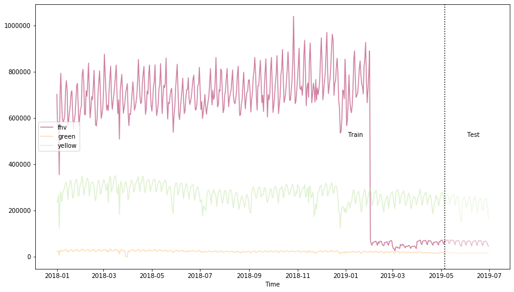
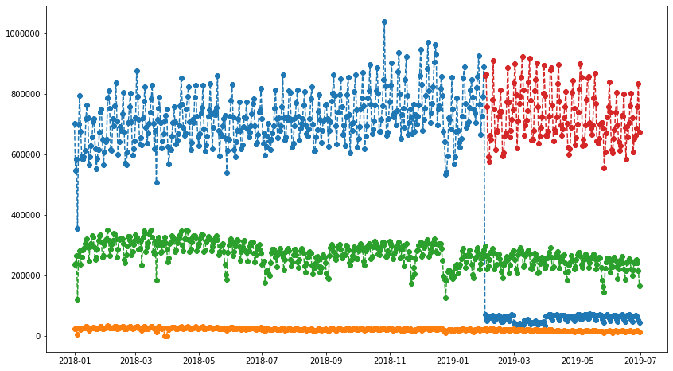
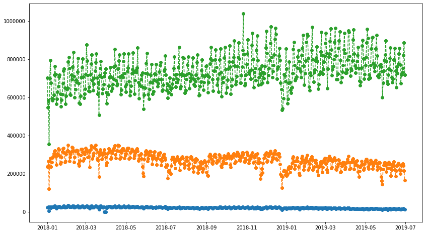
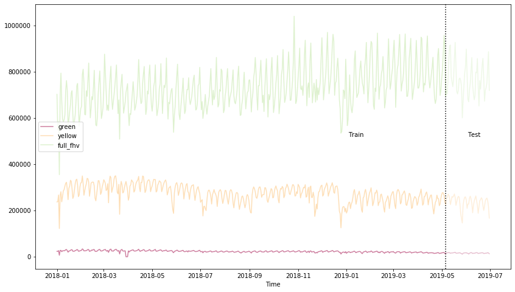

Feature Engineering and Training our Model
==========================================

We’ll first setup the glue context in which we can read the glue data
catalog, as well as setup some constants.

.. code:: python

    import sys
    from awsglue.transforms import *
    from awsglue.utils import getResolvedOptions
    from pyspark.context import SparkContext
    from awsglue.context import GlueContext
    from awsglue.job import Job

    glueContext = GlueContext(SparkContext.getOrCreate())

    database_name = '2019reinventWorkshop'
    canonical_table_name = "canonical"

.. parsed-literal::

    Starting Spark application

.. raw:: html

    <table>
    <tr><th>ID</th><th>YARN Application ID</th><th>Kind</th><th>State</th><th>Spark UI</th><th>Driver log</th><th>Current session?</th></tr><tr><td>0</td><td>application_1575125038238_0001</td><td>pyspark</td><td>idle</td><td><a target="_blank" href="http://ip-172-32-64-77.ec2.internal:20888/proxy/application_1575125038238_0001/">Link</a></td><td><a target="_blank" href="http://ip-172-32-84-1.ec2.internal:8042/node/containerlogs/container_1575125038238_0001_01_000001/livy">Link</a></td><td>✔</td></tr></table>

.. parsed-literal::

    FloatProgress(value=0.0, bar_style='info', description='Progress:', layout=Layout(height='25px', width='50%'),…

.. parsed-literal::

    SparkSession available as 'spark'.

.. parsed-literal::

    FloatProgress(value=0.0, bar_style='info', description='Progress:', layout=Layout(height='25px', width='50%'),…

Reading the Data using the Catalog
----------------------------------

Using the glue context, we can read in the data. This is done by using
the glue data catalog and looking up the data

Here we can see there are **500 million** records

.. code:: python

    taxi_data = glueContext.create_dynamic_frame.from_catalog(database=database_name, table_name=canonical_table_name)
    print("2018/2019 Taxi Data Count: ", taxi_data.count())
    taxi_data.printSchema()

.. parsed-literal::

    FloatProgress(value=0.0, bar_style='info', description='Progress:', layout=Layout(height='25px', width='50%'),…

.. parsed-literal::

    2018/2019 Taxi Data Count:  452091095
    root
    |-- vendorid: string
    |-- pickup_datetime: timestamp
    |-- dropoff_datetime: timestamp
    |-- pulocationid: long
    |-- dolocationid: long
    |-- type: string

Caching in Spark
~~~~~~~~~~~~~~~~

We’ll use the taxi dataframe a bit repeatitively, so we’ll cache it ehre
and show some sample records.

.. code:: python

    df = taxi_data.toDF().cache()
    df.show(10, False)

.. parsed-literal::

    FloatProgress(value=0.0, bar_style='info', description='Progress:', layout=Layout(height='25px', width='50%'),…

.. parsed-literal::

    +--------+-------------------+-------------------+------------+------------+-----+
    |vendorid|pickup_datetime    |dropoff_datetime   |pulocationid|dolocationid|type |
    +--------+-------------------+-------------------+------------+------------+-----+
    |null    |null               |null               |null        |null        |green|
    |null    |2018-01-01 00:18:50|2018-01-01 00:24:39|null        |null        |green|
    |null    |2018-01-01 00:30:26|2018-01-01 00:46:42|null        |null        |green|
    |null    |2018-01-01 00:07:25|2018-01-01 00:19:45|null        |null        |green|
    |null    |2018-01-01 00:32:40|2018-01-01 00:33:41|null        |null        |green|
    |null    |2018-01-01 00:32:40|2018-01-01 00:33:41|null        |null        |green|
    |null    |2018-01-01 00:38:35|2018-01-01 01:08:50|null        |null        |green|
    |null    |2018-01-01 00:18:41|2018-01-01 00:28:22|null        |null        |green|
    |null    |2018-01-01 00:38:02|2018-01-01 00:55:02|null        |null        |green|
    |null    |2018-01-01 00:05:02|2018-01-01 00:18:35|null        |null        |green|
    +--------+-------------------+-------------------+------------+------------+-----+
    only showing top 10 rows

Removing invalid dates
~~~~~~~~~~~~~~~~~~~~~~

When we originally looked at this data, we saw that it had a lot of bad
data in it, and timestamps that were outside the range that are valid.
Let’s ensure we are only using the valid records when aggregating and
creating our time series.

.. code:: python

    from pyspark.sql.functions import to_date, lit
    from pyspark.sql.types import TimestampType

    dates = ("2018-01-01",  "2019-07-01")
    date_from, date_to = [to_date(lit(s)).cast(TimestampType()) for s in dates]

    df  = df.where((df.pickup_datetime > date_from) & (df.pickup_datetime < date_to))

.. parsed-literal::

    FloatProgress(value=0.0, bar_style='info', description='Progress:', layout=Layout(height='25px', width='50%'),…

We need to restructure this so that each time is a single row, and the
time series values are in the series, followed by the numerical and
categorical features

Creating our time series (from individual records)
--------------------------------------------------

Right now they are individual records down to the second level, we’ll
create a record at the day level for each record and then
count/aggregate over those.

Let’s start by adding a ts_resampled column

.. code:: python

    from pyspark.sql.functions import col, max as max_, min as min_

    ## day = seconds*minutes*hours
    unit = 60 * 60 * 24
    epoch = (col("pickup_datetime").cast("bigint") / unit).cast("bigint") * unit

    with_epoch = df.withColumn("epoch", epoch)

    min_epoch, max_epoch = with_epoch.select(min_("epoch"), max_("epoch")).first()

    # Reference range
    ref = spark.range(
        min_epoch, max_epoch + 1, unit
    ).toDF("epoch")

    resampled_df = (ref
        .join(with_epoch, "epoch", "left")
        .orderBy("epoch")
        .withColumn("ts_resampled", col("epoch").cast("timestamp")))

    resampled_df.cache()

    resampled_df.show(10, False)

.. parsed-literal::

    FloatProgress(value=0.0, bar_style='info', description='Progress:', layout=Layout(height='25px', width='50%'),…

.. parsed-literal::

    +----------+--------+-------------------+-------------------+------------+------------+------+-------------------+
    |epoch     |vendorid|pickup_datetime    |dropoff_datetime   |pulocationid|dolocationid|type  |ts_resampled       |
    +----------+--------+-------------------+-------------------+------------+------------+------+-------------------+
    |1514764800|fhv     |2018-01-01 04:01:19|2018-01-01 04:06:54|null        |null        |fhv   |2018-01-01 00:00:00|
    |1514764800|null    |2018-01-01 10:55:25|2018-01-01 10:57:42|null        |null        |yellow|2018-01-01 00:00:00|
    |1514764800|fhv     |2018-01-01 03:43:11|2018-01-01 03:53:41|null        |null        |fhv   |2018-01-01 00:00:00|
    |1514764800|fhv     |2018-01-01 04:12:23|2018-01-01 04:36:15|null        |null        |fhv   |2018-01-01 00:00:00|
    |1514764800|fhv     |2018-01-01 05:27:22|2018-01-01 06:01:18|null        |null        |fhv   |2018-01-01 00:00:00|
    |1514764800|fhv     |2018-01-01 04:50:57|2018-01-01 04:56:17|null        |null        |fhv   |2018-01-01 00:00:00|
    |1514764800|fhv     |2018-01-01 04:23:56|2018-01-01 05:17:40|null        |null        |fhv   |2018-01-01 00:00:00|
    |1514764800|fhv     |2018-01-01 17:03:23|2018-01-01 17:33:46|null        |null        |fhv   |2018-01-01 00:00:00|
    |1514764800|fhv     |2018-01-01 17:48:59|2018-01-01 17:58:42|null        |null        |fhv   |2018-01-01 00:00:00|
    |1514764800|fhv     |2018-01-01 15:57:23|2018-01-01 16:09:00|null        |null        |fhv   |2018-01-01 00:00:00|
    +----------+--------+-------------------+-------------------+------------+------------+------+-------------------+
    only showing top 10 rows

Creating our time series data
~~~~~~~~~~~~~~~~~~~~~~~~~~~~~

You can see now that we are resampling per day the resample column, in
which we can now aggregate across.

.. code:: python

    from pyspark.sql import functions as func

    count_per_day_resamples = resampled_df.groupBy(["ts_resampled", "type"]).count()
    count_per_day_resamples.cache()
    count_per_day_resamples.show(10, False)

.. parsed-literal::

    FloatProgress(value=0.0, bar_style='info', description='Progress:', layout=Layout(height='25px', width='50%'),…

.. parsed-literal::

    +-------------------+------+------+
    |ts_resampled       |type  |count |
    +-------------------+------+------+
    |2019-04-10 00:00:00|green |17165 |
    |2018-02-21 00:00:00|green |25651 |
    |2018-11-11 00:00:00|yellow|257698|
    |2019-02-22 00:00:00|fhv   |65041 |
    |2018-03-15 00:00:00|yellow|348198|
    |2018-12-30 00:00:00|fhv   |683406|
    |2019-03-07 00:00:00|yellow|291098|
    |2018-11-28 00:00:00|green |22899 |
    |2018-03-05 00:00:00|yellow|290631|
    |2018-11-20 00:00:00|yellow|278900|
    +-------------------+------+------+
    only showing top 10 rows

We restructure it so that each taxi type is it’s own column in the dataset.
~~~~~~~~~~~~~~~~~~~~~~~~~~~~~~~~~~~~~~~~~~~~~~~~~~~~~~~~~~~~~~~~~~~~~~~~~~~

.. code:: python

    time_series_df = count_per_day_resamples.groupBy(["ts_resampled"])\
    .pivot('type')\
    .sum("count").cache()

    time_series_df.show(10,False)

.. parsed-literal::

    FloatProgress(value=0.0, bar_style='info', description='Progress:', layout=Layout(height='25px', width='50%'),…

.. parsed-literal::

    +-------------------+------+-----+------+
    |ts_resampled       |fhv   |green|yellow|
    +-------------------+------+-----+------+
    |2019-06-18 00:00:00|69383 |15545|242304|
    |2018-12-13 00:00:00|822745|24585|308411|
    |2019-03-21 00:00:00|47855 |20326|274057|
    |2018-09-09 00:00:00|794608|20365|256918|
    |2018-01-31 00:00:00|640887|26667|319256|
    |2018-08-16 00:00:00|717045|22113|277677|
    |2018-03-21 00:00:00|508492|11981|183629|
    |2018-09-20 00:00:00|723583|23378|298630|
    |2018-05-15 00:00:00|689620|25458|309023|
    |2018-12-24 00:00:00|640740|19314|185895|
    +-------------------+------+-----+------+
    only showing top 10 rows

Local Data Manipulation
-----------------------

Now that we an aggregated time series that is much smaller – let’s send
this back to the local python environment off the spark cluster on Glue.

.. code:: python

    %%spark -o time_series_df

.. parsed-literal::

    FloatProgress(value=0.0, bar_style='info', description='Progress:', layout=Layout(height='25px', width='50%'),…

.. parsed-literal::

    FloatProgress(value=0.0, bar_style='info', description='Progress:', layout=Layout(height='25px', width='50%'),…

We are in the local panda/python environment now
~~~~~~~~~~~~~~~~~~~~~~~~~~~~~~~~~~~~~~~~~~~~~~~~

.. code:: python

    %%local
    import pandas as pd
    print(time_series_df.dtypes)

    time_series_df = time_series_df.set_index('ts_resampled', drop=True)
    time_series_df = time_series_df.sort_index()

    time_series_df.head()

.. parsed-literal::

    ts_resampled    datetime64[ns]
    fhv                      int64
    green                    int64
    yellow                   int64
    dtype: object

.. parsed-literal::

    VBox(children=(HBox(children=(HTML(value='Type:'), Button(description='Table', layout=Layout(width='70px'), st…

.. parsed-literal::

    Output()

We’ll create the training window next, We are going to predict the next week
~~~~~~~~~~~~~~~~~~~~~~~~~~~~~~~~~~~~~~~~~~~~~~~~~~~~~~~~~~~~~~~~~~~~~~~~~~~~

.. code:: python

    %%local

    ## number of time-steps that the model is trained to predict
    prediction_length = 14

    n_weeks = 4
    end_training = time_series_df.index[-n_weeks*prediction_length]
    print('end training time', end_training)

    time_series = []
    for ts in time_series_df.columns:
        time_series.append(time_series_df[ts])

    time_series_training = []
    for ts in time_series_df.columns:
        time_series_training.append(time_series_df.loc[:end_training][ts])

.. parsed-literal::

    end training time 2019-05-06 00:00:00

We’ll install matplotlib in the local kernel to visualize this.
~~~~~~~~~~~~~~~~~~~~~~~~~~~~~~~~~~~~~~~~~~~~~~~~~~~~~~~~~~~~~~~

.. code:: python

    %%local
    !pip install matplotlib > /dev/null

Visualizing the training and test dataset:
~~~~~~~~~~~~~~~~~~~~~~~~~~~~~~~~~~~~~~~~~~

In this next cell, we can see how the training and test datasets are
split up. Since this is time series, we don’t do a random split,
instead, we look at how far in the future we are predicting and using
that a a knob.

.. code:: python

    %%local
    %matplotlib inline
    import matplotlib
    import matplotlib.pyplot as plt
    import numpy as np
    #cols_float = time_series_df.drop(['pulocationid', 'dolocationid'], axis=1).columns
    cols_float = time_series_df.columns
    cmap = matplotlib.cm.get_cmap('Spectral')
    colors = cmap(np.arange(0,len(cols_float))/len(cols_float))

    plt.figure(figsize=[14,8]);
    for c in range(len(cols_float)):
        plt.plot(time_series_df.loc[:end_training][cols_float[c]], alpha=0.5, color=colors[c], label=cols_float[c]);
    plt.legend(loc='center left');
    for c in range(len(cols_float)):
        plt.plot(time_series_df.loc[end_training:][cols_float[c]], alpha=0.25, color=colors[c], label=None);
    plt.axvline(x=end_training, color='k', linestyle=':');
    plt.text(time_series_df.index[int((time_series_df.shape[0]-n_weeks*prediction_length)*0.75)], time_series_df.max().max()/2, 'Train');
    plt.text(time_series_df.index[time_series_df.shape[0]-int(n_weeks*prediction_length/2)], time_series_df.max().max()/2, 'Test');
    plt.xlabel('Time');
    plt.show()

Cleaning our Time Series
------------------------

FHV still has the issue – the time series drops when the law is in
place.

we still need to pull in the FHV HV dataset starting in Feb. This
represents the rideshare apps going to a difference licence type under
the NYC TLC.

.. code:: python

    ## we are running back on spark now
    fhvhv_data = glueContext.create_dynamic_frame.from_catalog(database=database_name, table_name="fhvhv")
    fhvhv_df = fhvhv_data.toDF().cache()

.. parsed-literal::

    FloatProgress(value=0.0, bar_style='info', description='Progress:', layout=Layout(height='25px', width='50%'),…

Let’s filter the time range just in case we have additional bad records here.
~~~~~~~~~~~~~~~~~~~~~~~~~~~~~~~~~~~~~~~~~~~~~~~~~~~~~~~~~~~~~~~~~~~~~~~~~~~~~

.. code:: python

    fhvhv_df = fhvhv_df.where((fhvhv_df.pickup_datetime > date_from) & (fhvhv_df.pickup_datetime < date_to)).cache()

    from pyspark.sql.functions import to_timestamp
    fhvhv_df = fhvhv_df.withColumn("pickup_datetime", to_timestamp("pickup_datetime", "yyyy-MM-dd HH:mm:ss"))
    fhvhv_df.show(5, False)

.. parsed-literal::

    FloatProgress(value=0.0, bar_style='info', description='Progress:', layout=Layout(height='25px', width='50%'),…

.. parsed-literal::

    +-----------------+--------------------+-------------------+-------------------+------------+------------+-------+
    |hvfhs_license_num|dispatching_base_num|pickup_datetime    |dropoff_datetime   |pulocationid|dolocationid|sr_flag|
    +-----------------+--------------------+-------------------+-------------------+------------+------------+-------+
    |HV0003           |B02867              |2019-02-01 00:05:18|2019-02-01 00:14:57|245         |251         |null   |
    |HV0003           |B02879              |2019-02-01 00:41:29|2019-02-01 00:49:39|216         |197         |null   |
    |HV0005           |B02510              |2019-02-01 00:51:34|2019-02-01 01:28:29|261         |234         |null   |
    |HV0005           |B02510              |2019-02-01 00:03:51|2019-02-01 00:07:16|87          |87          |null   |
    |HV0005           |B02510              |2019-02-01 00:09:44|2019-02-01 00:39:56|87          |198         |null   |
    +-----------------+--------------------+-------------------+-------------------+------------+------------+-------+
    only showing top 5 rows

Let’s first create our rollup column for the time resampling
~~~~~~~~~~~~~~~~~~~~~~~~~~~~~~~~~~~~~~~~~~~~~~~~~~~~~~~~~~~~

.. code:: python

    from pyspark.sql.functions import col, max as max_, min as min_

    ## day = seconds*minutes*hours
    unit = 60 * 60 * 24

    epoch = (col("pickup_datetime").cast("bigint") / unit).cast("bigint") * unit

    with_epoch = fhvhv_df.withColumn("epoch", epoch)

    min_epoch, max_epoch = with_epoch.select(min_("epoch"), max_("epoch")).first()

    ref = spark.range(
        min_epoch, max_epoch + 1, unit
    ).toDF("epoch")

    resampled_fhvhv_df = (ref
        .join(with_epoch, "epoch", "left")
        .orderBy("epoch")
        .withColumn("ts_resampled", col("epoch").cast("timestamp")))

    resampled_fhvhv_df = resampled_fhvhv_df.cache()

    resampled_fhvhv_df.show(10, False)

.. parsed-literal::

    FloatProgress(value=0.0, bar_style='info', description='Progress:', layout=Layout(height='25px', width='50%'),…

.. parsed-literal::

    +----------+-----------------+--------------------+-------------------+-------------------+------------+------------+-------+-------------------+
    |epoch     |hvfhs_license_num|dispatching_base_num|pickup_datetime    |dropoff_datetime   |pulocationid|dolocationid|sr_flag|ts_resampled       |
    +----------+-----------------+--------------------+-------------------+-------------------+------------+------------+-------+-------------------+
    |1548979200|HV0003           |B02867              |2019-02-01 00:05:18|2019-02-01 00:14:57|245         |251         |null   |2019-02-01 00:00:00|
    |1548979200|HV0003           |B02879              |2019-02-01 00:41:29|2019-02-01 00:49:39|216         |197         |null   |2019-02-01 00:00:00|
    |1548979200|HV0005           |B02510              |2019-02-01 00:51:34|2019-02-01 01:28:29|261         |234         |null   |2019-02-01 00:00:00|
    |1548979200|HV0005           |B02510              |2019-02-01 00:03:51|2019-02-01 00:07:16|87          |87          |null   |2019-02-01 00:00:00|
    |1548979200|HV0005           |B02510              |2019-02-01 00:09:44|2019-02-01 00:39:56|87          |198         |null   |2019-02-01 00:00:00|
    |1548979200|HV0005           |B02510              |2019-02-01 00:59:55|2019-02-01 01:06:28|198         |198         |1      |2019-02-01 00:00:00|
    |1548979200|HV0005           |B02510              |2019-02-01 00:12:06|2019-02-01 00:42:13|161         |148         |null   |2019-02-01 00:00:00|
    |1548979200|HV0005           |B02510              |2019-02-01 00:45:35|2019-02-01 01:14:56|148         |21          |null   |2019-02-01 00:00:00|
    |1548979200|HV0003           |B02867              |2019-02-01 00:10:48|2019-02-01 00:20:23|226         |260         |null   |2019-02-01 00:00:00|
    |1548979200|HV0003           |B02867              |2019-02-01 00:32:32|2019-02-01 00:40:25|7           |223         |null   |2019-02-01 00:00:00|
    +----------+-----------------+--------------------+-------------------+-------------------+------------+------------+-------+-------------------+
    only showing top 10 rows

Create our Time Series now
~~~~~~~~~~~~~~~~~~~~~~~~~~

.. code:: python

    from pyspark.sql import functions as func
    count_per_day_resamples = resampled_fhvhv_df.groupBy(["ts_resampled"]).count()
    count_per_day_resamples.cache()
    count_per_day_resamples.show(10, False)
    fhvhv_timeseries_df = count_per_day_resamples

.. parsed-literal::

    FloatProgress(value=0.0, bar_style='info', description='Progress:', layout=Layout(height='25px', width='50%'),…

.. parsed-literal::

    +-------------------+------+
    |ts_resampled       |count |
    +-------------------+------+
    |2019-06-18 00:00:00|692171|
    |2019-03-21 00:00:00|809819|
    |2019-05-03 00:00:00|815626|
    |2019-05-12 00:00:00|857727|
    |2019-04-25 00:00:00|689853|
    |2019-03-10 00:00:00|812902|
    |2019-04-30 00:00:00|655312|
    |2019-06-26 00:00:00|663954|
    |2019-06-06 00:00:00|682378|
    |2019-02-06 00:00:00|663516|
    +-------------------+------+
    only showing top 10 rows

--------------

Now we bring this new time series back locally to join it w/ the
existing one.

.. code:: python

    %%spark -o fhvhv_timeseries_df

.. parsed-literal::

    FloatProgress(value=0.0, bar_style='info', description='Progress:', layout=Layout(height='25px', width='50%'),…

.. parsed-literal::

    FloatProgress(value=0.0, bar_style='info', description='Progress:', layout=Layout(height='25px', width='50%'),…

We rename the count column to be fhvhv so we can join it w/ the other dataframe
~~~~~~~~~~~~~~~~~~~~~~~~~~~~~~~~~~~~~~~~~~~~~~~~~~~~~~~~~~~~~~~~~~~~~~~~~~~~~~~

.. code:: python

    %%local
    fhvhv_timeseries_df = fhvhv_timeseries_df.rename(columns={"count": "fhvhv"})
    fhvhv_timeseries_df = fhvhv_timeseries_df.set_index('ts_resampled', drop=True)

Visualizing all the time series data
------------------------------------

When we look at the FHVHV dataset starting in Feb 1st, you can see the
time series looks normal and there isn’t a giant drop in the dataset on
that day.

.. code:: python

    %%local
    plt.figure(figsize=[14,8]);
    plt.plot(time_series_df.join(fhvhv_timeseries_df), marker='8', linestyle='--')

.. parsed-literal::

    [<matplotlib.lines.Line2D at 0x7f31f90e32e8>,
     <matplotlib.lines.Line2D at 0x7f31f90aa518>,
     <matplotlib.lines.Line2D at 0x7f31f90aa6d8>,
     <matplotlib.lines.Line2D at 0x7f31f90aa828>]

But now we need to combine the FHV and FHVHV dataset
----------------------------------------------------

Let’s create a new dataset and call it full_fhv meaning both
for-hire-vehicles and for-hire-vehicles high volume.

.. code:: python

    %%local
    full_timeseries = time_series_df.join(fhvhv_timeseries_df)
    full_timeseries = full_timeseries.fillna(0)
    full_timeseries['full_fhv'] = full_timeseries['fhv'] + full_timeseries['fhvhv']
    full_timeseries = full_timeseries.drop(['fhv', 'fhvhv'], axis=1)

    full_timeseries = full_timeseries.fillna(0)

Visualizing the joined dataset
~~~~~~~~~~~~~~~~~~~~~~~~~~~~~~

.. code:: python

    %%local
    plt.figure(figsize=[14,8]);
    plt.plot(full_timeseries, marker='8', linestyle='--')

.. parsed-literal::

    [<matplotlib.lines.Line2D at 0x7f31f9064080>,
     <matplotlib.lines.Line2D at 0x7f31f9027780>,
     <matplotlib.lines.Line2D at 0x7f31f9027860>]

Looking at the training/test split now
~~~~~~~~~~~~~~~~~~~~~~~~~~~~~~~~~~~~~~

.. code:: python

    %%local
    %matplotlib inline
    import matplotlib
    import matplotlib.pyplot as plt
    import numpy as np
    #cols_float = time_series_df.drop(['pulocationid', 'dolocationid'], axis=1).columns
    cols_float = full_timeseries.columns
    cmap = matplotlib.cm.get_cmap('Spectral')
    colors = cmap(np.arange(0,len(cols_float))/len(cols_float))

    plt.figure(figsize=[14,8]);
    for c in range(len(cols_float)):
        plt.plot(full_timeseries.loc[:end_training][cols_float[c]], alpha=0.5, color=colors[c], label=cols_float[c]);
    plt.legend(loc='center left');
    for c in range(len(cols_float)):
        plt.plot(full_timeseries.loc[end_training:][cols_float[c]], alpha=0.25, color=colors[c], label=None);
    plt.axvline(x=end_training, color='k', linestyle=':');
    plt.text(full_timeseries.index[int((full_timeseries.shape[0]-n_weeks*prediction_length)*0.75)], full_timeseries.max().max()/2, 'Train');
    plt.text(full_timeseries.index[full_timeseries.shape[0]-int(n_weeks*prediction_length/2)], full_timeseries.max().max()/2, 'Test');
    plt.xlabel('Time');
    plt.show()

.. code:: python

    %%local
    import json
    import boto3

    end_training = full_timeseries.index[-n_weeks*prediction_length]
    print('end training time', end_training)

    time_series = []
    for ts in full_timeseries.columns:
        time_series.append(full_timeseries[ts])

    time_series_training = []
    for ts in full_timeseries.columns:
        time_series_training.append(full_timeseries.loc[:end_training][ts])

    import sagemaker
    sagemaker_session = sagemaker.Session()
    bucket = sagemaker_session.default_bucket()

    key_prefix = '2019workshop-deepar/'

    s3_client = boto3.client('s3')
    def series_to_obj(ts, cat=None):
        obj = {"start": str(ts.index[0]), "target": list(ts)}
        if cat:
            obj["cat"] = cat
        return obj

    def series_to_jsonline(ts, cat=None):
        return json.dumps(series_to_obj(ts, cat))

    encoding = "utf-8"
    data = ''

    for ts in time_series_training:
        data = data + series_to_jsonline(ts)
        data = data + '\n'

    s3_client.put_object(Body=data.encode(encoding), Bucket=bucket, Key=key_prefix + 'data/train/train.json')

    data = ''
    for ts in time_series:
        data = data + series_to_jsonline(ts)
        data = data + '\n'

    s3_client.put_object(Body=data.encode(encoding), Bucket=bucket, Key=key_prefix + 'data/test/test.json')

.. parsed-literal::

    end training time 2019-05-06 00:00:00

.. parsed-literal::

    {'ResponseMetadata': {'RequestId': '080F10A207131EEC',
      'HostId': 'QunHqencw40NUjnNNHS/tFdSLN45HBmNRNPG2VNRqUxbZAZV3gg1Yc5caHB1IN+bl0VnnLNinaY=',
      'HTTPStatusCode': 200,
      'HTTPHeaders': {'x-amz-id-2': 'QunHqencw40NUjnNNHS/tFdSLN45HBmNRNPG2VNRqUxbZAZV3gg1Yc5caHB1IN+bl0VnnLNinaY=',
       'x-amz-request-id': '080F10A207131EEC',
       'date': 'Sat, 30 Nov 2019 16:26:35 GMT',
       'etag': '"3d0c723b9f128d637f003391b7546c16"',
       'content-length': '0',
       'server': 'AmazonS3'},
      'RetryAttempts': 0},
     'ETag': '"3d0c723b9f128d637f003391b7546c16"'}

Setting our data and output locations
~~~~~~~~~~~~~~~~~~~~~~~~~~~~~~~~~~~~~

.. code:: python

    %%local
    import boto3
    import s3fs
    import sagemaker
    from sagemaker import get_execution_role
    sagemaker_session = sagemaker.Session()
    role = get_execution_role()

    s3_data_path = "{}/{}data".format(bucket, key_prefix)
    s3_output_path = "{}/{}output".format(bucket, key_prefix)

Setting up the DeepAR Algorithm settings
~~~~~~~~~~~~~~~~~~~~~~~~~~~~~~~~~~~~~~~~

.. code:: python

    %%local

    region = sagemaker_session.boto_region_name
    image_name = sagemaker.amazon.amazon_estimator.get_image_uri(region, "forecasting-deepar", "latest")

    estimator = sagemaker.estimator.Estimator(
        sagemaker_session=sagemaker_session,
        image_name=image_name,
        role=role,
        train_instance_count=1,
        train_instance_type='ml.c4.2xlarge',
        base_job_name='DeepAR-forecast-taxidata',
        output_path="s3://" + s3_output_path
    )

    ## context_length = The number of time-points that the model gets to see before making the prediction.
    context_length = 14

    hyperparameters = {
        "time_freq": "D",
        "context_length": str(context_length),
        "prediction_length": str(prediction_length),
        "num_cells": "40",
        "num_layers": "3",
        "likelihood": "gaussian",
        "epochs": "100",
        "mini_batch_size": "32",
        "learning_rate": "0.001",
        "dropout_rate": "0.05",
        "early_stopping_patience": "10"
    }

    estimator.set_hyperparameters(**hyperparameters)

Kicking off the training
~~~~~~~~~~~~~~~~~~~~~~~~

.. code:: python

    %%local

    estimator.fit(inputs={
        "train": "s3://{}/train/".format(s3_data_path),
        "test": "s3://{}/test/".format(s3_data_path)
    })

.. parsed-literal::

    2019-11-30 16:26:45 Starting - Starting the training job...
    2019-11-30 16:27:13 Starting - Launching requested ML instances.........
    2019-11-30 16:28:18 Starting - Preparing the instances for training...
    2019-11-30 16:29:07 Downloading - Downloading input data...
    2019-11-30 16:29:41 Training - Training image download completed. Training in progress..Arguments: train
    [11/30/2019 16:29:43 INFO 140657760761664] Reading default configuration from /opt/amazon/lib/python.7/site-packages/algorithm/resources/default-input.json: {u'num_dynamic_feat': u'auto', u'dropout_rate': u'0.10', u'mini_batch_size': u'128', u'test_quantiles': u'[0.1, 0.2, 0.3, 0.4, 0.5, 0.6, 0.7, 0.8, 0.9]', u'_tuning_objective_metric': u'', u'_num_gpus': u'auto', u'num_eval_samples': u'100', u'learning_rate': u'0.001', u'num_cells': u'40', u'num_layers': u'2', u'embedding_dimension': u'10', u'_kvstore': u'auto', u'_num_kv_servers': u'auto', u'cardinality': u'auto', u'likelihood': u'student-t', u'early_stopping_patience': u''}
    [11/30/2019 16:29:43 INFO 140657760761664] Reading provided configuration from /opt/ml/input/config/hyperparameters.json: {u'dropout_rate': u'0.05', u'learning_rate': u'0.001', u'num_cells': u'40', u'prediction_length': u'14', u'epochs': u'100', u'time_freq': u'D', u'context_length': u'14', u'num_layers': u'3', u'mini_batch_size': u'32', u'likelihood': u'gaussian', u'early_stopping_patience': u'10'}
    [11/30/2019 16:29:43 INFO 140657760761664] Final configuration: {u'dropout_rate': u'0.05', u'test_quantiles': u'[0.1, 0.2, 0.3, 0.4, 0.5, 0.6, 0.7, 0.8, 0.9]', u'_tuning_objective_metric': u'', u'num_eval_samples': u'100', u'learning_rate': u'0.001', u'num_layers': u'3', u'epochs': u'100', u'embedding_dimension': u'10', u'num_cells': u'40', u'_num_kv_servers': u'auto', u'mini_batch_size': u'32', u'likelihood': u'gaussian', u'num_dynamic_feat': u'auto', u'cardinality': u'auto', u'_num_gpus': u'auto', u'prediction_length': u'14', u'time_freq': u'D', u'context_length': u'14', u'_kvstore': u'auto', u'early_stopping_patience': u'10'}
    Process 1 is a worker.
    [11/30/2019 16:29:43 INFO 140657760761664] Detected entry point for worker worker
    [11/30/2019 16:29:43 INFO 140657760761664] Using early stopping with patience 10
    [11/30/2019 16:29:43 INFO 140657760761664] [cardinality=auto] `cat` field was NOT found in the file `/opt/ml/input/data/train/train.json` and will NOT be used for training.
    [11/30/2019 16:29:43 INFO 140657760761664] [num_dynamic_feat=auto] `dynamic_feat` field was NOT found in the file `/opt/ml/input/data/train/train.json` and will NOT be used for training.
    [11/30/2019 16:29:43 INFO 140657760761664] Training set statistics:
    [11/30/2019 16:29:43 INFO 140657760761664] Integer time series
    [11/30/2019 16:29:43 INFO 140657760761664] number of time series: 3
    [11/30/2019 16:29:43 INFO 140657760761664] number of observations: 1473
    [11/30/2019 16:29:43 INFO 140657760761664] mean target length: 491
    [11/30/2019 16:29:43 INFO 140657760761664] min/mean/max target: 5.0/342890.394433/1039874.0
    [11/30/2019 16:29:43 INFO 140657760761664] mean abs(target): 342890.394433
    [11/30/2019 16:29:43 INFO 140657760761664] contains missing values: no
    [11/30/2019 16:29:43 INFO 140657760761664] Small number of time series. Doing 10 number of passes over dataset per epoch.
    [11/30/2019 16:29:43 INFO 140657760761664] Test set statistics:
    [11/30/2019 16:29:43 INFO 140657760761664] Integer time series
    [11/30/2019 16:29:43 INFO 140657760761664] number of time series: 3
    [11/30/2019 16:29:43 INFO 140657760761664] number of observations: 1638
    [11/30/2019 16:29:43 INFO 140657760761664] mean target length: 546
    [11/30/2019 16:29:43 INFO 140657760761664] min/mean/max target: 5.0/342546.620269/1039874.0
    [11/30/2019 16:29:43 INFO 140657760761664] mean abs(target): 342546.620269
    [11/30/2019 16:29:43 INFO 140657760761664] contains missing values: no
    [11/30/2019 16:29:43 INFO 140657760761664] nvidia-smi took: 0.0251910686493 secs to identify 0 gpus
    [11/30/2019 16:29:43 INFO 140657760761664] Number of GPUs being used: 0
    [11/30/2019 16:29:43 INFO 140657760761664] Create Store: local
    #metrics {"Metrics": {"get_graph.time": {"count": 1, "max": 72.59106636047363, "sum": 72.59106636047363, "min": 72.59106636047363}}, "EndTime": 1575131383.872348, "Dimensions": {"Host": "algo-1", "Operation": "training", "Algorithm": "AWS/DeepAR"}, "StartTime": 1575131383.79892}
    
    [11/30/2019 16:29:43 INFO 140657760761664] Number of GPUs being used: 0
    #metrics {"Metrics": {"initialize.time": {"count": 1, "max": 179.97288703918457, "sum": 179.97288703918457, "min": 179.97288703918457}}, "EndTime": 1575131383.979019, "Dimensions": {"Host": "algo-1", "Operation": "training", "Algorithm": "AWS/DeepAR"}, "StartTime": 1575131383.872428}
    
    [11/30/2019 16:29:44 INFO 140657760761664] Epoch[0] Batch[0] avg_epoch_loss=13.084117
    [11/30/2019 16:29:44 INFO 140657760761664] #quality_metric: host=algo-1, epoch=0, batch=0 train loss <loss>=13.0841169357
    [11/30/2019 16:29:44 INFO 140657760761664] Epoch[0] Batch[5] avg_epoch_loss=12.561649
    [11/30/2019 16:29:44 INFO 140657760761664] #quality_metric: host=algo-1, epoch=0, batch=5 train loss <loss>=12.5616491636
    [11/30/2019 16:29:44 INFO 140657760761664] Epoch[0] Batch [5]#011Speed: 1082.40 samples/sec#011loss=12.561649
    [11/30/2019 16:29:44 INFO 140657760761664] processed a total of 304 examples
    #metrics {"Metrics": {"epochs": {"count": 1, "max": 100, "sum": 100.0, "min": 100}, "update.time": {"count": 1, "max": 438.4138584136963, "sum": 438.4138584136963, "min": 438.4138584136963}}, "EndTime": 1575131384.417562, "Dimensions": {"Host": "algo-1", "Operation": "training", "Algorithm": "AWS/DeepAR"}, "StartTime": 1575131383.97908}
    
    [11/30/2019 16:29:44 INFO 140657760761664] #throughput_metric: host=algo-1, train throughput=693.261703397 records/second
    [11/30/2019 16:29:44 INFO 140657760761664] #progress_metric: host=algo-1, completed 1 % of epochs
    [11/30/2019 16:29:44 INFO 140657760761664] #quality_metric: host=algo-1, epoch=0, train loss <loss>=12.4054102898
    [11/30/2019 16:29:44 INFO 140657760761664] best epoch loss so far
    [11/30/2019 16:29:44 INFO 140657760761664] Saved checkpoint to "/opt/ml/model/state_69c66750-0a52-494a-838b-eff95388ff56-0000.params"
    #metrics {"Metrics": {"state.serialize.time": {"count": 1, "max": 14.506101608276367, "sum": 14.506101608276367, "min": 14.506101608276367}}, "EndTime": 1575131384.432697, "Dimensions": {"Host": "algo-1", "Operation": "training", "Algorithm": "AWS/DeepAR"}, "StartTime": 1575131384.417626}
    
    [11/30/2019 16:29:44 INFO 140657760761664] Epoch[1] Batch[0] avg_epoch_loss=11.543509
    [11/30/2019 16:29:44 INFO 140657760761664] #quality_metric: host=algo-1, epoch=1, batch=0 train loss <loss>=11.5435094833
    [11/30/2019 16:29:44 INFO 140657760761664] Epoch[1] Batch[5] avg_epoch_loss=11.853811
    [11/30/2019 16:29:44 INFO 140657760761664] #quality_metric: host=algo-1, epoch=1, batch=5 train loss <loss>=11.8538109461
    [11/30/2019 16:29:44 INFO 140657760761664] Epoch[1] Batch [5]#011Speed: 1200.96 samples/sec#011loss=11.853811
    [11/30/2019 16:29:44 INFO 140657760761664] processed a total of 303 examples
    #metrics {"Metrics": {"update.time": {"count": 1, "max": 313.37714195251465, "sum": 313.37714195251465, "min": 313.37714195251465}}, "EndTime": 1575131384.746183, "Dimensions": {"Host": "algo-1", "Operation": "training", "Algorithm": "AWS/DeepAR"}, "StartTime": 1575131384.432759}
    
    [11/30/2019 16:29:44 INFO 140657760761664] #throughput_metric: host=algo-1, train throughput=966.559590765 records/second
    [11/30/2019 16:29:44 INFO 140657760761664] #progress_metric: host=algo-1, completed 2 % of epochs
    [11/30/2019 16:29:44 INFO 140657760761664] #quality_metric: host=algo-1, epoch=1, train loss <loss>=11.612717247
    [11/30/2019 16:29:44 INFO 140657760761664] best epoch loss so far
    [11/30/2019 16:29:44 INFO 140657760761664] Saved checkpoint to "/opt/ml/model/state_180ffbc0-0b42-4349-aeb2-3dd997e411ee-0000.params"
    #metrics {"Metrics": {"state.serialize.time": {"count": 1, "max": 14.13583755493164, "sum": 14.13583755493164, "min": 14.13583755493164}}, "EndTime": 1575131384.760916, "Dimensions": {"Host": "algo-1", "Operation": "training", "Algorithm": "AWS/DeepAR"}, "StartTime": 1575131384.746256}
    
    [11/30/2019 16:29:44 INFO 140657760761664] Epoch[2] Batch[0] avg_epoch_loss=11.307412
    [11/30/2019 16:29:44 INFO 140657760761664] #quality_metric: host=algo-1, epoch=2, batch=0 train loss <loss>=11.3074121475
    [11/30/2019 16:29:44 INFO 140657760761664] Epoch[2] Batch[5] avg_epoch_loss=11.342184
    [11/30/2019 16:29:44 INFO 140657760761664] #quality_metric: host=algo-1, epoch=2, batch=5 train loss <loss>=11.3421843847
    [11/30/2019 16:29:44 INFO 140657760761664] Epoch[2] Batch [5]#011Speed: 1186.24 samples/sec#011loss=11.342184
    [11/30/2019 16:29:45 INFO 140657760761664] Epoch[2] Batch[10] avg_epoch_loss=11.268009
    [11/30/2019 16:29:45 INFO 140657760761664] #quality_metric: host=algo-1, epoch=2, batch=10 train loss <loss>=11.1789993286
    [11/30/2019 16:29:45 INFO 140657760761664] Epoch[2] Batch [10]#011Speed: 1131.09 samples/sec#011loss=11.178999
    [11/30/2019 16:29:45 INFO 140657760761664] processed a total of 328 examples
    #metrics {"Metrics": {"update.time": {"count": 1, "max": 351.1309623718262, "sum": 351.1309623718262, "min": 351.1309623718262}}, "EndTime": 1575131385.112164, "Dimensions": {"Host": "algo-1", "Operation": "training", "Algorithm": "AWS/DeepAR"}, "StartTime": 1575131384.760976}
    
    [11/30/2019 16:29:45 INFO 140657760761664] #throughput_metric: host=algo-1, train throughput=933.823852992 records/second
    [11/30/2019 16:29:45 INFO 140657760761664] #progress_metric: host=algo-1, completed 3 % of epochs
    [11/30/2019 16:29:45 INFO 140657760761664] #quality_metric: host=algo-1, epoch=2, train loss <loss>=11.2680093592
    [11/30/2019 16:29:45 INFO 140657760761664] best epoch loss so far
    [11/30/2019 16:29:45 INFO 140657760761664] Saved checkpoint to "/opt/ml/model/state_cb8228c2-d13f-4282-a8be-6c0110ee4205-0000.params"
    #metrics {"Metrics": {"state.serialize.time": {"count": 1, "max": 13.696908950805664, "sum": 13.696908950805664, "min": 13.696908950805664}}, "EndTime": 1575131385.126428, "Dimensions": {"Host": "algo-1", "Operation": "training", "Algorithm": "AWS/DeepAR"}, "StartTime": 1575131385.112241}
    
    [11/30/2019 16:29:45 INFO 140657760761664] Epoch[3] Batch[0] avg_epoch_loss=11.775387
    [11/30/2019 16:29:45 INFO 140657760761664] #quality_metric: host=algo-1, epoch=3, batch=0 train loss <loss>=11.7753868103
    [11/30/2019 16:29:45 INFO 140657760761664] Epoch[3] Batch[5] avg_epoch_loss=11.569252
    [11/30/2019 16:29:45 INFO 140657760761664] #quality_metric: host=algo-1, epoch=3, batch=5 train loss <loss>=11.5692516963
    [11/30/2019 16:29:45 INFO 140657760761664] Epoch[3] Batch [5]#011Speed: 1216.54 samples/sec#011loss=11.569252
    [11/30/2019 16:29:45 INFO 140657760761664] processed a total of 296 examples
    #metrics {"Metrics": {"update.time": {"count": 1, "max": 320.6939697265625, "sum": 320.6939697265625, "min": 320.6939697265625}}, "EndTime": 1575131385.447235, "Dimensions": {"Host": "algo-1", "Operation": "training", "Algorithm": "AWS/DeepAR"}, "StartTime": 1575131385.126488}
    
    [11/30/2019 16:29:45 INFO 140657760761664] #throughput_metric: host=algo-1, train throughput=922.675933702 records/second
    [11/30/2019 16:29:45 INFO 140657760761664] #progress_metric: host=algo-1, completed 4 % of epochs
    [11/30/2019 16:29:45 INFO 140657760761664] #quality_metric: host=algo-1, epoch=3, train loss <loss>=11.6022842407
    [11/30/2019 16:29:45 INFO 140657760761664] loss did not improve
    [11/30/2019 16:29:45 INFO 140657760761664] Epoch[4] Batch[0] avg_epoch_loss=11.529972
    [11/30/2019 16:29:45 INFO 140657760761664] #quality_metric: host=algo-1, epoch=4, batch=0 train loss <loss>=11.5299720764
    [11/30/2019 16:29:45 INFO 140657760761664] Epoch[4] Batch[5] avg_epoch_loss=11.531543
    [11/30/2019 16:29:45 INFO 140657760761664] #quality_metric: host=algo-1, epoch=4, batch=5 train loss <loss>=11.531542778
    [11/30/2019 16:29:45 INFO 140657760761664] Epoch[4] Batch [5]#011Speed: 1128.21 samples/sec#011loss=11.531543
    [11/30/2019 16:29:45 INFO 140657760761664] processed a total of 308 examples
    #metrics {"Metrics": {"update.time": {"count": 1, "max": 336.6720676422119, "sum": 336.6720676422119, "min": 336.6720676422119}}, "EndTime": 1575131385.784423, "Dimensions": {"Host": "algo-1", "Operation": "training", "Algorithm": "AWS/DeepAR"}, "StartTime": 1575131385.447313}
    
    [11/30/2019 16:29:45 INFO 140657760761664] #throughput_metric: host=algo-1, train throughput=914.529829482 records/second
    [11/30/2019 16:29:45 INFO 140657760761664] #progress_metric: host=algo-1, completed 5 % of epochs
    [11/30/2019 16:29:45 INFO 140657760761664] #quality_metric: host=algo-1, epoch=4, train loss <loss>=11.496231842
    [11/30/2019 16:29:45 INFO 140657760761664] loss did not improve
    [11/30/2019 16:29:45 INFO 140657760761664] Epoch[5] Batch[0] avg_epoch_loss=11.429693
    [11/30/2019 16:29:45 INFO 140657760761664] #quality_metric: host=algo-1, epoch=5, batch=0 train loss <loss>=11.429693222
    [11/30/2019 16:29:46 INFO 140657760761664] Epoch[5] Batch[5] avg_epoch_loss=11.502197
    [11/30/2019 16:29:46 INFO 140657760761664] #quality_metric: host=algo-1, epoch=5, batch=5 train loss <loss>=11.5021974246
    [11/30/2019 16:29:46 INFO 140657760761664] Epoch[5] Batch [5]#011Speed: 1210.92 samples/sec#011loss=11.502197
    [11/30/2019 16:29:46 INFO 140657760761664] Epoch[5] Batch[10] avg_epoch_loss=11.288384
    [11/30/2019 16:29:46 INFO 140657760761664] #quality_metric: host=algo-1, epoch=5, batch=10 train loss <loss>=11.0318073273
    [11/30/2019 16:29:46 INFO 140657760761664] Epoch[5] Batch [10]#011Speed: 1166.00 samples/sec#011loss=11.031807
    [11/30/2019 16:29:46 INFO 140657760761664] processed a total of 336 examples
    #metrics {"Metrics": {"update.time": {"count": 1, "max": 367.095947265625, "sum": 367.095947265625, "min": 367.095947265625}}, "EndTime": 1575131386.152045, "Dimensions": {"Host": "algo-1", "Operation": "training", "Algorithm": "AWS/DeepAR"}, "StartTime": 1575131385.7845}
    
    [11/30/2019 16:29:46 INFO 140657760761664] #throughput_metric: host=algo-1, train throughput=915.037687483 records/second
    [11/30/2019 16:29:46 INFO 140657760761664] #progress_metric: host=algo-1, completed 6 % of epochs
    [11/30/2019 16:29:46 INFO 140657760761664] #quality_metric: host=algo-1, epoch=5, train loss <loss>=11.288383744
    [11/30/2019 16:29:46 INFO 140657760761664] loss did not improve
    [11/30/2019 16:29:46 INFO 140657760761664] Epoch[6] Batch[0] avg_epoch_loss=11.120630
    [11/30/2019 16:29:46 INFO 140657760761664] #quality_metric: host=algo-1, epoch=6, batch=0 train loss <loss>=11.1206302643
    [11/30/2019 16:29:46 INFO 140657760761664] Epoch[6] Batch[5] avg_epoch_loss=11.133206
    [11/30/2019 16:29:46 INFO 140657760761664] #quality_metric: host=algo-1, epoch=6, batch=5 train loss <loss>=11.1332060496
    [11/30/2019 16:29:46 INFO 140657760761664] Epoch[6] Batch [5]#011Speed: 1149.90 samples/sec#011loss=11.133206
    [11/30/2019 16:29:46 INFO 140657760761664] processed a total of 305 examples
    #metrics {"Metrics": {"update.time": {"count": 1, "max": 314.59808349609375, "sum": 314.59808349609375, "min": 314.59808349609375}}, "EndTime": 1575131386.467154, "Dimensions": {"Host": "algo-1", "Operation": "training", "Algorithm": "AWS/DeepAR"}, "StartTime": 1575131386.15211}
    
    [11/30/2019 16:29:46 INFO 140657760761664] #throughput_metric: host=algo-1, train throughput=969.142829437 records/second
    [11/30/2019 16:29:46 INFO 140657760761664] #progress_metric: host=algo-1, completed 7 % of epochs
    [11/30/2019 16:29:46 INFO 140657760761664] #quality_metric: host=algo-1, epoch=6, train loss <loss>=11.1763834
    [11/30/2019 16:29:46 INFO 140657760761664] best epoch loss so far
    [11/30/2019 16:29:46 INFO 140657760761664] Saved checkpoint to "/opt/ml/model/state_bc44f47d-8f44-4ede-b4e3-9e726c1c9b8c-0000.params"
    #metrics {"Metrics": {"state.serialize.time": {"count": 1, "max": 14.055013656616211, "sum": 14.055013656616211, "min": 14.055013656616211}}, "EndTime": 1575131386.481823, "Dimensions": {"Host": "algo-1", "Operation": "training", "Algorithm": "AWS/DeepAR"}, "StartTime": 1575131386.46723}
    
    [11/30/2019 16:29:46 INFO 140657760761664] Epoch[7] Batch[0] avg_epoch_loss=11.204243
    [11/30/2019 16:29:46 INFO 140657760761664] #quality_metric: host=algo-1, epoch=7, batch=0 train loss <loss>=11.2042427063
    [11/30/2019 16:29:46 INFO 140657760761664] Epoch[7] Batch[5] avg_epoch_loss=11.445836
    [11/30/2019 16:29:46 INFO 140657760761664] #quality_metric: host=algo-1, epoch=7, batch=5 train loss <loss>=11.4458359083
    [11/30/2019 16:29:46 INFO 140657760761664] Epoch[7] Batch [5]#011Speed: 1099.40 samples/sec#011loss=11.445836
    [11/30/2019 16:29:46 INFO 140657760761664] processed a total of 316 examples
    #metrics {"Metrics": {"update.time": {"count": 1, "max": 322.6950168609619, "sum": 322.6950168609619, "min": 322.6950168609619}}, "EndTime": 1575131386.804633, "Dimensions": {"Host": "algo-1", "Operation": "training", "Algorithm": "AWS/DeepAR"}, "StartTime": 1575131386.481883}
    
    [11/30/2019 16:29:46 INFO 140657760761664] #throughput_metric: host=algo-1, train throughput=978.940348457 records/second
    [11/30/2019 16:29:46 INFO 140657760761664] #progress_metric: host=algo-1, completed 8 % of epochs
    [11/30/2019 16:29:46 INFO 140657760761664] #quality_metric: host=algo-1, epoch=7, train loss <loss>=11.4341204643
    [11/30/2019 16:29:46 INFO 140657760761664] loss did not improve
    [11/30/2019 16:29:46 INFO 140657760761664] Epoch[8] Batch[0] avg_epoch_loss=11.525706
    [11/30/2019 16:29:46 INFO 140657760761664] #quality_metric: host=algo-1, epoch=8, batch=0 train loss <loss>=11.5257062912
    [11/30/2019 16:29:47 INFO 140657760761664] Epoch[8] Batch[5] avg_epoch_loss=11.321895
    [11/30/2019 16:29:47 INFO 140657760761664] #quality_metric: host=algo-1, epoch=8, batch=5 train loss <loss>=11.3218946457
    [11/30/2019 16:29:47 INFO 140657760761664] Epoch[8] Batch [5]#011Speed: 1002.87 samples/sec#011loss=11.321895
    [11/30/2019 16:29:47 INFO 140657760761664] Epoch[8] Batch[10] avg_epoch_loss=10.957104
    [11/30/2019 16:29:47 INFO 140657760761664] #quality_metric: host=algo-1, epoch=8, batch=10 train loss <loss>=10.5193548203
    [11/30/2019 16:29:47 INFO 140657760761664] Epoch[8] Batch [10]#011Speed: 1042.35 samples/sec#011loss=10.519355
    [11/30/2019 16:29:47 INFO 140657760761664] processed a total of 326 examples
    #metrics {"Metrics": {"update.time": {"count": 1, "max": 383.8310241699219, "sum": 383.8310241699219, "min": 383.8310241699219}}, "EndTime": 1575131387.189002, "Dimensions": {"Host": "algo-1", "Operation": "training", "Algorithm": "AWS/DeepAR"}, "StartTime": 1575131386.8047}
    
    [11/30/2019 16:29:47 INFO 140657760761664] #throughput_metric: host=algo-1, train throughput=849.088935738 records/second
    [11/30/2019 16:29:47 INFO 140657760761664] #progress_metric: host=algo-1, completed 9 % of epochs
    [11/30/2019 16:29:47 INFO 140657760761664] #quality_metric: host=algo-1, epoch=8, train loss <loss>=10.9571038159
    [11/30/2019 16:29:47 INFO 140657760761664] best epoch loss so far
    [11/30/2019 16:29:47 INFO 140657760761664] Saved checkpoint to "/opt/ml/model/state_3517a004-cfca-454a-a835-341f5c4e6434-0000.params"
    #metrics {"Metrics": {"state.serialize.time": {"count": 1, "max": 21.010875701904297, "sum": 21.010875701904297, "min": 21.010875701904297}}, "EndTime": 1575131387.210623, "Dimensions": {"Host": "algo-1", "Operation": "training", "Algorithm": "AWS/DeepAR"}, "StartTime": 1575131387.189077}
    
    [11/30/2019 16:29:47 INFO 140657760761664] Epoch[9] Batch[0] avg_epoch_loss=11.336051
    [11/30/2019 16:29:47 INFO 140657760761664] #quality_metric: host=algo-1, epoch=9, batch=0 train loss <loss>=11.3360509872
    [11/30/2019 16:29:47 INFO 140657760761664] Epoch[9] Batch[5] avg_epoch_loss=11.312789
    [11/30/2019 16:29:47 INFO 140657760761664] #quality_metric: host=algo-1, epoch=9, batch=5 train loss <loss>=11.3127894402
    [11/30/2019 16:29:47 INFO 140657760761664] Epoch[9] Batch [5]#011Speed: 1033.45 samples/sec#011loss=11.312789
    [11/30/2019 16:29:47 INFO 140657760761664] Epoch[9] Batch[10] avg_epoch_loss=11.353988
    [11/30/2019 16:29:47 INFO 140657760761664] #quality_metric: host=algo-1, epoch=9, batch=10 train loss <loss>=11.403427124
    [11/30/2019 16:29:47 INFO 140657760761664] Epoch[9] Batch [10]#011Speed: 881.09 samples/sec#011loss=11.403427
    [11/30/2019 16:29:47 INFO 140657760761664] processed a total of 336 examples
    #metrics {"Metrics": {"update.time": {"count": 1, "max": 413.4540557861328, "sum": 413.4540557861328, "min": 413.4540557861328}}, "EndTime": 1575131387.624198, "Dimensions": {"Host": "algo-1", "Operation": "training", "Algorithm": "AWS/DeepAR"}, "StartTime": 1575131387.210689}
    
    [11/30/2019 16:29:47 INFO 140657760761664] #throughput_metric: host=algo-1, train throughput=812.447549835 records/second
    [11/30/2019 16:29:47 INFO 140657760761664] #progress_metric: host=algo-1, completed 10 % of epochs
    [11/30/2019 16:29:47 INFO 140657760761664] #quality_metric: host=algo-1, epoch=9, train loss <loss>=11.3539883874
    [11/30/2019 16:29:47 INFO 140657760761664] loss did not improve
    [11/30/2019 16:29:47 INFO 140657760761664] Epoch[10] Batch[0] avg_epoch_loss=10.794859
    [11/30/2019 16:29:47 INFO 140657760761664] #quality_metric: host=algo-1, epoch=10, batch=0 train loss <loss>=10.7948589325
    [11/30/2019 16:29:47 INFO 140657760761664] Epoch[10] Batch[5] avg_epoch_loss=11.195995
    [11/30/2019 16:29:47 INFO 140657760761664] #quality_metric: host=algo-1, epoch=10, batch=5 train loss <loss>=11.1959945361
    [11/30/2019 16:29:47 INFO 140657760761664] Epoch[10] Batch [5]#011Speed: 949.42 samples/sec#011loss=11.195995
    [11/30/2019 16:29:48 INFO 140657760761664] Epoch[10] Batch[10] avg_epoch_loss=11.216783
    [11/30/2019 16:29:48 INFO 140657760761664] #quality_metric: host=algo-1, epoch=10, batch=10 train loss <loss>=11.2417282104
    [11/30/2019 16:29:48 INFO 140657760761664] Epoch[10] Batch [10]#011Speed: 899.09 samples/sec#011loss=11.241728
    [11/30/2019 16:29:48 INFO 140657760761664] processed a total of 350 examples
    #metrics {"Metrics": {"update.time": {"count": 1, "max": 435.26315689086914, "sum": 435.26315689086914, "min": 435.26315689086914}}, "EndTime": 1575131388.060028, "Dimensions": {"Host": "algo-1", "Operation": "training", "Algorithm": "AWS/DeepAR"}, "StartTime": 1575131387.624271}
    
    [11/30/2019 16:29:48 INFO 140657760761664] #throughput_metric: host=algo-1, train throughput=803.899002688 records/second
    [11/30/2019 16:29:48 INFO 140657760761664] #progress_metric: host=algo-1, completed 11 % of epochs
    [11/30/2019 16:29:48 INFO 140657760761664] #quality_metric: host=algo-1, epoch=10, train loss <loss>=11.2167825699
    [11/30/2019 16:29:48 INFO 140657760761664] loss did not improve
    [11/30/2019 16:29:48 INFO 140657760761664] Epoch[11] Batch[0] avg_epoch_loss=11.323181
    [11/30/2019 16:29:48 INFO 140657760761664] #quality_metric: host=algo-1, epoch=11, batch=0 train loss <loss>=11.3231811523
    [11/30/2019 16:29:48 INFO 140657760761664] Epoch[11] Batch[5] avg_epoch_loss=11.015685
    [11/30/2019 16:29:48 INFO 140657760761664] #quality_metric: host=algo-1, epoch=11, batch=5 train loss <loss>=11.0156849225
    [11/30/2019 16:29:48 INFO 140657760761664] Epoch[11] Batch [5]#011Speed: 847.25 samples/sec#011loss=11.015685
    [11/30/2019 16:29:48 INFO 140657760761664] Epoch[11] Batch[10] avg_epoch_loss=11.156606
    [11/30/2019 16:29:48 INFO 140657760761664] #quality_metric: host=algo-1, epoch=11, batch=10 train loss <loss>=11.3257108688
    [11/30/2019 16:29:48 INFO 140657760761664] Epoch[11] Batch [10]#011Speed: 1025.19 samples/sec#011loss=11.325711
    [11/30/2019 16:29:48 INFO 140657760761664] processed a total of 333 examples
    #metrics {"Metrics": {"update.time": {"count": 1, "max": 455.63697814941406, "sum": 455.63697814941406, "min": 455.63697814941406}}, "EndTime": 1575131388.516234, "Dimensions": {"Host": "algo-1", "Operation": "training", "Algorithm": "AWS/DeepAR"}, "StartTime": 1575131388.060105}
    
    [11/30/2019 16:29:48 INFO 140657760761664] #throughput_metric: host=algo-1, train throughput=730.671786467 records/second
    [11/30/2019 16:29:48 INFO 140657760761664] #progress_metric: host=algo-1, completed 12 % of epochs
    [11/30/2019 16:29:48 INFO 140657760761664] #quality_metric: host=algo-1, epoch=11, train loss <loss>=11.1566058072
    [11/30/2019 16:29:48 INFO 140657760761664] loss did not improve
    [11/30/2019 16:29:48 INFO 140657760761664] Epoch[12] Batch[0] avg_epoch_loss=11.386516
    [11/30/2019 16:29:48 INFO 140657760761664] #quality_metric: host=algo-1, epoch=12, batch=0 train loss <loss>=11.3865156174
    [11/30/2019 16:29:48 INFO 140657760761664] Epoch[12] Batch[5] avg_epoch_loss=11.044365
    [11/30/2019 16:29:48 INFO 140657760761664] #quality_metric: host=algo-1, epoch=12, batch=5 train loss <loss>=11.044365406
    [11/30/2019 16:29:48 INFO 140657760761664] Epoch[12] Batch [5]#011Speed: 1024.15 samples/sec#011loss=11.044365
    [11/30/2019 16:29:48 INFO 140657760761664] Epoch[12] Batch[10] avg_epoch_loss=11.160591
    [11/30/2019 16:29:48 INFO 140657760761664] #quality_metric: host=algo-1, epoch=12, batch=10 train loss <loss>=11.3000627518
    [11/30/2019 16:29:48 INFO 140657760761664] Epoch[12] Batch [10]#011Speed: 1059.63 samples/sec#011loss=11.300063
    [11/30/2019 16:29:48 INFO 140657760761664] processed a total of 335 examples
    #metrics {"Metrics": {"update.time": {"count": 1, "max": 406.9790840148926, "sum": 406.9790840148926, "min": 406.9790840148926}}, "EndTime": 1575131388.923674, "Dimensions": {"Host": "algo-1", "Operation": "training", "Algorithm": "AWS/DeepAR"}, "StartTime": 1575131388.516307}
    
    [11/30/2019 16:29:48 INFO 140657760761664] #throughput_metric: host=algo-1, train throughput=822.915883581 records/second
    [11/30/2019 16:29:48 INFO 140657760761664] #progress_metric: host=algo-1, completed 13 % of epochs
    [11/30/2019 16:29:48 INFO 140657760761664] #quality_metric: host=algo-1, epoch=12, train loss <loss>=11.1605914723
    [11/30/2019 16:29:48 INFO 140657760761664] loss did not improve
    [11/30/2019 16:29:49 INFO 140657760761664] Epoch[13] Batch[0] avg_epoch_loss=11.314456
    [11/30/2019 16:29:49 INFO 140657760761664] #quality_metric: host=algo-1, epoch=13, batch=0 train loss <loss>=11.314455986
    [11/30/2019 16:29:49 INFO 140657760761664] Epoch[13] Batch[5] avg_epoch_loss=11.248668
    [11/30/2019 16:29:49 INFO 140657760761664] #quality_metric: host=algo-1, epoch=13, batch=5 train loss <loss>=11.2486680349
    [11/30/2019 16:29:49 INFO 140657760761664] Epoch[13] Batch [5]#011Speed: 1105.80 samples/sec#011loss=11.248668
    [11/30/2019 16:29:49 INFO 140657760761664] Epoch[13] Batch[10] avg_epoch_loss=11.205602
    [11/30/2019 16:29:49 INFO 140657760761664] #quality_metric: host=algo-1, epoch=13, batch=10 train loss <loss>=11.1539218903
    [11/30/2019 16:29:49 INFO 140657760761664] Epoch[13] Batch [10]#011Speed: 995.09 samples/sec#011loss=11.153922
    [11/30/2019 16:29:49 INFO 140657760761664] processed a total of 348 examples
    #metrics {"Metrics": {"update.time": {"count": 1, "max": 397.4108695983887, "sum": 397.4108695983887, "min": 397.4108695983887}}, "EndTime": 1575131389.321589, "Dimensions": {"Host": "algo-1", "Operation": "training", "Algorithm": "AWS/DeepAR"}, "StartTime": 1575131388.923749}
    
    [11/30/2019 16:29:49 INFO 140657760761664] #throughput_metric: host=algo-1, train throughput=875.46058706 records/second
    [11/30/2019 16:29:49 INFO 140657760761664] #progress_metric: host=algo-1, completed 14 % of epochs
    [11/30/2019 16:29:49 INFO 140657760761664] #quality_metric: host=algo-1, epoch=13, train loss <loss>=11.2056016055
    [11/30/2019 16:29:49 INFO 140657760761664] loss did not improve
    [11/30/2019 16:29:49 INFO 140657760761664] Epoch[14] Batch[0] avg_epoch_loss=10.776047
    [11/30/2019 16:29:49 INFO 140657760761664] #quality_metric: host=algo-1, epoch=14, batch=0 train loss <loss>=10.7760467529
    [11/30/2019 16:29:49 INFO 140657760761664] Epoch[14] Batch[5] avg_epoch_loss=10.890142
    [11/30/2019 16:29:49 INFO 140657760761664] #quality_metric: host=algo-1, epoch=14, batch=5 train loss <loss>=10.890141805
    [11/30/2019 16:29:49 INFO 140657760761664] Epoch[14] Batch [5]#011Speed: 1192.29 samples/sec#011loss=10.890142
    [11/30/2019 16:29:49 INFO 140657760761664] Epoch[14] Batch[10] avg_epoch_loss=10.867761
    [11/30/2019 16:29:49 INFO 140657760761664] #quality_metric: host=algo-1, epoch=14, batch=10 train loss <loss>=10.8409036636
    [11/30/2019 16:29:49 INFO 140657760761664] Epoch[14] Batch [10]#011Speed: 1086.88 samples/sec#011loss=10.840904
    [11/30/2019 16:29:49 INFO 140657760761664] processed a total of 328 examples
    #metrics {"Metrics": {"update.time": {"count": 1, "max": 359.12179946899414, "sum": 359.12179946899414, "min": 359.12179946899414}}, "EndTime": 1575131389.681233, "Dimensions": {"Host": "algo-1", "Operation": "training", "Algorithm": "AWS/DeepAR"}, "StartTime": 1575131389.321647}
    
    [11/30/2019 16:29:49 INFO 140657760761664] #throughput_metric: host=algo-1, train throughput=913.043344833 records/second
    [11/30/2019 16:29:49 INFO 140657760761664] #progress_metric: host=algo-1, completed 15 % of epochs
    [11/30/2019 16:29:49 INFO 140657760761664] #quality_metric: host=algo-1, epoch=14, train loss <loss>=10.8677608317
    [11/30/2019 16:29:49 INFO 140657760761664] best epoch loss so far
    [11/30/2019 16:29:49 INFO 140657760761664] Saved checkpoint to "/opt/ml/model/state_0fec42b3-c584-4660-9bba-d7bcd3a29e84-0000.params"
    #metrics {"Metrics": {"state.serialize.time": {"count": 1, "max": 17.184019088745117, "sum": 17.184019088745117, "min": 17.184019088745117}}, "EndTime": 1575131389.69897, "Dimensions": {"Host": "algo-1", "Operation": "training", "Algorithm": "AWS/DeepAR"}, "StartTime": 1575131389.681311}
    
    [11/30/2019 16:29:49 INFO 140657760761664] Epoch[15] Batch[0] avg_epoch_loss=10.758276
    [11/30/2019 16:29:49 INFO 140657760761664] #quality_metric: host=algo-1, epoch=15, batch=0 train loss <loss>=10.7582759857
    [11/30/2019 16:29:49 INFO 140657760761664] Epoch[15] Batch[5] avg_epoch_loss=11.068750
    [11/30/2019 16:29:49 INFO 140657760761664] #quality_metric: host=algo-1, epoch=15, batch=5 train loss <loss>=11.0687500636
    [11/30/2019 16:29:49 INFO 140657760761664] Epoch[15] Batch [5]#011Speed: 1117.68 samples/sec#011loss=11.068750
    [11/30/2019 16:29:50 INFO 140657760761664] processed a total of 300 examples
    #metrics {"Metrics": {"update.time": {"count": 1, "max": 329.8060894012451, "sum": 329.8060894012451, "min": 329.8060894012451}}, "EndTime": 1575131390.028907, "Dimensions": {"Host": "algo-1", "Operation": "training", "Algorithm": "AWS/DeepAR"}, "StartTime": 1575131389.699043}
    
    [11/30/2019 16:29:50 INFO 140657760761664] #throughput_metric: host=algo-1, train throughput=909.302658336 records/second
    [11/30/2019 16:29:50 INFO 140657760761664] #progress_metric: host=algo-1, completed 16 % of epochs
    [11/30/2019 16:29:50 INFO 140657760761664] #quality_metric: host=algo-1, epoch=15, train loss <loss>=10.9549746513
    [11/30/2019 16:29:50 INFO 140657760761664] loss did not improve
    [11/30/2019 16:29:50 INFO 140657760761664] Epoch[16] Batch[0] avg_epoch_loss=11.169759
    [11/30/2019 16:29:50 INFO 140657760761664] #quality_metric: host=algo-1, epoch=16, batch=0 train loss <loss>=11.1697587967
    [11/30/2019 16:29:50 INFO 140657760761664] Epoch[16] Batch[5] avg_epoch_loss=11.076884
    [11/30/2019 16:29:50 INFO 140657760761664] #quality_metric: host=algo-1, epoch=16, batch=5 train loss <loss>=11.0768841108
    [11/30/2019 16:29:50 INFO 140657760761664] Epoch[16] Batch [5]#011Speed: 1164.08 samples/sec#011loss=11.076884
    [11/30/2019 16:29:50 INFO 140657760761664] processed a total of 318 examples
    #metrics {"Metrics": {"update.time": {"count": 1, "max": 340.06404876708984, "sum": 340.06404876708984, "min": 340.06404876708984}}, "EndTime": 1575131390.369544, "Dimensions": {"Host": "algo-1", "Operation": "training", "Algorithm": "AWS/DeepAR"}, "StartTime": 1575131390.028989}
    
    [11/30/2019 16:29:50 INFO 140657760761664] #throughput_metric: host=algo-1, train throughput=934.826960924 records/second
    [11/30/2019 16:29:50 INFO 140657760761664] #progress_metric: host=algo-1, completed 17 % of epochs
    [11/30/2019 16:29:50 INFO 140657760761664] #quality_metric: host=algo-1, epoch=16, train loss <loss>=10.9921466827
    [11/30/2019 16:29:50 INFO 140657760761664] loss did not improve
    [11/30/2019 16:29:50 INFO 140657760761664] Epoch[17] Batch[0] avg_epoch_loss=11.118506
    [11/30/2019 16:29:50 INFO 140657760761664] #quality_metric: host=algo-1, epoch=17, batch=0 train loss <loss>=11.1185064316
    [11/30/2019 16:29:50 INFO 140657760761664] Epoch[17] Batch[5] avg_epoch_loss=10.985323
    [11/30/2019 16:29:50 INFO 140657760761664] #quality_metric: host=algo-1, epoch=17, batch=5 train loss <loss>=10.9853231112
    [11/30/2019 16:29:50 INFO 140657760761664] Epoch[17] Batch [5]#011Speed: 1146.54 samples/sec#011loss=10.985323
    [11/30/2019 16:29:50 INFO 140657760761664] processed a total of 309 examples
    #metrics {"Metrics": {"update.time": {"count": 1, "max": 323.4109878540039, "sum": 323.4109878540039, "min": 323.4109878540039}}, "EndTime": 1575131390.693494, "Dimensions": {"Host": "algo-1", "Operation": "training", "Algorithm": "AWS/DeepAR"}, "StartTime": 1575131390.369612}
    
    [11/30/2019 16:29:50 INFO 140657760761664] #throughput_metric: host=algo-1, train throughput=955.139269164 records/second
    [11/30/2019 16:29:50 INFO 140657760761664] #progress_metric: host=algo-1, completed 18 % of epochs
    [11/30/2019 16:29:50 INFO 140657760761664] #quality_metric: host=algo-1, epoch=17, train loss <loss>=11.0881063461
    [11/30/2019 16:29:50 INFO 140657760761664] loss did not improve
    [11/30/2019 16:29:50 INFO 140657760761664] Epoch[18] Batch[0] avg_epoch_loss=10.437140
    [11/30/2019 16:29:50 INFO 140657760761664] #quality_metric: host=algo-1, epoch=18, batch=0 train loss <loss>=10.4371395111
    [11/30/2019 16:29:50 INFO 140657760761664] Epoch[18] Batch[5] avg_epoch_loss=11.002823
    [11/30/2019 16:29:50 INFO 140657760761664] #quality_metric: host=algo-1, epoch=18, batch=5 train loss <loss>=11.0028233528
    [11/30/2019 16:29:50 INFO 140657760761664] Epoch[18] Batch [5]#011Speed: 1213.98 samples/sec#011loss=11.002823
    [11/30/2019 16:29:51 INFO 140657760761664] processed a total of 318 examples
    #metrics {"Metrics": {"update.time": {"count": 1, "max": 339.57600593566895, "sum": 339.57600593566895, "min": 339.57600593566895}}, "EndTime": 1575131391.03361, "Dimensions": {"Host": "algo-1", "Operation": "training", "Algorithm": "AWS/DeepAR"}, "StartTime": 1575131390.693562}
    
    [11/30/2019 16:29:51 INFO 140657760761664] #throughput_metric: host=algo-1, train throughput=936.147746678 records/second
    [11/30/2019 16:29:51 INFO 140657760761664] #progress_metric: host=algo-1, completed 19 % of epochs
    [11/30/2019 16:29:51 INFO 140657760761664] #quality_metric: host=algo-1, epoch=18, train loss <loss>=10.9492453575
    [11/30/2019 16:29:51 INFO 140657760761664] loss did not improve
    [11/30/2019 16:29:51 INFO 140657760761664] Epoch[19] Batch[0] avg_epoch_loss=11.144054
    [11/30/2019 16:29:51 INFO 140657760761664] #quality_metric: host=algo-1, epoch=19, batch=0 train loss <loss>=11.1440544128
    [11/30/2019 16:29:51 INFO 140657760761664] Epoch[19] Batch[5] avg_epoch_loss=11.232653
    [11/30/2019 16:29:51 INFO 140657760761664] #quality_metric: host=algo-1, epoch=19, batch=5 train loss <loss>=11.2326534589
    [11/30/2019 16:29:51 INFO 140657760761664] Epoch[19] Batch [5]#011Speed: 1090.45 samples/sec#011loss=11.232653
    [11/30/2019 16:29:51 INFO 140657760761664] Epoch[19] Batch[10] avg_epoch_loss=11.190658
    [11/30/2019 16:29:51 INFO 140657760761664] #quality_metric: host=algo-1, epoch=19, batch=10 train loss <loss>=11.1402643204
    [11/30/2019 16:29:51 INFO 140657760761664] Epoch[19] Batch [10]#011Speed: 1222.95 samples/sec#011loss=11.140264
    [11/30/2019 16:29:51 INFO 140657760761664] processed a total of 335 examples
    #metrics {"Metrics": {"update.time": {"count": 1, "max": 382.02691078186035, "sum": 382.02691078186035, "min": 382.02691078186035}}, "EndTime": 1575131391.416161, "Dimensions": {"Host": "algo-1", "Operation": "training", "Algorithm": "AWS/DeepAR"}, "StartTime": 1575131391.033688}
    
    [11/30/2019 16:29:51 INFO 140657760761664] #throughput_metric: host=algo-1, train throughput=876.649359433 records/second
    [11/30/2019 16:29:51 INFO 140657760761664] #progress_metric: host=algo-1, completed 20 % of epochs
    [11/30/2019 16:29:51 INFO 140657760761664] #quality_metric: host=algo-1, epoch=19, train loss <loss>=11.1906583959
    [11/30/2019 16:29:51 INFO 140657760761664] loss did not improve
    [11/30/2019 16:29:51 INFO 140657760761664] Epoch[20] Batch[0] avg_epoch_loss=10.614120
    [11/30/2019 16:29:51 INFO 140657760761664] #quality_metric: host=algo-1, epoch=20, batch=0 train loss <loss>=10.6141204834
    [11/30/2019 16:29:51 INFO 140657760761664] Epoch[20] Batch[5] avg_epoch_loss=10.965454
    [11/30/2019 16:29:51 INFO 140657760761664] #quality_metric: host=algo-1, epoch=20, batch=5 train loss <loss>=10.9654542605
    [11/30/2019 16:29:51 INFO 140657760761664] Epoch[20] Batch [5]#011Speed: 1217.96 samples/sec#011loss=10.965454
    [11/30/2019 16:29:51 INFO 140657760761664] Epoch[20] Batch[10] avg_epoch_loss=11.028810
    [11/30/2019 16:29:51 INFO 140657760761664] #quality_metric: host=algo-1, epoch=20, batch=10 train loss <loss>=11.1048358917
    [11/30/2019 16:29:51 INFO 140657760761664] Epoch[20] Batch [10]#011Speed: 973.56 samples/sec#011loss=11.104836
    [11/30/2019 16:29:51 INFO 140657760761664] processed a total of 333 examples
    #metrics {"Metrics": {"update.time": {"count": 1, "max": 387.83907890319824, "sum": 387.83907890319824, "min": 387.83907890319824}}, "EndTime": 1575131391.804478, "Dimensions": {"Host": "algo-1", "Operation": "training", "Algorithm": "AWS/DeepAR"}, "StartTime": 1575131391.416235}
    
    [11/30/2019 16:29:51 INFO 140657760761664] #throughput_metric: host=algo-1, train throughput=858.351303134 records/second
    [11/30/2019 16:29:51 INFO 140657760761664] #progress_metric: host=algo-1, completed 21 % of epochs
    [11/30/2019 16:29:51 INFO 140657760761664] #quality_metric: host=algo-1, epoch=20, train loss <loss>=11.0288095474
    [11/30/2019 16:29:51 INFO 140657760761664] loss did not improve
    [11/30/2019 16:29:51 INFO 140657760761664] Epoch[21] Batch[0] avg_epoch_loss=10.710171
    [11/30/2019 16:29:51 INFO 140657760761664] #quality_metric: host=algo-1, epoch=21, batch=0 train loss <loss>=10.7101707458
    [11/30/2019 16:29:52 INFO 140657760761664] Epoch[21] Batch[5] avg_epoch_loss=10.991527
    [11/30/2019 16:29:52 INFO 140657760761664] #quality_metric: host=algo-1, epoch=21, batch=5 train loss <loss>=10.9915272395
    [11/30/2019 16:29:52 INFO 140657760761664] Epoch[21] Batch [5]#011Speed: 1129.43 samples/sec#011loss=10.991527
    [11/30/2019 16:29:52 INFO 140657760761664] processed a total of 303 examples
    #metrics {"Metrics": {"update.time": {"count": 1, "max": 352.0510196685791, "sum": 352.0510196685791, "min": 352.0510196685791}}, "EndTime": 1575131392.15703, "Dimensions": {"Host": "algo-1", "Operation": "training", "Algorithm": "AWS/DeepAR"}, "StartTime": 1575131391.804556}
    
    [11/30/2019 16:29:52 INFO 140657760761664] #throughput_metric: host=algo-1, train throughput=860.387525515 records/second
    [11/30/2019 16:29:52 INFO 140657760761664] #progress_metric: host=algo-1, completed 22 % of epochs
    [11/30/2019 16:29:52 INFO 140657760761664] #quality_metric: host=algo-1, epoch=21, train loss <loss>=10.8595946312
    [11/30/2019 16:29:52 INFO 140657760761664] best epoch loss so far
    [11/30/2019 16:29:52 INFO 140657760761664] Saved checkpoint to "/opt/ml/model/state_afd195b9-b81b-481a-b83f-fc3da9cc67d7-0000.params"
    #metrics {"Metrics": {"state.serialize.time": {"count": 1, "max": 20.630836486816406, "sum": 20.630836486816406, "min": 20.630836486816406}}, "EndTime": 1575131392.178267, "Dimensions": {"Host": "algo-1", "Operation": "training", "Algorithm": "AWS/DeepAR"}, "StartTime": 1575131392.15711}
    
    [11/30/2019 16:29:52 INFO 140657760761664] Epoch[22] Batch[0] avg_epoch_loss=10.801229
    [11/30/2019 16:29:52 INFO 140657760761664] #quality_metric: host=algo-1, epoch=22, batch=0 train loss <loss>=10.8012285233
    [11/30/2019 16:29:52 INFO 140657760761664] Epoch[22] Batch[5] avg_epoch_loss=10.897065
    [11/30/2019 16:29:52 INFO 140657760761664] #quality_metric: host=algo-1, epoch=22, batch=5 train loss <loss>=10.8970645269
    [11/30/2019 16:29:52 INFO 140657760761664] Epoch[22] Batch [5]#011Speed: 1235.31 samples/sec#011loss=10.897065
    [11/30/2019 16:29:52 INFO 140657760761664] Epoch[22] Batch[10] avg_epoch_loss=10.918552
    [11/30/2019 16:29:52 INFO 140657760761664] #quality_metric: host=algo-1, epoch=22, batch=10 train loss <loss>=10.9443367004
    [11/30/2019 16:29:52 INFO 140657760761664] Epoch[22] Batch [10]#011Speed: 1233.26 samples/sec#011loss=10.944337
    [11/30/2019 16:29:52 INFO 140657760761664] processed a total of 336 examples
    #metrics {"Metrics": {"update.time": {"count": 1, "max": 355.93295097351074, "sum": 355.93295097351074, "min": 355.93295097351074}}, "EndTime": 1575131392.534308, "Dimensions": {"Host": "algo-1", "Operation": "training", "Algorithm": "AWS/DeepAR"}, "StartTime": 1575131392.178325}
    
    [11/30/2019 16:29:52 INFO 140657760761664] #throughput_metric: host=algo-1, train throughput=943.719874562 records/second
    [11/30/2019 16:29:52 INFO 140657760761664] #progress_metric: host=algo-1, completed 23 % of epochs
    [11/30/2019 16:29:52 INFO 140657760761664] #quality_metric: host=algo-1, epoch=22, train loss <loss>=10.9185518785
    [11/30/2019 16:29:52 INFO 140657760761664] loss did not improve
    [11/30/2019 16:29:52 INFO 140657760761664] Epoch[23] Batch[0] avg_epoch_loss=10.825591
    [11/30/2019 16:29:52 INFO 140657760761664] #quality_metric: host=algo-1, epoch=23, batch=0 train loss <loss>=10.8255910873
    [11/30/2019 16:29:52 INFO 140657760761664] Epoch[23] Batch[5] avg_epoch_loss=10.959688
    [11/30/2019 16:29:52 INFO 140657760761664] #quality_metric: host=algo-1, epoch=23, batch=5 train loss <loss>=10.9596881866
    [11/30/2019 16:29:52 INFO 140657760761664] Epoch[23] Batch [5]#011Speed: 1207.47 samples/sec#011loss=10.959688
    [11/30/2019 16:29:52 INFO 140657760761664] processed a total of 304 examples
    #metrics {"Metrics": {"update.time": {"count": 1, "max": 330.36303520202637, "sum": 330.36303520202637, "min": 330.36303520202637}}, "EndTime": 1575131392.865151, "Dimensions": {"Host": "algo-1", "Operation": "training", "Algorithm": "AWS/DeepAR"}, "StartTime": 1575131392.534381}
    
    [11/30/2019 16:29:52 INFO 140657760761664] #throughput_metric: host=algo-1, train throughput=919.812798202 records/second
    [11/30/2019 16:29:52 INFO 140657760761664] #progress_metric: host=algo-1, completed 24 % of epochs
    [11/30/2019 16:29:52 INFO 140657760761664] #quality_metric: host=algo-1, epoch=23, train loss <loss>=10.7987992287
    [11/30/2019 16:29:52 INFO 140657760761664] best epoch loss so far
    [11/30/2019 16:29:52 INFO 140657760761664] Saved checkpoint to "/opt/ml/model/state_4d952657-a43f-4806-b881-55f084041e01-0000.params"
    #metrics {"Metrics": {"state.serialize.time": {"count": 1, "max": 19.411087036132812, "sum": 19.411087036132812, "min": 19.411087036132812}}, "EndTime": 1575131392.885128, "Dimensions": {"Host": "algo-1", "Operation": "training", "Algorithm": "AWS/DeepAR"}, "StartTime": 1575131392.865255}
    
    [11/30/2019 16:29:52 INFO 140657760761664] Epoch[24] Batch[0] avg_epoch_loss=11.502991
    [11/30/2019 16:29:52 INFO 140657760761664] #quality_metric: host=algo-1, epoch=24, batch=0 train loss <loss>=11.5029907227
    [11/30/2019 16:29:53 INFO 140657760761664] Epoch[24] Batch[5] avg_epoch_loss=11.037862
    [11/30/2019 16:29:53 INFO 140657760761664] #quality_metric: host=algo-1, epoch=24, batch=5 train loss <loss>=11.0378623009
    [11/30/2019 16:29:53 INFO 140657760761664] Epoch[24] Batch [5]#011Speed: 1136.21 samples/sec#011loss=11.037862
    [11/30/2019 16:29:53 INFO 140657760761664] Epoch[24] Batch[10] avg_epoch_loss=11.062090
    [11/30/2019 16:29:53 INFO 140657760761664] #quality_metric: host=algo-1, epoch=24, batch=10 train loss <loss>=11.0911626816
    [11/30/2019 16:29:53 INFO 140657760761664] Epoch[24] Batch [10]#011Speed: 1111.99 samples/sec#011loss=11.091163
    [11/30/2019 16:29:53 INFO 140657760761664] processed a total of 341 examples
    #metrics {"Metrics": {"update.time": {"count": 1, "max": 378.1099319458008, "sum": 378.1099319458008, "min": 378.1099319458008}}, "EndTime": 1575131393.263366, "Dimensions": {"Host": "algo-1", "Operation": "training", "Algorithm": "AWS/DeepAR"}, "StartTime": 1575131392.885207}
    
    [11/30/2019 16:29:53 INFO 140657760761664] #throughput_metric: host=algo-1, train throughput=901.606249338 records/second
    [11/30/2019 16:29:53 INFO 140657760761664] #progress_metric: host=algo-1, completed 25 % of epochs
    [11/30/2019 16:29:53 INFO 140657760761664] #quality_metric: host=algo-1, epoch=24, train loss <loss>=11.0620897466
    [11/30/2019 16:29:53 INFO 140657760761664] loss did not improve
    [11/30/2019 16:29:53 INFO 140657760761664] Epoch[25] Batch[0] avg_epoch_loss=10.812670
    [11/30/2019 16:29:53 INFO 140657760761664] #quality_metric: host=algo-1, epoch=25, batch=0 train loss <loss>=10.812669754
    [11/30/2019 16:29:53 INFO 140657760761664] Epoch[25] Batch[5] avg_epoch_loss=10.899194
    [11/30/2019 16:29:53 INFO 140657760761664] #quality_metric: host=algo-1, epoch=25, batch=5 train loss <loss>=10.8991940816
    [11/30/2019 16:29:53 INFO 140657760761664] Epoch[25] Batch [5]#011Speed: 1145.95 samples/sec#011loss=10.899194
    [11/30/2019 16:29:53 INFO 140657760761664] processed a total of 312 examples
    #metrics {"Metrics": {"update.time": {"count": 1, "max": 329.3180465698242, "sum": 329.3180465698242, "min": 329.3180465698242}}, "EndTime": 1575131393.593195, "Dimensions": {"Host": "algo-1", "Operation": "training", "Algorithm": "AWS/DeepAR"}, "StartTime": 1575131393.263439}
    
    [11/30/2019 16:29:53 INFO 140657760761664] #throughput_metric: host=algo-1, train throughput=947.004459947 records/second
    [11/30/2019 16:29:53 INFO 140657760761664] #progress_metric: host=algo-1, completed 26 % of epochs
    [11/30/2019 16:29:53 INFO 140657760761664] #quality_metric: host=algo-1, epoch=25, train loss <loss>=10.7822431564
    [11/30/2019 16:29:53 INFO 140657760761664] best epoch loss so far
    [11/30/2019 16:29:53 INFO 140657760761664] Saved checkpoint to "/opt/ml/model/state_9b76b505-ec67-40b3-94df-bb134f1035d5-0000.params"
    #metrics {"Metrics": {"state.serialize.time": {"count": 1, "max": 19.988059997558594, "sum": 19.988059997558594, "min": 19.988059997558594}}, "EndTime": 1575131393.613767, "Dimensions": {"Host": "algo-1", "Operation": "training", "Algorithm": "AWS/DeepAR"}, "StartTime": 1575131393.593273}
    
    [11/30/2019 16:29:53 INFO 140657760761664] Epoch[26] Batch[0] avg_epoch_loss=10.912527
    [11/30/2019 16:29:53 INFO 140657760761664] #quality_metric: host=algo-1, epoch=26, batch=0 train loss <loss>=10.9125270844
    [11/30/2019 16:29:53 INFO 140657760761664] Epoch[26] Batch[5] avg_epoch_loss=10.956731
    [11/30/2019 16:29:53 INFO 140657760761664] #quality_metric: host=algo-1, epoch=26, batch=5 train loss <loss>=10.9567310015
    [11/30/2019 16:29:53 INFO 140657760761664] Epoch[26] Batch [5]#011Speed: 1206.31 samples/sec#011loss=10.956731
    [11/30/2019 16:29:53 INFO 140657760761664] Epoch[26] Batch[10] avg_epoch_loss=11.084283
    [11/30/2019 16:29:53 INFO 140657760761664] #quality_metric: host=algo-1, epoch=26, batch=10 train loss <loss>=11.2373447418
    [11/30/2019 16:29:53 INFO 140657760761664] Epoch[26] Batch [10]#011Speed: 1168.12 samples/sec#011loss=11.237345
    [11/30/2019 16:29:53 INFO 140657760761664] processed a total of 323 examples
    #metrics {"Metrics": {"update.time": {"count": 1, "max": 364.0120029449463, "sum": 364.0120029449463, "min": 364.0120029449463}}, "EndTime": 1575131393.977882, "Dimensions": {"Host": "algo-1", "Operation": "training", "Algorithm": "AWS/DeepAR"}, "StartTime": 1575131393.613821}
    
    [11/30/2019 16:29:53 INFO 140657760761664] #throughput_metric: host=algo-1, train throughput=887.077150741 records/second
    [11/30/2019 16:29:53 INFO 140657760761664] #progress_metric: host=algo-1, completed 27 % of epochs
    [11/30/2019 16:29:53 INFO 140657760761664] #quality_metric: host=algo-1, epoch=26, train loss <loss>=11.0842827017
    [11/30/2019 16:29:53 INFO 140657760761664] loss did not improve
    [11/30/2019 16:29:54 INFO 140657760761664] Epoch[27] Batch[0] avg_epoch_loss=11.405628
    [11/30/2019 16:29:54 INFO 140657760761664] #quality_metric: host=algo-1, epoch=27, batch=0 train loss <loss>=11.4056282043
    [11/30/2019 16:29:54 INFO 140657760761664] Epoch[27] Batch[5] avg_epoch_loss=11.410955
    [11/30/2019 16:29:54 INFO 140657760761664] #quality_metric: host=algo-1, epoch=27, batch=5 train loss <loss>=11.4109549522
    [11/30/2019 16:29:54 INFO 140657760761664] Epoch[27] Batch [5]#011Speed: 1171.53 samples/sec#011loss=11.410955
    [11/30/2019 16:29:54 INFO 140657760761664] processed a total of 318 examples
    #metrics {"Metrics": {"update.time": {"count": 1, "max": 337.0828628540039, "sum": 337.0828628540039, "min": 337.0828628540039}}, "EndTime": 1575131394.315439, "Dimensions": {"Host": "algo-1", "Operation": "training", "Algorithm": "AWS/DeepAR"}, "StartTime": 1575131393.977955}
    
    [11/30/2019 16:29:54 INFO 140657760761664] #throughput_metric: host=algo-1, train throughput=943.111383263 records/second
    [11/30/2019 16:29:54 INFO 140657760761664] #progress_metric: host=algo-1, completed 28 % of epochs
    [11/30/2019 16:29:54 INFO 140657760761664] #quality_metric: host=algo-1, epoch=27, train loss <loss>=11.2308731079
    [11/30/2019 16:29:54 INFO 140657760761664] loss did not improve
    [11/30/2019 16:29:54 INFO 140657760761664] Epoch[28] Batch[0] avg_epoch_loss=10.775253
    [11/30/2019 16:29:54 INFO 140657760761664] #quality_metric: host=algo-1, epoch=28, batch=0 train loss <loss>=10.7752532959
    [11/30/2019 16:29:54 INFO 140657760761664] Epoch[28] Batch[5] avg_epoch_loss=11.065414
    [11/30/2019 16:29:54 INFO 140657760761664] #quality_metric: host=algo-1, epoch=28, batch=5 train loss <loss>=11.0654142698
    [11/30/2019 16:29:54 INFO 140657760761664] Epoch[28] Batch [5]#011Speed: 1148.01 samples/sec#011loss=11.065414
    [11/30/2019 16:29:54 INFO 140657760761664] processed a total of 310 examples
    #metrics {"Metrics": {"update.time": {"count": 1, "max": 341.9628143310547, "sum": 341.9628143310547, "min": 341.9628143310547}}, "EndTime": 1575131394.657948, "Dimensions": {"Host": "algo-1", "Operation": "training", "Algorithm": "AWS/DeepAR"}, "StartTime": 1575131394.315508}
    
    [11/30/2019 16:29:54 INFO 140657760761664] #throughput_metric: host=algo-1, train throughput=906.236249471 records/second
    [11/30/2019 16:29:54 INFO 140657760761664] #progress_metric: host=algo-1, completed 29 % of epochs
    [11/30/2019 16:29:54 INFO 140657760761664] #quality_metric: host=algo-1, epoch=28, train loss <loss>=11.0119464874
    [11/30/2019 16:29:54 INFO 140657760761664] loss did not improve
    [11/30/2019 16:29:54 INFO 140657760761664] Epoch[29] Batch[0] avg_epoch_loss=11.090364
    [11/30/2019 16:29:54 INFO 140657760761664] #quality_metric: host=algo-1, epoch=29, batch=0 train loss <loss>=11.0903635025
    [11/30/2019 16:29:54 INFO 140657760761664] Epoch[29] Batch[5] avg_epoch_loss=10.968114
    [11/30/2019 16:29:54 INFO 140657760761664] #quality_metric: host=algo-1, epoch=29, batch=5 train loss <loss>=10.9681135813
    [11/30/2019 16:29:54 INFO 140657760761664] Epoch[29] Batch [5]#011Speed: 1245.21 samples/sec#011loss=10.968114
    [11/30/2019 16:29:54 INFO 140657760761664] processed a total of 316 examples
    #metrics {"Metrics": {"update.time": {"count": 1, "max": 319.1089630126953, "sum": 319.1089630126953, "min": 319.1089630126953}}, "EndTime": 1575131394.97759, "Dimensions": {"Host": "algo-1", "Operation": "training", "Algorithm": "AWS/DeepAR"}, "StartTime": 1575131394.658024}
    
    [11/30/2019 16:29:54 INFO 140657760761664] #throughput_metric: host=algo-1, train throughput=989.922319409 records/second
    [11/30/2019 16:29:54 INFO 140657760761664] #progress_metric: host=algo-1, completed 30 % of epochs
    [11/30/2019 16:29:54 INFO 140657760761664] #quality_metric: host=algo-1, epoch=29, train loss <loss>=10.9914549828
    [11/30/2019 16:29:54 INFO 140657760761664] loss did not improve
    [11/30/2019 16:29:55 INFO 140657760761664] Epoch[30] Batch[0] avg_epoch_loss=11.099952
    [11/30/2019 16:29:55 INFO 140657760761664] #quality_metric: host=algo-1, epoch=30, batch=0 train loss <loss>=11.0999517441
    [11/30/2019 16:29:55 INFO 140657760761664] Epoch[30] Batch[5] avg_epoch_loss=10.965332
    [11/30/2019 16:29:55 INFO 140657760761664] #quality_metric: host=algo-1, epoch=30, batch=5 train loss <loss>=10.9653320312
    [11/30/2019 16:29:55 INFO 140657760761664] Epoch[30] Batch [5]#011Speed: 1226.64 samples/sec#011loss=10.965332
    [11/30/2019 16:29:55 INFO 140657760761664] processed a total of 293 examples
    #metrics {"Metrics": {"update.time": {"count": 1, "max": 325.0389099121094, "sum": 325.0389099121094, "min": 325.0389099121094}}, "EndTime": 1575131395.303113, "Dimensions": {"Host": "algo-1", "Operation": "training", "Algorithm": "AWS/DeepAR"}, "StartTime": 1575131394.977663}
    
    [11/30/2019 16:29:55 INFO 140657760761664] #throughput_metric: host=algo-1, train throughput=901.119879863 records/second
    [11/30/2019 16:29:55 INFO 140657760761664] #progress_metric: host=algo-1, completed 31 % of epochs
    [11/30/2019 16:29:55 INFO 140657760761664] #quality_metric: host=algo-1, epoch=30, train loss <loss>=10.8014466286
    [11/30/2019 16:29:55 INFO 140657760761664] loss did not improve
    [11/30/2019 16:29:55 INFO 140657760761664] Epoch[31] Batch[0] avg_epoch_loss=11.109714
    [11/30/2019 16:29:55 INFO 140657760761664] #quality_metric: host=algo-1, epoch=31, batch=0 train loss <loss>=11.1097135544
    [11/30/2019 16:29:55 INFO 140657760761664] Epoch[31] Batch[5] avg_epoch_loss=11.098782
    [11/30/2019 16:29:55 INFO 140657760761664] #quality_metric: host=algo-1, epoch=31, batch=5 train loss <loss>=11.0987817446
    [11/30/2019 16:29:55 INFO 140657760761664] Epoch[31] Batch [5]#011Speed: 1119.19 samples/sec#011loss=11.098782
    [11/30/2019 16:29:55 INFO 140657760761664] processed a total of 309 examples
    #metrics {"Metrics": {"update.time": {"count": 1, "max": 325.37198066711426, "sum": 325.37198066711426, "min": 325.37198066711426}}, "EndTime": 1575131395.628996, "Dimensions": {"Host": "algo-1", "Operation": "training", "Algorithm": "AWS/DeepAR"}, "StartTime": 1575131395.303189}
    
    [11/30/2019 16:29:55 INFO 140657760761664] #throughput_metric: host=algo-1, train throughput=949.356007788 records/second
    [11/30/2019 16:29:55 INFO 140657760761664] #progress_metric: host=algo-1, completed 32 % of epochs
    [11/30/2019 16:29:55 INFO 140657760761664] #quality_metric: host=algo-1, epoch=31, train loss <loss>=11.0050726891
    [11/30/2019 16:29:55 INFO 140657760761664] loss did not improve
    [11/30/2019 16:29:55 INFO 140657760761664] Epoch[32] Batch[0] avg_epoch_loss=10.975577
    [11/30/2019 16:29:55 INFO 140657760761664] #quality_metric: host=algo-1, epoch=32, batch=0 train loss <loss>=10.9755773544
    [11/30/2019 16:29:55 INFO 140657760761664] Epoch[32] Batch[5] avg_epoch_loss=10.815983
    [11/30/2019 16:29:55 INFO 140657760761664] #quality_metric: host=algo-1, epoch=32, batch=5 train loss <loss>=10.8159825007
    [11/30/2019 16:29:55 INFO 140657760761664] Epoch[32] Batch [5]#011Speed: 1165.20 samples/sec#011loss=10.815983
    [11/30/2019 16:29:55 INFO 140657760761664] processed a total of 313 examples
    #metrics {"Metrics": {"update.time": {"count": 1, "max": 330.68108558654785, "sum": 330.68108558654785, "min": 330.68108558654785}}, "EndTime": 1575131395.96022, "Dimensions": {"Host": "algo-1", "Operation": "training", "Algorithm": "AWS/DeepAR"}, "StartTime": 1575131395.629072}
    
    [11/30/2019 16:29:55 INFO 140657760761664] #throughput_metric: host=algo-1, train throughput=946.214077417 records/second
    [11/30/2019 16:29:55 INFO 140657760761664] #progress_metric: host=algo-1, completed 33 % of epochs
    [11/30/2019 16:29:55 INFO 140657760761664] #quality_metric: host=algo-1, epoch=32, train loss <loss>=10.7815012932
    [11/30/2019 16:29:55 INFO 140657760761664] best epoch loss so far
    [11/30/2019 16:29:55 INFO 140657760761664] Saved checkpoint to "/opt/ml/model/state_2dd9a9a7-00b8-449a-aa62-2ae9701037b1-0000.params"
    #metrics {"Metrics": {"state.serialize.time": {"count": 1, "max": 19.906044006347656, "sum": 19.906044006347656, "min": 19.906044006347656}}, "EndTime": 1575131395.980681, "Dimensions": {"Host": "algo-1", "Operation": "training", "Algorithm": "AWS/DeepAR"}, "StartTime": 1575131395.960296}
    
    [11/30/2019 16:29:56 INFO 140657760761664] Epoch[33] Batch[0] avg_epoch_loss=10.885527
    [11/30/2019 16:29:56 INFO 140657760761664] #quality_metric: host=algo-1, epoch=33, batch=0 train loss <loss>=10.8855266571
    [11/30/2019 16:29:56 INFO 140657760761664] Epoch[33] Batch[5] avg_epoch_loss=11.092681
    [11/30/2019 16:29:56 INFO 140657760761664] #quality_metric: host=algo-1, epoch=33, batch=5 train loss <loss>=11.0926809311
    [11/30/2019 16:29:56 INFO 140657760761664] Epoch[33] Batch [5]#011Speed: 1115.08 samples/sec#011loss=11.092681
    [11/30/2019 16:29:56 INFO 140657760761664] Epoch[33] Batch[10] avg_epoch_loss=11.012475
    [11/30/2019 16:29:56 INFO 140657760761664] #quality_metric: host=algo-1, epoch=33, batch=10 train loss <loss>=10.91622715
    [11/30/2019 16:29:56 INFO 140657760761664] Epoch[33] Batch [10]#011Speed: 1119.30 samples/sec#011loss=10.916227
    [11/30/2019 16:29:56 INFO 140657760761664] processed a total of 345 examples
    #metrics {"Metrics": {"update.time": {"count": 1, "max": 376.2049674987793, "sum": 376.2049674987793, "min": 376.2049674987793}}, "EndTime": 1575131396.356996, "Dimensions": {"Host": "algo-1", "Operation": "training", "Algorithm": "AWS/DeepAR"}, "StartTime": 1575131395.980739}
    
    [11/30/2019 16:29:56 INFO 140657760761664] #throughput_metric: host=algo-1, train throughput=916.768011333 records/second
    [11/30/2019 16:29:56 INFO 140657760761664] #progress_metric: host=algo-1, completed 34 % of epochs
    [11/30/2019 16:29:56 INFO 140657760761664] #quality_metric: host=algo-1, epoch=33, train loss <loss>=11.0124746669
    [11/30/2019 16:29:56 INFO 140657760761664] loss did not improve
    [11/30/2019 16:29:56 INFO 140657760761664] Epoch[34] Batch[0] avg_epoch_loss=10.840313
    [11/30/2019 16:29:56 INFO 140657760761664] #quality_metric: host=algo-1, epoch=34, batch=0 train loss <loss>=10.8403129578
    [11/30/2019 16:29:56 INFO 140657760761664] Epoch[34] Batch[5] avg_epoch_loss=10.774440
    [11/30/2019 16:29:56 INFO 140657760761664] #quality_metric: host=algo-1, epoch=34, batch=5 train loss <loss>=10.7744396528
    [11/30/2019 16:29:56 INFO 140657760761664] Epoch[34] Batch [5]#011Speed: 1189.46 samples/sec#011loss=10.774440
    [11/30/2019 16:29:56 INFO 140657760761664] Epoch[34] Batch[10] avg_epoch_loss=10.920055
    [11/30/2019 16:29:56 INFO 140657760761664] #quality_metric: host=algo-1, epoch=34, batch=10 train loss <loss>=11.094792366
    [11/30/2019 16:29:56 INFO 140657760761664] Epoch[34] Batch [10]#011Speed: 1196.73 samples/sec#011loss=11.094792
    [11/30/2019 16:29:56 INFO 140657760761664] processed a total of 335 examples
    #metrics {"Metrics": {"update.time": {"count": 1, "max": 352.2989749908447, "sum": 352.2989749908447, "min": 352.2989749908447}}, "EndTime": 1575131396.709889, "Dimensions": {"Host": "algo-1", "Operation": "training", "Algorithm": "AWS/DeepAR"}, "StartTime": 1575131396.357078}
    
    [11/30/2019 16:29:56 INFO 140657760761664] #throughput_metric: host=algo-1, train throughput=950.608038168 records/second
    [11/30/2019 16:29:56 INFO 140657760761664] #progress_metric: host=algo-1, completed 35 % of epochs
    [11/30/2019 16:29:56 INFO 140657760761664] #quality_metric: host=algo-1, epoch=34, train loss <loss>=10.9200545224
    [11/30/2019 16:29:56 INFO 140657760761664] loss did not improve
    [11/30/2019 16:29:56 INFO 140657760761664] Epoch[35] Batch[0] avg_epoch_loss=10.686173
    [11/30/2019 16:29:56 INFO 140657760761664] #quality_metric: host=algo-1, epoch=35, batch=0 train loss <loss>=10.686173439
    [11/30/2019 16:29:56 INFO 140657760761664] Epoch[35] Batch[5] avg_epoch_loss=10.848715
    [11/30/2019 16:29:56 INFO 140657760761664] #quality_metric: host=algo-1, epoch=35, batch=5 train loss <loss>=10.8487146695
    [11/30/2019 16:29:56 INFO 140657760761664] Epoch[35] Batch [5]#011Speed: 1058.96 samples/sec#011loss=10.848715
    [11/30/2019 16:29:57 INFO 140657760761664] Epoch[35] Batch[10] avg_epoch_loss=10.778698
    [11/30/2019 16:29:57 INFO 140657760761664] #quality_metric: host=algo-1, epoch=35, batch=10 train loss <loss>=10.6946788788
    [11/30/2019 16:29:57 INFO 140657760761664] Epoch[35] Batch [10]#011Speed: 1053.95 samples/sec#011loss=10.694679
    [11/30/2019 16:29:57 INFO 140657760761664] processed a total of 321 examples
    #metrics {"Metrics": {"update.time": {"count": 1, "max": 404.58083152770996, "sum": 404.58083152770996, "min": 404.58083152770996}}, "EndTime": 1575131397.114952, "Dimensions": {"Host": "algo-1", "Operation": "training", "Algorithm": "AWS/DeepAR"}, "StartTime": 1575131396.70996}
    
    [11/30/2019 16:29:57 INFO 140657760761664] #throughput_metric: host=algo-1, train throughput=793.207624003 records/second
    [11/30/2019 16:29:57 INFO 140657760761664] #progress_metric: host=algo-1, completed 36 % of epochs
    [11/30/2019 16:29:57 INFO 140657760761664] #quality_metric: host=algo-1, epoch=35, train loss <loss>=10.778698401
    [11/30/2019 16:29:57 INFO 140657760761664] best epoch loss so far
    [11/30/2019 16:29:57 INFO 140657760761664] Saved checkpoint to "/opt/ml/model/state_0116ea36-118a-4989-b7ab-41a84fce5f3d-0000.params"
    #metrics {"Metrics": {"state.serialize.time": {"count": 1, "max": 19.61493492126465, "sum": 19.61493492126465, "min": 19.61493492126465}}, "EndTime": 1575131397.135088, "Dimensions": {"Host": "algo-1", "Operation": "training", "Algorithm": "AWS/DeepAR"}, "StartTime": 1575131397.115025}
    
    [11/30/2019 16:29:57 INFO 140657760761664] Epoch[36] Batch[0] avg_epoch_loss=10.761388
    [11/30/2019 16:29:57 INFO 140657760761664] #quality_metric: host=algo-1, epoch=36, batch=0 train loss <loss>=10.761387825
    [11/30/2019 16:29:57 INFO 140657760761664] Epoch[36] Batch[5] avg_epoch_loss=10.424281
    [11/30/2019 16:29:57 INFO 140657760761664] #quality_metric: host=algo-1, epoch=36, batch=5 train loss <loss>=10.4242806435
    [11/30/2019 16:29:57 INFO 140657760761664] Epoch[36] Batch [5]#011Speed: 1225.75 samples/sec#011loss=10.424281
    [11/30/2019 16:29:57 INFO 140657760761664] Epoch[36] Batch[10] avg_epoch_loss=10.717050
    [11/30/2019 16:29:57 INFO 140657760761664] #quality_metric: host=algo-1, epoch=36, batch=10 train loss <loss>=11.0683725357
    [11/30/2019 16:29:57 INFO 140657760761664] Epoch[36] Batch [10]#011Speed: 1217.64 samples/sec#011loss=11.068373
    [11/30/2019 16:29:57 INFO 140657760761664] processed a total of 323 examples
    #metrics {"Metrics": {"update.time": {"count": 1, "max": 345.71099281311035, "sum": 345.71099281311035, "min": 345.71099281311035}}, "EndTime": 1575131397.480908, "Dimensions": {"Host": "algo-1", "Operation": "training", "Algorithm": "AWS/DeepAR"}, "StartTime": 1575131397.135147}
    
    [11/30/2019 16:29:57 INFO 140657760761664] #throughput_metric: host=algo-1, train throughput=934.01719999 records/second
    [11/30/2019 16:29:57 INFO 140657760761664] #progress_metric: host=algo-1, completed 37 % of epochs
    [11/30/2019 16:29:57 INFO 140657760761664] #quality_metric: host=algo-1, epoch=36, train loss <loss>=10.7170496854
    [11/30/2019 16:29:57 INFO 140657760761664] best epoch loss so far
    [11/30/2019 16:29:57 INFO 140657760761664] Saved checkpoint to "/opt/ml/model/state_eb6eba5a-a99c-4c25-9f73-934897b081a4-0000.params"
    #metrics {"Metrics": {"state.serialize.time": {"count": 1, "max": 19.63210105895996, "sum": 19.63210105895996, "min": 19.63210105895996}}, "EndTime": 1575131397.501094, "Dimensions": {"Host": "algo-1", "Operation": "training", "Algorithm": "AWS/DeepAR"}, "StartTime": 1575131397.480983}
    
    [11/30/2019 16:29:57 INFO 140657760761664] Epoch[37] Batch[0] avg_epoch_loss=10.980392
    [11/30/2019 16:29:57 INFO 140657760761664] #quality_metric: host=algo-1, epoch=37, batch=0 train loss <loss>=10.9803915024
    [11/30/2019 16:29:57 INFO 140657760761664] Epoch[37] Batch[5] avg_epoch_loss=10.693951
    [11/30/2019 16:29:57 INFO 140657760761664] #quality_metric: host=algo-1, epoch=37, batch=5 train loss <loss>=10.6939511299
    [11/30/2019 16:29:57 INFO 140657760761664] Epoch[37] Batch [5]#011Speed: 1228.86 samples/sec#011loss=10.693951
    [11/30/2019 16:29:57 INFO 140657760761664] Epoch[37] Batch[10] avg_epoch_loss=10.766361
    [11/30/2019 16:29:57 INFO 140657760761664] #quality_metric: host=algo-1, epoch=37, batch=10 train loss <loss>=10.8532535553
    [11/30/2019 16:29:57 INFO 140657760761664] Epoch[37] Batch [10]#011Speed: 1114.16 samples/sec#011loss=10.853254
    [11/30/2019 16:29:57 INFO 140657760761664] processed a total of 346 examples
    #metrics {"Metrics": {"update.time": {"count": 1, "max": 365.476131439209, "sum": 365.476131439209, "min": 365.476131439209}}, "EndTime": 1575131397.866699, "Dimensions": {"Host": "algo-1", "Operation": "training", "Algorithm": "AWS/DeepAR"}, "StartTime": 1575131397.501155}
    
    [11/30/2019 16:29:57 INFO 140657760761664] #throughput_metric: host=algo-1, train throughput=946.428097497 records/second
    [11/30/2019 16:29:57 INFO 140657760761664] #progress_metric: host=algo-1, completed 38 % of epochs
    [11/30/2019 16:29:57 INFO 140657760761664] #quality_metric: host=algo-1, epoch=37, train loss <loss>=10.7663613233
    [11/30/2019 16:29:57 INFO 140657760761664] loss did not improve
    [11/30/2019 16:29:57 INFO 140657760761664] Epoch[38] Batch[0] avg_epoch_loss=10.943336
    [11/30/2019 16:29:57 INFO 140657760761664] #quality_metric: host=algo-1, epoch=38, batch=0 train loss <loss>=10.9433355331
    [11/30/2019 16:29:58 INFO 140657760761664] Epoch[38] Batch[5] avg_epoch_loss=10.928860
    [11/30/2019 16:29:58 INFO 140657760761664] #quality_metric: host=algo-1, epoch=38, batch=5 train loss <loss>=10.9288597107
    [11/30/2019 16:29:58 INFO 140657760761664] Epoch[38] Batch [5]#011Speed: 1245.15 samples/sec#011loss=10.928860
    [11/30/2019 16:29:58 INFO 140657760761664] Epoch[38] Batch[10] avg_epoch_loss=10.751878
    [11/30/2019 16:29:58 INFO 140657760761664] #quality_metric: host=algo-1, epoch=38, batch=10 train loss <loss>=10.5395008087
    [11/30/2019 16:29:58 INFO 140657760761664] Epoch[38] Batch [10]#011Speed: 1212.10 samples/sec#011loss=10.539501
    [11/30/2019 16:29:58 INFO 140657760761664] processed a total of 334 examples
    #metrics {"Metrics": {"update.time": {"count": 1, "max": 355.93605041503906, "sum": 355.93605041503906, "min": 355.93605041503906}}, "EndTime": 1575131398.223124, "Dimensions": {"Host": "algo-1", "Operation": "training", "Algorithm": "AWS/DeepAR"}, "StartTime": 1575131397.866775}
    
    [11/30/2019 16:29:58 INFO 140657760761664] #throughput_metric: host=algo-1, train throughput=938.076110925 records/second
    [11/30/2019 16:29:58 INFO 140657760761664] #progress_metric: host=algo-1, completed 39 % of epochs
    [11/30/2019 16:29:58 INFO 140657760761664] #quality_metric: host=algo-1, epoch=38, train loss <loss>=10.7518783916
    [11/30/2019 16:29:58 INFO 140657760761664] loss did not improve
    [11/30/2019 16:29:58 INFO 140657760761664] Epoch[39] Batch[0] avg_epoch_loss=10.241104
    [11/30/2019 16:29:58 INFO 140657760761664] #quality_metric: host=algo-1, epoch=39, batch=0 train loss <loss>=10.241104126
    [11/30/2019 16:29:58 INFO 140657760761664] Epoch[39] Batch[5] avg_epoch_loss=10.674151
    [11/30/2019 16:29:58 INFO 140657760761664] #quality_metric: host=algo-1, epoch=39, batch=5 train loss <loss>=10.6741507848
    [11/30/2019 16:29:58 INFO 140657760761664] Epoch[39] Batch [5]#011Speed: 983.99 samples/sec#011loss=10.674151
    [11/30/2019 16:29:58 INFO 140657760761664] processed a total of 312 examples
    #metrics {"Metrics": {"update.time": {"count": 1, "max": 375.98586082458496, "sum": 375.98586082458496, "min": 375.98586082458496}}, "EndTime": 1575131398.599621, "Dimensions": {"Host": "algo-1", "Operation": "training", "Algorithm": "AWS/DeepAR"}, "StartTime": 1575131398.223193}
    
    [11/30/2019 16:29:58 INFO 140657760761664] #throughput_metric: host=algo-1, train throughput=829.564361432 records/second
    [11/30/2019 16:29:58 INFO 140657760761664] #progress_metric: host=algo-1, completed 40 % of epochs
    [11/30/2019 16:29:58 INFO 140657760761664] #quality_metric: host=algo-1, epoch=39, train loss <loss>=10.7625462532
    [11/30/2019 16:29:58 INFO 140657760761664] loss did not improve
    [11/30/2019 16:29:58 INFO 140657760761664] Epoch[40] Batch[0] avg_epoch_loss=10.869785
    [11/30/2019 16:29:58 INFO 140657760761664] #quality_metric: host=algo-1, epoch=40, batch=0 train loss <loss>=10.8697853088
    [11/30/2019 16:29:58 INFO 140657760761664] Epoch[40] Batch[5] avg_epoch_loss=10.707974
    [11/30/2019 16:29:58 INFO 140657760761664] #quality_metric: host=algo-1, epoch=40, batch=5 train loss <loss>=10.7079737981
    [11/30/2019 16:29:58 INFO 140657760761664] Epoch[40] Batch [5]#011Speed: 1014.36 samples/sec#011loss=10.707974
    [11/30/2019 16:29:58 INFO 140657760761664] Epoch[40] Batch[10] avg_epoch_loss=10.762103
    [11/30/2019 16:29:58 INFO 140657760761664] #quality_metric: host=algo-1, epoch=40, batch=10 train loss <loss>=10.8270570755
    [11/30/2019 16:29:58 INFO 140657760761664] Epoch[40] Batch [10]#011Speed: 1179.95 samples/sec#011loss=10.827057
    [11/30/2019 16:29:58 INFO 140657760761664] processed a total of 324 examples
    #metrics {"Metrics": {"update.time": {"count": 1, "max": 385.1900100708008, "sum": 385.1900100708008, "min": 385.1900100708008}}, "EndTime": 1575131398.985327, "Dimensions": {"Host": "algo-1", "Operation": "training", "Algorithm": "AWS/DeepAR"}, "StartTime": 1575131398.599699}
    
    [11/30/2019 16:29:58 INFO 140657760761664] #throughput_metric: host=algo-1, train throughput=840.900762962 records/second
    [11/30/2019 16:29:58 INFO 140657760761664] #progress_metric: host=algo-1, completed 41 % of epochs
    [11/30/2019 16:29:58 INFO 140657760761664] #quality_metric: host=algo-1, epoch=40, train loss <loss>=10.7621025606
    [11/30/2019 16:29:58 INFO 140657760761664] loss did not improve
    [11/30/2019 16:29:59 INFO 140657760761664] Epoch[41] Batch[0] avg_epoch_loss=11.000257
    [11/30/2019 16:29:59 INFO 140657760761664] #quality_metric: host=algo-1, epoch=41, batch=0 train loss <loss>=11.0002565384
    [11/30/2019 16:29:59 INFO 140657760761664] Epoch[41] Batch[5] avg_epoch_loss=10.934035
    [11/30/2019 16:29:59 INFO 140657760761664] #quality_metric: host=algo-1, epoch=41, batch=5 train loss <loss>=10.9340354602
    [11/30/2019 16:29:59 INFO 140657760761664] Epoch[41] Batch [5]#011Speed: 1200.30 samples/sec#011loss=10.934035
    [11/30/2019 16:29:59 INFO 140657760761664] processed a total of 306 examples
    #metrics {"Metrics": {"update.time": {"count": 1, "max": 347.9650020599365, "sum": 347.9650020599365, "min": 347.9650020599365}}, "EndTime": 1575131399.333776, "Dimensions": {"Host": "algo-1", "Operation": "training", "Algorithm": "AWS/DeepAR"}, "StartTime": 1575131398.985401}
    
    [11/30/2019 16:29:59 INFO 140657760761664] #throughput_metric: host=algo-1, train throughput=879.120496626 records/second
    [11/30/2019 16:29:59 INFO 140657760761664] #progress_metric: host=algo-1, completed 42 % of epochs
    [11/30/2019 16:29:59 INFO 140657760761664] #quality_metric: host=algo-1, epoch=41, train loss <loss>=10.8994800568
    [11/30/2019 16:29:59 INFO 140657760761664] loss did not improve
    [11/30/2019 16:29:59 INFO 140657760761664] Epoch[42] Batch[0] avg_epoch_loss=10.722577
    [11/30/2019 16:29:59 INFO 140657760761664] #quality_metric: host=algo-1, epoch=42, batch=0 train loss <loss>=10.722577095
    [11/30/2019 16:29:59 INFO 140657760761664] Epoch[42] Batch[5] avg_epoch_loss=10.752093
    [11/30/2019 16:29:59 INFO 140657760761664] #quality_metric: host=algo-1, epoch=42, batch=5 train loss <loss>=10.7520933151
    [11/30/2019 16:29:59 INFO 140657760761664] Epoch[42] Batch [5]#011Speed: 1227.94 samples/sec#011loss=10.752093
    [11/30/2019 16:29:59 INFO 140657760761664] processed a total of 314 examples
    #metrics {"Metrics": {"update.time": {"count": 1, "max": 323.21691513061523, "sum": 323.21691513061523, "min": 323.21691513061523}}, "EndTime": 1575131399.657482, "Dimensions": {"Host": "algo-1", "Operation": "training", "Algorithm": "AWS/DeepAR"}, "StartTime": 1575131399.333851}
    
    [11/30/2019 16:29:59 INFO 140657760761664] #throughput_metric: host=algo-1, train throughput=971.18650822 records/second
    [11/30/2019 16:29:59 INFO 140657760761664] #progress_metric: host=algo-1, completed 43 % of epochs
    [11/30/2019 16:29:59 INFO 140657760761664] #quality_metric: host=algo-1, epoch=42, train loss <loss>=10.7396873474
    [11/30/2019 16:29:59 INFO 140657760761664] loss did not improve
    [11/30/2019 16:29:59 INFO 140657760761664] Epoch[43] Batch[0] avg_epoch_loss=10.040716
    [11/30/2019 16:29:59 INFO 140657760761664] #quality_metric: host=algo-1, epoch=43, batch=0 train loss <loss>=10.0407161713
    [11/30/2019 16:29:59 INFO 140657760761664] Epoch[43] Batch[5] avg_epoch_loss=10.671568
    [11/30/2019 16:29:59 INFO 140657760761664] #quality_metric: host=algo-1, epoch=43, batch=5 train loss <loss>=10.671567599
    [11/30/2019 16:29:59 INFO 140657760761664] Epoch[43] Batch [5]#011Speed: 1073.07 samples/sec#011loss=10.671568
    [11/30/2019 16:30:00 INFO 140657760761664] Epoch[43] Batch[10] avg_epoch_loss=10.726690
    [11/30/2019 16:30:00 INFO 140657760761664] #quality_metric: host=algo-1, epoch=43, batch=10 train loss <loss>=10.7928371429
    [11/30/2019 16:30:00 INFO 140657760761664] Epoch[43] Batch [10]#011Speed: 1078.08 samples/sec#011loss=10.792837
    [11/30/2019 16:30:00 INFO 140657760761664] processed a total of 342 examples
    #metrics {"Metrics": {"update.time": {"count": 1, "max": 369.65417861938477, "sum": 369.65417861938477, "min": 369.65417861938477}}, "EndTime": 1575131400.027668, "Dimensions": {"Host": "algo-1", "Operation": "training", "Algorithm": "AWS/DeepAR"}, "StartTime": 1575131399.657553}
    
    [11/30/2019 16:30:00 INFO 140657760761664] #throughput_metric: host=algo-1, train throughput=924.914045559 records/second
    [11/30/2019 16:30:00 INFO 140657760761664] #progress_metric: host=algo-1, completed 44 % of epochs
    [11/30/2019 16:30:00 INFO 140657760761664] #quality_metric: host=algo-1, epoch=43, train loss <loss>=10.726690119
    [11/30/2019 16:30:00 INFO 140657760761664] loss did not improve
    [11/30/2019 16:30:00 INFO 140657760761664] Epoch[44] Batch[0] avg_epoch_loss=11.044625
    [11/30/2019 16:30:00 INFO 140657760761664] #quality_metric: host=algo-1, epoch=44, batch=0 train loss <loss>=11.0446252823
    [11/30/2019 16:30:00 INFO 140657760761664] Epoch[44] Batch[5] avg_epoch_loss=10.733619
    [11/30/2019 16:30:00 INFO 140657760761664] #quality_metric: host=algo-1, epoch=44, batch=5 train loss <loss>=10.733619372
    [11/30/2019 16:30:00 INFO 140657760761664] Epoch[44] Batch [5]#011Speed: 965.37 samples/sec#011loss=10.733619
    [11/30/2019 16:30:00 INFO 140657760761664] Epoch[44] Batch[10] avg_epoch_loss=10.951829
    [11/30/2019 16:30:00 INFO 140657760761664] #quality_metric: host=algo-1, epoch=44, batch=10 train loss <loss>=11.2136800766
    [11/30/2019 16:30:00 INFO 140657760761664] Epoch[44] Batch [10]#011Speed: 1201.88 samples/sec#011loss=11.213680
    [11/30/2019 16:30:00 INFO 140657760761664] processed a total of 321 examples
    #metrics {"Metrics": {"update.time": {"count": 1, "max": 390.2130126953125, "sum": 390.2130126953125, "min": 390.2130126953125}}, "EndTime": 1575131400.418395, "Dimensions": {"Host": "algo-1", "Operation": "training", "Algorithm": "AWS/DeepAR"}, "StartTime": 1575131400.027744}
    
    [11/30/2019 16:30:00 INFO 140657760761664] #throughput_metric: host=algo-1, train throughput=822.391450467 records/second
    [11/30/2019 16:30:00 INFO 140657760761664] #progress_metric: host=algo-1, completed 45 % of epochs
    [11/30/2019 16:30:00 INFO 140657760761664] #quality_metric: host=algo-1, epoch=44, train loss <loss>=10.9518287832
    [11/30/2019 16:30:00 INFO 140657760761664] loss did not improve
    [11/30/2019 16:30:00 INFO 140657760761664] Epoch[45] Batch[0] avg_epoch_loss=10.878129
    [11/30/2019 16:30:00 INFO 140657760761664] #quality_metric: host=algo-1, epoch=45, batch=0 train loss <loss>=10.8781290054
    [11/30/2019 16:30:00 INFO 140657760761664] Epoch[45] Batch[5] avg_epoch_loss=10.760768
    [11/30/2019 16:30:00 INFO 140657760761664] #quality_metric: host=algo-1, epoch=45, batch=5 train loss <loss>=10.7607679367
    [11/30/2019 16:30:00 INFO 140657760761664] Epoch[45] Batch [5]#011Speed: 1154.22 samples/sec#011loss=10.760768
    [11/30/2019 16:30:00 INFO 140657760761664] processed a total of 320 examples
    #metrics {"Metrics": {"update.time": {"count": 1, "max": 336.11607551574707, "sum": 336.11607551574707, "min": 336.11607551574707}}, "EndTime": 1575131400.75503, "Dimensions": {"Host": "algo-1", "Operation": "training", "Algorithm": "AWS/DeepAR"}, "StartTime": 1575131400.418471}
    
    [11/30/2019 16:30:00 INFO 140657760761664] #throughput_metric: host=algo-1, train throughput=951.730033682 records/second
    [11/30/2019 16:30:00 INFO 140657760761664] #progress_metric: host=algo-1, completed 46 % of epochs
    [11/30/2019 16:30:00 INFO 140657760761664] #quality_metric: host=algo-1, epoch=45, train loss <loss>=10.7703885078
    [11/30/2019 16:30:00 INFO 140657760761664] loss did not improve
    [11/30/2019 16:30:00 INFO 140657760761664] Epoch[46] Batch[0] avg_epoch_loss=10.351963
    [11/30/2019 16:30:00 INFO 140657760761664] #quality_metric: host=algo-1, epoch=46, batch=0 train loss <loss>=10.3519630432
    [11/30/2019 16:30:00 INFO 140657760761664] Epoch[46] Batch[5] avg_epoch_loss=10.757680
    [11/30/2019 16:30:01 INFO 140657760761664] #quality_metric: host=algo-1, epoch=46, batch=5 train loss <loss>=10.7576799393
    [11/30/2019 16:30:01 INFO 140657760761664] Epoch[46] Batch [5]#011Speed: 1133.89 samples/sec#011loss=10.757680
    [11/30/2019 16:30:01 INFO 140657760761664] processed a total of 319 examples
    #metrics {"Metrics": {"update.time": {"count": 1, "max": 352.22411155700684, "sum": 352.22411155700684, "min": 352.22411155700684}}, "EndTime": 1575131401.107782, "Dimensions": {"Host": "algo-1", "Operation": "training", "Algorithm": "AWS/DeepAR"}, "StartTime": 1575131400.755107}
    
    [11/30/2019 16:30:01 INFO 140657760761664] #throughput_metric: host=algo-1, train throughput=905.382885068 records/second
    [11/30/2019 16:30:01 INFO 140657760761664] #progress_metric: host=algo-1, completed 47 % of epochs
    [11/30/2019 16:30:01 INFO 140657760761664] #quality_metric: host=algo-1, epoch=46, train loss <loss>=10.7637651443
    [11/30/2019 16:30:01 INFO 140657760761664] loss did not improve
    [11/30/2019 16:30:01 INFO 140657760761664] Loading parameters from best epoch (36)
    #metrics {"Metrics": {"state.deserialize.time": {"count": 1, "max": 8.539915084838867, "sum": 8.539915084838867, "min": 8.539915084838867}}, "EndTime": 1575131401.116903, "Dimensions": {"Host": "algo-1", "Operation": "training", "Algorithm": "AWS/DeepAR"}, "StartTime": 1575131401.107859}
    
    [11/30/2019 16:30:01 INFO 140657760761664] stopping training now
    [11/30/2019 16:30:01 INFO 140657760761664] #progress_metric: host=algo-1, completed 100 % of epochs
    [11/30/2019 16:30:01 INFO 140657760761664] Final loss: 10.7170496854 (occurred at epoch 36)
    [11/30/2019 16:30:01 INFO 140657760761664] #quality_metric: host=algo-1, train final_loss <loss>=10.7170496854
    [11/30/2019 16:30:01 INFO 140657760761664] Worker algo-1 finished training.
    [11/30/2019 16:30:01 WARNING 140657760761664] wait_for_all_workers will not sync workers since the kv store is not running distributed
    [11/30/2019 16:30:01 INFO 140657760761664] All workers finished. Serializing model for prediction.
    #metrics {"Metrics": {"get_graph.time": {"count": 1, "max": 108.70194435119629, "sum": 108.70194435119629, "min": 108.70194435119629}}, "EndTime": 1575131401.226341, "Dimensions": {"Host": "algo-1", "Operation": "training", "Algorithm": "AWS/DeepAR"}, "StartTime": 1575131401.116966}
    
    [11/30/2019 16:30:01 INFO 140657760761664] Number of GPUs being used: 0
    #metrics {"Metrics": {"finalize.time": {"count": 1, "max": 153.6271572113037, "sum": 153.6271572113037, "min": 153.6271572113037}}, "EndTime": 1575131401.271223, "Dimensions": {"Host": "algo-1", "Operation": "training", "Algorithm": "AWS/DeepAR"}, "StartTime": 1575131401.226416}
    
    [11/30/2019 16:30:01 INFO 140657760761664] Serializing to /opt/ml/model/model_algo-1
    [11/30/2019 16:30:01 INFO 140657760761664] Saved checkpoint to "/opt/ml/model/model_algo-1-0000.params"
    #metrics {"Metrics": {"model.serialize.time": {"count": 1, "max": 7.069826126098633, "sum": 7.069826126098633, "min": 7.069826126098633}}, "EndTime": 1575131401.278404, "Dimensions": {"Host": "algo-1", "Operation": "training", "Algorithm": "AWS/DeepAR"}, "StartTime": 1575131401.271295}
    
    [11/30/2019 16:30:01 INFO 140657760761664] Successfully serialized the model for prediction.
    [11/30/2019 16:30:01 INFO 140657760761664] Evaluating model accuracy on testset using 100 samples
    #metrics {"Metrics": {"model.bind.time": {"count": 1, "max": 0.03695487976074219, "sum": 0.03695487976074219, "min": 0.03695487976074219}}, "EndTime": 1575131401.279076, "Dimensions": {"Host": "algo-1", "Operation": "training", "Algorithm": "AWS/DeepAR"}, "StartTime": 1575131401.278445}
    
    #metrics {"Metrics": {"model.score.time": {"count": 1, "max": 417.0551300048828, "sum": 417.0551300048828, "min": 417.0551300048828}}, "EndTime": 1575131401.6961, "Dimensions": {"Host": "algo-1", "Operation": "training", "Algorithm": "AWS/DeepAR"}, "StartTime": 1575131401.279135}
    
    [11/30/2019 16:30:01 INFO 140657760761664] #test_score (algo-1, RMSE): 26350.5937694
    [11/30/2019 16:30:01 INFO 140657760761664] #test_score (algo-1, mean_wQuantileLoss): 0.036173888
    [11/30/2019 16:30:01 INFO 140657760761664] #test_score (algo-1, wQuantileLoss[0.1]): 0.026595287
    [11/30/2019 16:30:01 INFO 140657760761664] #test_score (algo-1, wQuantileLoss[0.2]): 0.040024366
    [11/30/2019 16:30:01 INFO 140657760761664] #test_score (algo-1, wQuantileLoss[0.3]): 0.046109695
    [11/30/2019 16:30:01 INFO 140657760761664] #test_score (algo-1, wQuantileLoss[0.4]): 0.04796083
    [11/30/2019 16:30:01 INFO 140657760761664] #test_score (algo-1, wQuantileLoss[0.5]): 0.044627175
    [11/30/2019 16:30:01 INFO 140657760761664] #test_score (algo-1, wQuantileLoss[0.6]): 0.041932512
    [11/30/2019 16:30:01 INFO 140657760761664] #test_score (algo-1, wQuantileLoss[0.7]): 0.03474249
    [11/30/2019 16:30:01 INFO 140657760761664] #test_score (algo-1, wQuantileLoss[0.8]): 0.027418833
    [11/30/2019 16:30:01 INFO 140657760761664] #test_score (algo-1, wQuantileLoss[0.9]): 0.016153822
    [11/30/2019 16:30:01 INFO 140657760761664] #quality_metric: host=algo-1, test mean_wQuantileLoss <loss>=0.0361738875508
    [11/30/2019 16:30:01 INFO 140657760761664] #quality_metric: host=algo-1, test RMSE <loss>=26350.5937694
    #metrics {"Metrics": {"totaltime": {"count": 1, "max": 18092.56100654602, "sum": 18092.56100654602, "min": 18092.56100654602}, "setuptime": {"count": 1, "max": 9.248971939086914, "sum": 9.248971939086914, "min": 9.248971939086914}}, "EndTime": 1575131401.711991, "Dimensions": {"Host": "algo-1", "Operation": "training", "Algorithm": "AWS/DeepAR"}, "StartTime": 1575131401.696185}
    

    2019-11-30 16:30:13 Uploading - Uploading generated training model
    2019-11-30 16:30:13 Completed - Training job completed
    Training seconds: 66
    Billable seconds: 66

DeepAR Deep Dive
----------------

While the training is happening, Let’s elaborate on the DeepAR model’s
architecture by walking through an example. When interested in
quantifying the confidence of the estimates produced, then it’s
probabilistic forecasts that are wanted. The data we’re working with is
real-valued, so let’s opt for the Gaussian likelihood:

.. math:: \ell(y_t|\mu_t,\sigma_t)=\frac{1}{\sqrt{2\pi\sigma^2}}\exp{\frac{-(y_t-\mu_t)^2}{2\sigma^2}}.

:math:`\theta` represents the ``parameters of the likelihood``. In the
case of Gaussian, :math:`\theta_t` will represent the mean and standard
deviation:

.. math:: \theta_t = \{\mu_{t},\sigma_{t}\}.

The neural network’s last hidden layer results in :math:`h_{d,t}`. This
:math:`h_{d,t}` will undergo 1 activation function per likelihood
parameter. For example, for the Gaussian likelihood, :math:`h_{d,t}` is
transformed by an affine activation function to get the mean:

.. math:: \mu_{t} = w_{\mu}^T h_{d,t} + b_{\mu},

 and then :math:`h` is transformed by a softplus activation to get the
standard deviation:

.. math:: \sigma_t = \log\left(1 + \exp(w_{\sigma}^T h_{d,t} + b_{\sigma})\right).

The ``activation parameters`` are the
:math:`w_{\mu},b_{\mu},w_{\sigma},b_{\sigma}` parameters within the
activation functions. The NN is trained to learn the fixed constants of
the activation parameters. Since the :math:`h_{d,t}` output vary given
each time-step’s input, this still allows the likelihood parameters to
vary over time, and therefore capture dynamic behaviors in the
time-series data.

.. figure:: images/deepar_training.png
   :alt: DeepAR Training

   DeepAR Training

From the above diagram, the green input at each time-step is the data
point preceding the current time-step’s data, as well as the previous
network’s output. For simplicity, on this diagram we aren’t showing
covariates which would also be input.

The LSTM layers are shown in red, and the final hidden layer produces
the :math:`h_{d,t}` value, which we saw in the previous slide will
undergo an activation function for each parameter of the specified
likelihood. To learn the activation function parameters, the NN takes
the :math:`h_{d,t}` at time :math:`t` and the data up until time
:math:`t`, and performs Stochastic Gradient Descent (SGD) to yield the
activation parameters which maximize the likelihood at time :math:`t`.
The blue output layer uses the SGD-optimized activation functions to
output the maximum likelihood parameters.

This is how DeepAR trains its model to your data input. Now we want to
DeepAR to give us probabilistic forecasts for the next time-step.

.. figure:: images/deepar_forecast.png
   :alt: DeepAR Forecast

   DeepAR Forecast

The pink line marks our current point in time, divides our training data
from data not yet seen. For the first input, it can use the data point
of the current time. The input will be processed by the trained LSTM
layers, and subsequently get activated by the optimized activation
functions to output the maximum-likelihood theta parameters at time
:math:`t+1`.

Now that DeepAR has completed the likelihood with its parameter
estimates, DeepAR can simulate ``Monte Carlo (MC) samples`` from this
likelihood and produce an empirical distribution for the predicted
datapoint - the probabilistic forecasts shown in purple. The MC samples
produced at time :math:`t+1` are used as input for time :math:`t+2`,
etc, until the end of the prediction horizon. In the interactive plots
below, we’ll see how Monte Carlo samples are able to provide us a
confidence interval about the point estimate.

.. code:: python

    %%local
    class DeepARPredictor(sagemaker.predictor.RealTimePredictor):

        def __init__(self, *args, **kwargs):
            super().__init__(*args, content_type=sagemaker.content_types.CONTENT_TYPE_JSON, **kwargs)

        def predict(self, ts, cat=None, dynamic_feat=None,
                    num_samples=100, return_samples=False, quantiles=["0.1", "0.5", "0.9"]):
            """Requests the prediction of for the time series listed in `ts`, each with the (optional)
            corresponding category listed in `cat`.

            ts -- `pandas.Series` object, the time series to predict
            cat -- integer, the group associated to the time series (default: None)
            num_samples -- integer, number of samples to compute at prediction time (default: 100)
            return_samples -- boolean indicating whether to include samples in the response (default: False)
            quantiles -- list of strings specifying the quantiles to compute (default: ["0.1", "0.5", "0.9"])

            Return value: list of `pandas.DataFrame` objects, each containing the predictions
            """
            prediction_time = ts.index[-1] + 1
            quantiles = [str(q) for q in quantiles]
            req = self.__encode_request(ts, cat, dynamic_feat, num_samples, return_samples, quantiles)
            res = super(DeepARPredictor, self).predict(req)
            return self.__decode_response(res, ts.index.freq, prediction_time, return_samples)

        def __encode_request(self, ts, cat, dynamic_feat, num_samples, return_samples, quantiles):
            instance = series_to_dict(ts, cat if cat is not None else None, dynamic_feat if dynamic_feat else None)

            configuration = {
                "num_samples": num_samples,
                "output_types": ["quantiles", "samples"] if return_samples else ["quantiles"],
                "quantiles": quantiles
            }

            http_request_data = {
                "instances": [instance],
                "configuration": configuration
            }

            return json.dumps(http_request_data).encode('utf-8')

        def __decode_response(self, response, freq, prediction_time, return_samples):
            # we only sent one time series so we only receive one in return
            # however, if possible one will pass multiple time series as predictions will then be faster
            predictions = json.loads(response.decode('utf-8'))['predictions'][0]
            prediction_length = len(next(iter(predictions['quantiles'].values())))
            prediction_index = pd.DatetimeIndex(start=prediction_time, freq=freq, periods=prediction_length)
            if return_samples:
                dict_of_samples = {'sample_' + str(i): s for i, s in enumerate(predictions['samples'])}
            else:
                dict_of_samples = {}
            return pd.DataFrame(data={**predictions['quantiles'], **dict_of_samples}, index=prediction_index)

        def set_frequency(self, freq):
            self.freq = freq

    def encode_target(ts):
        return [x if np.isfinite(x) else "NaN" for x in ts]

    def series_to_dict(ts, cat=None, dynamic_feat=None):
        """Given a pandas.Series object, returns a dictionary encoding the time series.

        ts -- a pands.Series object with the target time series
        cat -- an integer indicating the time series category

        Return value: a dictionary
        """
        obj = {"start": str(ts.index[0]), "target": encode_target(ts)}
        if cat is not None:
            obj["cat"] = cat
        if dynamic_feat is not None:
            obj["dynamic_feat"] = dynamic_feat
        return obj

Deploying a realtime predictor
------------------------------

Next we will deploy a predictor, this may take a few minutes
~~~~~~~~~~~~~~~~~~~~~~~~~~~~~~~~~~~~~~~~~~~~~~~~~~~~~~~~~~~~

.. code:: python

    %%local
    predictor = estimator.deploy(
        initial_instance_count=1,
        instance_type='ml.m4.xlarge',
        predictor_cls=DeepARPredictor
    )

.. parsed-literal::

    --------------------------------------------------------------------------------------!

Running Predictions on the Endpoint
-----------------------------------

.. code:: python

    %%local
    ABB = full_timeseries.asfreq('d')
    print('Green Rides:')
    print(predictor.predict(ts=ABB.loc[end_training:, 'green'], quantiles=[0.10, 0.5, 0.90], num_samples=100).head())
    print('\nYellow Rides:')
    print(predictor.predict(ts=ABB.loc[end_training:, 'yellow'], quantiles=[0.10, 0.5, 0.90], num_samples=100).head())
    print('\nFHV Rides:')
    print(predictor.predict(ts=ABB.loc[end_training:, 'full_fhv'], quantiles=[0.10, 0.5, 0.90], num_samples=100).head())

.. parsed-literal::

    Green Rides:
                         0.1           0.5           0.9
    2019-07-01   9721.018555  13791.329102  17538.664062
    2019-07-02  11092.904297  14636.870117  17553.996094
    2019-07-03  11470.556641  14888.299805  18519.500000
    2019-07-04  11351.886719  15973.585938  20251.890625
    2019-07-05  13768.468750  16813.535156  20389.726562

    Yellow Rides:
                          0.1            0.5            0.9
    2019-07-01  159293.500000  194948.109375  227773.562500
    2019-07-02  184475.156250  215566.890625  241038.796875
    2019-07-03  203786.625000  233359.468750  265797.250000
    2019-07-04  210038.375000  249315.265625  285376.531250
    2019-07-05  225598.546875  251787.218750  281431.187500

    FHV Rides:
                        0.1          0.5          0.9
    2019-07-01  585261.7500  675419.6250  758377.4375
    2019-07-02  601097.9375  668050.7500  754662.2500
    2019-07-03  638367.8750  716293.1875  772745.3125
    2019-07-04  703654.0625  780941.1875  852240.3750
    2019-07-05  768018.5625  832646.1875  923119.3750

.. code:: python

    %%local
    endpoint_name = predictor.endpoint

    %store ABB
    %store endpoint_name
    %store end_training
    %store prediction_length

.. parsed-literal::

    Stored 'ABB' (DataFrame)
    Stored 'endpoint_name' (str)
    Stored 'end_training' (Timestamp)
    Stored 'prediction_length' (int)

We’ll show you in the next notebook, how to recreate the predictor and evaluate the results more.
-------------------------------------------------------------------------------------------------
