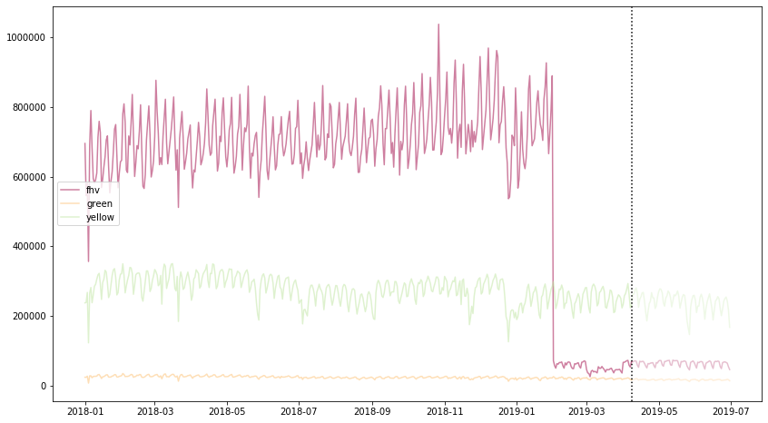
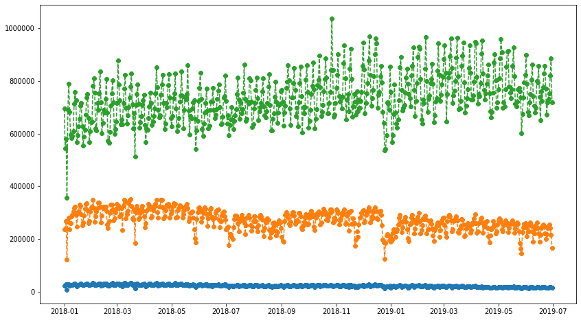
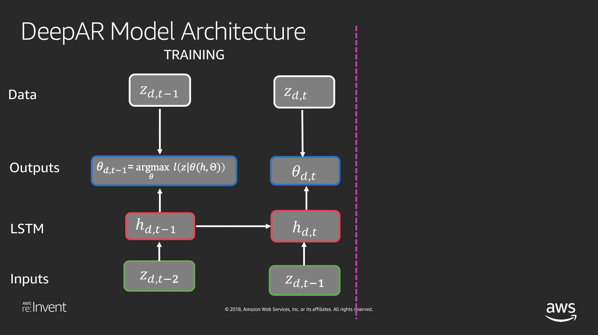
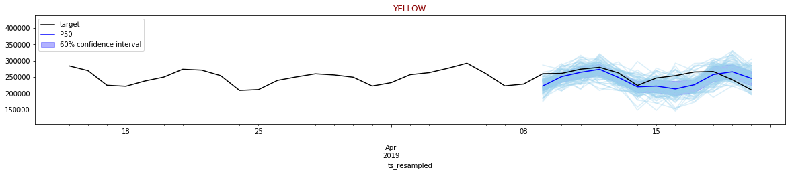

Feature Engineering and Training our Model
==========================================

We’ll first setup the glue context in which we can read the glue data
catalog, as well as setup some constants.

.. code:: python3

    import sys
    from awsglue.transforms import *
    from awsglue.utils import getResolvedOptions
    from pyspark.context import SparkContext
    from awsglue.context import GlueContext
    from awsglue.job import Job
    
    glueContext = GlueContext(SparkContext.getOrCreate())
    
    database_name = "reinvent19"
    canonical_table_name = "canonical"

.. parsed-literal::

    FloatProgress(value=0.0, bar_style='info', description='Progress:', layout=Layout(height='25px', width='50%'),…

Reading the Data using the Catalog
----------------------------------

Using the glue context, we can read in the data. This is done by using
the glue data catalog and looking up the data

Here we can see there are **500 million** records

.. code:: python3

    taxi_data = glueContext.create_dynamic_frame.from_catalog(database=database_name, table_name=canonical_table_name)
    print("2018/2019 Taxi Data Count: ", taxi_data.count())
    taxi_data.printSchema()

.. parsed-literal::

    FloatProgress(value=0.0, bar_style='info', description='Progress:', layout=Layout(height='25px', width='50%'),…

.. parsed-literal::

    2018/2019 Taxi Data Count:  4634941576
    root
    |-- vendorid: string
    |-- pickup_datetime: timestamp
    |-- dropoff_datetime: timestamp
    |-- pulocationid: long
    |-- dolocationid: long
    |-- type: string

Caching in Spark
~~~~~~~~~~~~~~~~

We’ll use the taxi dataframe a bit repeatitively, so we’ll cache it ehre
and show some sample records.

.. code:: python3

    df = taxi_data.toDF().cache()
    df.show(30, False)

Removing invalid dates
~~~~~~~~~~~~~~~~~~~~~~

When we originally looked at this data, we saw that it had a lot of bad
data in it, and timestamps that were outside the range that are valid.
Let’s ensure we are only using the valid records when aggregating and
creating our time series.

.. code:: python3

    from pyspark.sql.functions import to_date, lit
    from pyspark.sql.types import TimestampType
    
    dates = ("2018-01-01",  "2019-07-01")
    date_from, date_to = [to_date(lit(s)).cast(TimestampType()) for s in dates]
    
    df  = df.where((df.pickup_datetime > date_from) & (df.pickup_datetime < date_to))

.. parsed-literal::

    FloatProgress(value=0.0, bar_style='info', description='Progress:', layout=Layout(height='25px', width='50%'),…

We need to restructure this so that each time is a single row, and the
time series values are in the series, followed by the numerical and
categorical features

Creating our time series (from individual records)
--------------------------------------------------

Right now they are individual records down to the second level, we’ll
create a record at the day level for each record and then
count/aggregate over those.

Let’s start by adding a ts_resampled column

.. code:: python3

    from pyspark.sql.functions import col, max as max_, min as min_
    
    ## day = seconds*minutes*hours
    unit = 60 * 60 * 24
    epoch = (col("pickup_datetime").cast("bigint") / unit).cast("bigint") * unit
    
    with_epoch = df.withColumn("epoch", epoch)
    
    min_epoch, max_epoch = with_epoch.select(min_("epoch"), max_("epoch")).first()
    
    # Reference range 
    ref = spark.range(
        min_epoch, max_epoch + 1, unit
    ).toDF("epoch")
    
    resampled_df = (ref
        .join(with_epoch, "epoch", "left")
        .orderBy("epoch")
        .withColumn("ts_resampled", col("epoch").cast("timestamp")))
    
    resampled_df.cache()
    
    resampled_df.show(10, False)

.. parsed-literal::

    FloatProgress(value=0.0, bar_style='info', description='Progress:', layout=Layout(height='25px', width='50%'),…

.. parsed-literal::

    +----------+-------------------+-------------------+------------+------------+------+--------+-------------------+
    |epoch     |pickup_datetime    |dropoff_datetime   |pulocationid|dolocationid|type  |vendorid|ts_resampled       |
    +----------+-------------------+-------------------+------------+------------+------+--------+-------------------+
    |1514764800|2018-01-01 09:20:00|null               |null        |null        |fhv   |fhv     |2018-01-01 00:00:00|
    |1514764800|2018-01-01 12:37:41|2018-01-01 13:04:49|141         |132         |yellow|1       |2018-01-01 00:00:00|
    |1514764800|2018-01-01 10:20:00|null               |null        |null        |fhv   |fhv     |2018-01-01 00:00:00|
    |1514764800|2018-01-01 12:50:17|2018-01-01 13:06:24|138         |79          |yellow|2       |2018-01-01 00:00:00|
    |1514764800|2018-01-01 11:20:00|null               |null        |null        |fhv   |fhv     |2018-01-01 00:00:00|
    |1514764800|2018-01-01 12:05:16|2018-01-01 12:27:23|138         |170         |yellow|2       |2018-01-01 00:00:00|
    |1514764800|2018-01-01 11:55:00|null               |null        |null        |fhv   |fhv     |2018-01-01 00:00:00|
    |1514764800|2018-01-01 12:32:16|2018-01-01 12:42:28|137         |186         |yellow|2       |2018-01-01 00:00:00|
    |1514764800|2018-01-01 14:15:00|null               |null        |null        |fhv   |fhv     |2018-01-01 00:00:00|
    |1514764800|2018-01-01 12:43:54|2018-01-01 13:16:04|186         |93          |yellow|2       |2018-01-01 00:00:00|
    +----------+-------------------+-------------------+------------+------------+------+--------+-------------------+
    only showing top 10 rows

Creating our time series data
~~~~~~~~~~~~~~~~~~~~~~~~~~~~~

You can see now that we are resampling per day the resample column, in
which we can now aggregate across.

.. code:: python3

    from pyspark.sql import functions as func
    
    count_per_day_resamples = resampled_df.groupBy(["ts_resampled", "type"]).count()
    count_per_day_resamples.cache()
    count_per_day_resamples.show(10, False)

.. parsed-literal::

    FloatProgress(value=0.0, bar_style='info', description='Progress:', layout=Layout(height='25px', width='50%'),…

.. parsed-literal::

    +-------------------+------+------+
    |ts_resampled       |type  |count |
    +-------------------+------+------+
    |2018-03-05 00:00:00|yellow|290631|
    |2018-11-11 00:00:00|yellow|257698|
    |2018-11-28 00:00:00|green |22899 |
    |2018-11-20 00:00:00|yellow|278900|
    |2018-12-30 00:00:00|fhv   |688807|
    |2019-02-22 00:00:00|fhv   |65041 |
    |2018-02-21 00:00:00|green |25651 |
    |2018-03-15 00:00:00|yellow|348198|
    |2018-09-03 00:00:00|yellow|189402|
    |2019-03-07 00:00:00|yellow|291098|
    +-------------------+------+------+
    only showing top 10 rows

.. code:: python3

    #time_series_df = count_per_day_resamples.groupBy(["ts_resampled", "pulocationid", "dolocationid"])\
    time_series_df = count_per_day_resamples.groupBy(["ts_resampled"])\
    .pivot('type').sum("count").drop("null").cache()
    time_series_df.show(10,False)

.. parsed-literal::

    FloatProgress(value=0.0, bar_style='info', description='Progress:', layout=Layout(height='25px', width='50%'),…

.. parsed-literal::

    +-------------------+------+-----+------+
    |ts_resampled       |fhv   |green|yellow|
    +-------------------+------+-----+------+
    |2019-06-18 00:00:00|69383 |15545|242304|
    |2018-12-13 00:00:00|818550|24585|308411|
    |2019-03-21 00:00:00|47855 |20326|274057|
    |2018-09-09 00:00:00|803042|20365|256918|
    |2018-05-15 00:00:00|688946|25458|309023|
    |2018-07-13 00:00:00|749636|24518|277145|
    |2018-08-16 00:00:00|715263|22113|277677|
    |2018-03-21 00:00:00|511349|11981|183629|
    |2018-09-20 00:00:00|719646|23378|298630|
    |2018-01-31 00:00:00|642437|26667|319256|
    |2018-12-24 00:00:00|639463|19314|185895|
    |2019-05-03 00:00:00|71081 |18265|275523|
    |2018-02-13 00:00:00|639229|25869|317963|
    |2018-07-27 00:00:00|809908|24765|281050|
    |2018-03-25 00:00:00|714282|25115|275756|
    |2018-11-21 00:00:00|749954|22711|260399|
    |2018-05-11 00:00:00|743644|29137|324657|
    |2019-05-12 00:00:00|57573 |14959|225371|
    |2019-04-25 00:00:00|64567 |16580|266326|
    |2018-09-25 00:00:00|701224|21278|251618|
    |2019-03-10 00:00:00|35838 |15727|228385|
    |2018-10-19 00:00:00|806788|25717|304569|
    |2018-11-12 00:00:00|652918|18514|260713|
    |2018-06-01 00:00:00|774779|28152|320596|
    |2018-09-02 00:00:00|721487|19579|191190|
    |2019-06-26 00:00:00|67536 |15561|249641|
    |2019-04-30 00:00:00|64186 |15550|253571|
    |2018-04-11 00:00:00|665871|25950|320829|
    |2018-02-27 00:00:00|617158|25348|301654|
    |2019-06-06 00:00:00|68407 |16707|261778|
    +-------------------+------+-----+------+
    only showing top 30 rows

Local Data Manipulation
-----------------------

now that we an aggregated time series that is much smaller – let’s send
this back to the local python environment off the spark cluster on Glue.

.. code:: python3

    %%spark -o time_series_df

.. parsed-literal::

    FloatProgress(value=0.0, bar_style='info', description='Progress:', layout=Layout(height='25px', width='50%'),…

.. parsed-literal::

    FloatProgress(value=0.0, bar_style='info', description='Progress:', layout=Layout(height='25px', width='50%'),…

we are in the local panda/python environment now
~~~~~~~~~~~~~~~~~~~~~~~~~~~~~~~~~~~~~~~~~~~~~~~~

.. code:: python3

    %%local
    time_series_df.dtypes

.. parsed-literal::

    ts_resampled    datetime64[ns]
    fhv                      int64
    green                    int64
    yellow                   int64
    dtype: object

.. code:: python3

    %%local
    import pandas as pd
    time_series_df = time_series_df.set_index('ts_resampled', drop=True)
    time_series_df = time_series_df.sort_index()

.. code:: python3

    %%local
    prediction_length = 12
    context_length = 12
    
    n_weeks = 7
    end_training = time_series_df.index[-n_weeks*prediction_length]
    print('end training time', end_training)
    
    time_series = []
    for ts in time_series_df.columns:
        time_series.append(time_series_df[ts])
        
    time_series_training = []
    for ts in time_series_df.columns:
        time_series_training.append(time_series_df.loc[:end_training][ts])

.. parsed-literal::

    end training time 2019-04-08 00:00:00

.. code:: python3

    %%local
    %matplotlib inline
    import matplotlib
    import matplotlib.pyplot as plt
    import numpy as np
    #cols_float = time_series_df.drop(['pulocationid', 'dolocationid'], axis=1).columns
    cols_float = time_series_df.columns
    cmap = matplotlib.cm.get_cmap('Spectral')
    colors = cmap(np.arange(0,len(cols_float))/len(cols_float))
    
    
    plt.figure(figsize=[14,8]);
    for c in range(len(cols_float)):
        plt.plot(time_series_df.loc[:end_training][cols_float[c]], alpha=0.5, color=colors[c], label=cols_float[c]);  
    plt.legend(loc='center left');
    for c in range(len(cols_float)):
        plt.plot(time_series_df.loc[end_training:][cols_float[c]], alpha=0.25, color=colors[c], label=None);
    plt.axvline(x=end_training, color='k', linestyle=':');
    #plt.text(time_series_df.index[int((time_series_df.shape[0]-n_weeks*prediction_length)*0.75)], time_series_df.max().max()/2, 'Train');
    #plt.text(time_series_df.index[time_series_df.shape[0]-int(n_weeks*prediction_length/2)], time_series_df.max().max()/2, 'Test');
    #plt.xlabel('Time');
    #plt.show()

Cleaning our Time Series
------------------------

we still need to pull in the FHV HV dataset starting in Feb. This
represents the rideshare apps going to a difference licence type under
the NYC TLC.

.. code:: python3

    fhvhv_data = glueContext.create_dynamic_frame.from_catalog(database=database_name, table_name="fhvhv")
    fhvhv_df = fhvhv_data.toDF().cache()

.. parsed-literal::

    FloatProgress(value=0.0, bar_style='info', description='Progress:', layout=Layout(height='25px', width='50%'),…

.. code:: python3

    from pyspark.sql.functions import to_date, lit
    from pyspark.sql.types import TimestampType
    
    dates = ("2018-01-01",  "2019-07-01")
    date_from, date_to = [to_date(lit(s)).cast(TimestampType()) for s in dates]
    
    fhvhv_df = fhvhv_df.where((fhvhv_df.pickup_datetime > date_from) & (fhvhv_df.pickup_datetime < date_to)).cache()
    from pyspark.sql.functions import to_timestamp
    fhvhv_df = fhvhv_df.withColumn("pickup_datetime", to_timestamp("pickup_datetime", "yyyy-MM-dd HH:mm:ss"))
    fhvhv_df.show(5, False)

.. parsed-literal::

    FloatProgress(value=0.0, bar_style='info', description='Progress:', layout=Layout(height='25px', width='50%'),…

.. parsed-literal::

    +-----------------+--------------------+-------------------+-------------------+------------+------------+-------+
    |hvfhs_license_num|dispatching_base_num|pickup_datetime    |dropoff_datetime   |pulocationid|dolocationid|sr_flag|
    +-----------------+--------------------+-------------------+-------------------+------------+------------+-------+
    |HV0003           |B02867              |2019-02-01 00:05:18|2019-02-01 00:14:57|245         |251         |null   |
    |HV0003           |B02879              |2019-02-01 00:41:29|2019-02-01 00:49:39|216         |197         |null   |
    |HV0005           |B02510              |2019-02-01 00:51:34|2019-02-01 01:28:29|261         |234         |null   |
    |HV0005           |B02510              |2019-02-01 00:03:51|2019-02-01 00:07:16|87          |87          |null   |
    |HV0005           |B02510              |2019-02-01 00:09:44|2019-02-01 00:39:56|87          |198         |null   |
    +-----------------+--------------------+-------------------+-------------------+------------+------------+-------+
    only showing top 5 rows

.. code:: python3

    from pyspark.sql.functions import col, max as max_, min as min_
    
    ## day = seconds*minutes*hours
    unit = 60 * 60 * 24
    
    epoch = (col("pickup_datetime").cast("bigint") / unit).cast("bigint") * unit
    
    with_epoch = fhvhv_df.withColumn("epoch", epoch)
    
    min_epoch, max_epoch = with_epoch.select(min_("epoch"), max_("epoch")).first()
    
    ref = spark.range(
        min_epoch, max_epoch + 1, unit
    ).toDF("epoch")
    
    resampled_fhvhv_df = (ref
        .join(with_epoch, "epoch", "left")
        .orderBy("epoch")
        .withColumn("ts_resampled", col("epoch").cast("timestamp")))
    
    resampled_fhvhv_df = resampled_fhvhv_df.cache()
    
    resampled_fhvhv_df.show(10, False)

.. parsed-literal::

    FloatProgress(value=0.0, bar_style='info', description='Progress:', layout=Layout(height='25px', width='50%'),…

.. parsed-literal::

    +----------+-----------------+--------------------+-------------------+-------------------+------------+------------+-------+-------------------+
    |epoch     |hvfhs_license_num|dispatching_base_num|pickup_datetime    |dropoff_datetime   |pulocationid|dolocationid|sr_flag|ts_resampled       |
    +----------+-----------------+--------------------+-------------------+-------------------+------------+------------+-------+-------------------+
    |1548979200|HV0003           |B02867              |2019-02-01 00:05:18|2019-02-01 00:14:57|245         |251         |null   |2019-02-01 00:00:00|
    |1548979200|HV0003           |B02879              |2019-02-01 00:41:29|2019-02-01 00:49:39|216         |197         |null   |2019-02-01 00:00:00|
    |1548979200|HV0005           |B02510              |2019-02-01 00:51:34|2019-02-01 01:28:29|261         |234         |null   |2019-02-01 00:00:00|
    |1548979200|HV0005           |B02510              |2019-02-01 00:03:51|2019-02-01 00:07:16|87          |87          |null   |2019-02-01 00:00:00|
    |1548979200|HV0005           |B02510              |2019-02-01 00:09:44|2019-02-01 00:39:56|87          |198         |null   |2019-02-01 00:00:00|
    |1548979200|HV0005           |B02510              |2019-02-01 00:59:55|2019-02-01 01:06:28|198         |198         |1      |2019-02-01 00:00:00|
    |1548979200|HV0005           |B02510              |2019-02-01 00:12:06|2019-02-01 00:42:13|161         |148         |null   |2019-02-01 00:00:00|
    |1548979200|HV0005           |B02510              |2019-02-01 00:45:35|2019-02-01 01:14:56|148         |21          |null   |2019-02-01 00:00:00|
    |1548979200|HV0003           |B02867              |2019-02-01 00:10:48|2019-02-01 00:20:23|226         |260         |null   |2019-02-01 00:00:00|
    |1548979200|HV0003           |B02867              |2019-02-01 00:32:32|2019-02-01 00:40:25|7           |223         |null   |2019-02-01 00:00:00|
    +----------+-----------------+--------------------+-------------------+-------------------+------------+------------+-------+-------------------+
    only showing top 10 rows

.. code:: python3

    from pyspark.sql import functions as func
    #count_per_day_resamples = resampled_df.groupBy(["ts_resampled", "type", "pulocationid", "dolocationid"]).count()
    count_per_day_resamples = resampled_fhvhv_df.groupBy(["ts_resampled"]).count()
    count_per_day_resamples.cache()
    count_per_day_resamples.show(10, False)
    fhvhv_timeseries_df = count_per_day_resamples

.. parsed-literal::

    FloatProgress(value=0.0, bar_style='info', description='Progress:', layout=Layout(height='25px', width='50%'),…

.. parsed-literal::

    +-------------------+------+
    |ts_resampled       |count |
    +-------------------+------+
    |2019-06-18 00:00:00|692171|
    |2019-03-21 00:00:00|809819|
    |2019-05-03 00:00:00|815626|
    |2019-05-12 00:00:00|857727|
    |2019-04-25 00:00:00|689853|
    |2019-03-10 00:00:00|812902|
    |2019-04-30 00:00:00|655312|
    |2019-06-26 00:00:00|663954|
    |2019-06-06 00:00:00|682378|
    |2019-02-06 00:00:00|663516|
    +-------------------+------+
    only showing top 10 rows

.. code:: python3

    %%spark -o fhvhv_timeseries_df

.. parsed-literal::

    FloatProgress(value=0.0, bar_style='info', description='Progress:', layout=Layout(height='25px', width='50%'),…

.. parsed-literal::

    FloatProgress(value=0.0, bar_style='info', description='Progress:', layout=Layout(height='25px', width='50%'),…

.. code:: python3

    %%local
    fhvhv_timeseries_df = fhvhv_timeseries_df.rename(columns={"count": "fhvhv"})
    fhvhv_timeseries_df = fhvhv_timeseries_df.set_index('ts_resampled', drop=True)

Visualizing all the time series data
------------------------------------

When we look at the FHVHV dataset starting in Feb 1st, you can see the
time series looks normal and there isn’t a giant drop in the dataset on
that day.

.. code:: python3

    %%local
    plt.figure(figsize=[14,8]);
    plt.plot(time_series_df.join(fhvhv_timeseries_df), marker='8', linestyle='--')

.. parsed-literal::

    [<matplotlib.lines.Line2D at 0x7f997e4e92b0>,
     <matplotlib.lines.Line2D at 0x7f997e4956a0>,
     <matplotlib.lines.Line2D at 0x7f997e495780>,
     <matplotlib.lines.Line2D at 0x7f997e4958d0>]

.. image:: output_29_1.png

but now we need to combine the FHV and FHVHV dataset
----------------------------------------------------

Let’s create a new dataset and call it full_fhv meaning both
for-hire-vehicles and for-hire-vehicles high volume.

.. code:: python3

    %%local
    full_timeseries = time_series_df.join(fhvhv_timeseries_df)
    full_timeseries = full_timeseries.fillna(0)
    full_timeseries['full_fhv'] = full_timeseries['fhv'] + full_timeseries['fhvhv']
    full_timeseries = full_timeseries.drop(['fhv', 'fhvhv'], axis=1)

.. code:: python3

    %%local
    plt.figure(figsize=[14,8]);
    plt.plot(full_timeseries, marker='8', linestyle='--')

.. parsed-literal::

    [<matplotlib.lines.Line2D at 0x7f997e5e9cc0>,
     <matplotlib.lines.Line2D at 0x7f997e522cf8>,
     <matplotlib.lines.Line2D at 0x7f997e522cc0>]

.. code:: python3

    %%local
    plt.figure(figsize=[14,8]);
    plt.plot(full_timeseries.resample('7D', convention='end').sum(), marker='8', linestyle='--')

.. parsed-literal::

    [<matplotlib.lines.Line2D at 0x7f997e58d240>,
     <matplotlib.lines.Line2D at 0x7f997e5b2ef0>,
     <matplotlib.lines.Line2D at 0x7f997e5c00f0>]

.. image:: output_33_1.png

.. code:: python3

    %%local
    full_timeseries.isna().sum()

.. parsed-literal::

    green       0
    yellow      0
    full_fhv    0
    dtype: int64

.. code:: python3

    %%local
    import json
    import boto3
    
    bucket = 'sagemaker-us-east-1-783526147575'
    key_prefix = '2019workshop/'
    
    s3_client = boto3.client('s3')
    def series_to_obj(ts, cat=None):
        obj = {"start": str(ts.index[0]), "target": list(ts)}
        if cat:
            obj["cat"] = cat
        return obj
    
    def series_to_jsonline(ts, cat=None):
        return json.dumps(series_to_obj(ts, cat))
    
    encoding = "utf-8"
    data = ''
    
    for ts in time_series_training:
        data = data + series_to_jsonline(ts)
        data = data + '\n'
        
    s3_client.put_object(Body=data.encode(encoding), Bucket=bucket, Key=key_prefix + 'data/train/train.json')
        
    
    data = ''
    for ts in time_series:
        data = data + series_to_jsonline(ts)
        data = data + '\n'
    
    s3_client.put_object(Body=data.encode(encoding), Bucket=bucket, Key=key_prefix + 'data/test/test.json')

.. parsed-literal::

    {'ResponseMetadata': {'RequestId': '533CAC49C7F43336',
      'HostId': 'wun5bVNSWv0/sYGWYwaFX6IqKmB0Pco6s4DiChHTLOeGOZykZKp3/cNmzB7uMmdoa/sx3m/ITTo=',
      'HTTPStatusCode': 200,
      'HTTPHeaders': {'x-amz-id-2': 'wun5bVNSWv0/sYGWYwaFX6IqKmB0Pco6s4DiChHTLOeGOZykZKp3/cNmzB7uMmdoa/sx3m/ITTo=',
       'x-amz-request-id': '533CAC49C7F43336',
       'date': 'Sun, 13 Oct 2019 01:06:23 GMT',
       'etag': '"22723dba9b8f7c7e73c73b67e8ed22f6"',
       'content-length': '0',
       'server': 'AmazonS3'},
      'RetryAttempts': 0},
     'ETag': '"22723dba9b8f7c7e73c73b67e8ed22f6"'}

.. code:: python3

    %%local
    import boto3
    import s3fs
    import sagemaker
    from sagemaker import get_execution_role
    sagemaker_session = sagemaker.Session()
    role = get_execution_role()
    
    s3_data_path = "{}/{}data".format(bucket, key_prefix)
    s3_output_path = "{}/{}output".format(bucket, key_prefix)
    print('Data location: %s'%s3_data_path)
    print('Output location: %s'%s3_output_path)

.. parsed-literal::

    Data location: sagemaker-us-east-1-783526147575/2019workshop/data
    Output location: sagemaker-us-east-1-783526147575/2019workshop/output

.. code:: python3

    %%local
    
    region = sagemaker_session.boto_region_name
    image_name = sagemaker.amazon.amazon_estimator.get_image_uri(region, "forecasting-deepar", "latest")
    
    estimator = sagemaker.estimator.Estimator(
        sagemaker_session=sagemaker_session,
        image_name=image_name,
        role=role,
        train_instance_count=1,
        train_instance_type='ml.c4.2xlarge',
        base_job_name='DeepAR-forecast-taxidata',
        output_path="s3://" + s3_output_path
    )

.. code:: python3

    %%local
    hyperparameters = {
        "time_freq": freq,
        "context_length": str(context_length),
        "prediction_length": str(prediction_length),
        "num_cells": "40",
        "num_layers": "3",
        "likelihood": "gaussian",
        "epochs": "100",
        "mini_batch_size": "32",
        "learning_rate": "0.001",
        "dropout_rate": "0.05",
        "early_stopping_patience": "10"
    }
    
    estimator.set_hyperparameters(**hyperparameters)

.. code:: python3

    %%local
    data_channels = {
        "train": "s3://{}/train/".format(s3_data_path),
        "test": "s3://{}/test/".format(s3_data_path)
    }
    
    estimator.fit(inputs=data_channels)

.. parsed-literal::

    2019-10-13 01:06:28 Starting - Starting the training job...
    2019-10-13 01:06:30 Starting - Launching requested ML instances......
    2019-10-13 01:07:33 Starting - Preparing the instances for training...
    2019-10-13 01:08:11 Downloading - Downloading input data...
    2019-10-13 01:08:52 Training - Training image download completed. Training in progress..Arguments: train
    [10/13/2019 01:08:54 INFO 140349257213760] Reading default configuration from /opt/amazon/lib/python3.7/site-packages/algorithm/resources/default-input.json: {u'num_dynamic_feat': u'auto', u'dropout_rate': u'0.10', u'mini_batch_size': u'128', u'test_quantiles': u'[0.1, 0.2, 0.3, 0.4, 0.5, 0.6, 0.7, 0.8, 0.9]', u'_tuning_objective_metric': u'', u'_num_gpus': u'auto', u'num_eval_samples': u'100', u'learning_rate': u'0.001', u'num_cells': u'40', u'num_layers': u'2', u'embedding_dimension': u'10', u'_kvstore': u'auto', u'_num_kv_servers': u'auto', u'cardinality': u'auto', u'likelihood': u'student-t', u'early_stopping_patience': u''}
    [10/13/2019 01:08:54 INFO 140349257213760] Reading provided configuration from /opt/ml/input/config/hyperparameters.json: {u'dropout_rate': u'0.05', u'learning_rate': u'0.001', u'num_cells': u'40', u'prediction_length': u'12', u'epochs': u'100', u'time_freq': u'7D', u'context_length': u'12', u'num_layers': u'3', u'mini_batch_size': u'32', u'likelihood': u'gaussian', u'early_stopping_patience': u'10'}
    [10/13/2019 01:08:54 INFO 140349257213760] Final configuration: {u'dropout_rate': u'0.05', u'test_quantiles': u'[0.1, 0.2, 0.3, 0.4, 0.5, 0.6, 0.7, 0.8, 0.9]', u'_tuning_objective_metric': u'', u'num_eval_samples': u'100', u'learning_rate': u'0.001', u'num_layers': u'3', u'epochs': u'100', u'embedding_dimension': u'10', u'num_cells': u'40', u'_num_kv_servers': u'auto', u'mini_batch_size': u'32', u'likelihood': u'gaussian', u'num_dynamic_feat': u'auto', u'cardinality': u'auto', u'_num_gpus': u'auto', u'prediction_length': u'12', u'time_freq': u'7D', u'context_length': u'12', u'_kvstore': u'auto', u'early_stopping_patience': u'10'}
    Process 1 is a worker.
    [10/13/2019 01:08:54 INFO 140349257213760] Detected entry point for worker worker
    [10/13/2019 01:08:54 INFO 140349257213760] Using early stopping with patience 10
    [10/13/2019 01:08:54 INFO 140349257213760] [cardinality=auto] `cat` field was NOT found in the file `/opt/ml/input/data/train/train.json` and will NOT be used for training.
    [10/13/2019 01:08:54 INFO 140349257213760] [num_dynamic_feat=auto] `dynamic_feat` field was NOT found in the file `/opt/ml/input/data/train/train.json` and will NOT be used for training.
    [10/13/2019 01:08:54 INFO 140349257213760] Training set statistics:
    [10/13/2019 01:08:54 INFO 140349257213760] Integer time series
    [10/13/2019 01:08:54 INFO 140349257213760] number of time series: 3
    [10/13/2019 01:08:54 INFO 140349257213760] number of observations: 1389
    [10/13/2019 01:08:54 INFO 140349257213760] mean target length: 463
    [10/13/2019 01:08:54 INFO 140349257213760] min/mean/max target: 6519.0/306392.25198/1037761.0
    [10/13/2019 01:08:54 INFO 140349257213760] mean abs(target): 306392.25198
    [10/13/2019 01:08:54 INFO 140349257213760] contains missing values: no
    [10/13/2019 01:08:54 INFO 140349257213760] Small number of time series. Doing 10 number of passes over dataset per epoch.
    [10/13/2019 01:08:54 INFO 140349257213760] Test set statistics:
    [10/13/2019 01:08:54 INFO 140349257213760] Integer time series
    [10/13/2019 01:08:54 INFO 140349257213760] number of time series: 3
    [10/13/2019 01:08:54 INFO 140349257213760] number of observations: 1638
    [10/13/2019 01:08:54 INFO 140349257213760] mean target length: 546
    [10/13/2019 01:08:54 INFO 140349257213760] min/mean/max target: 6519.0/276000.449939/1037761.0
    [10/13/2019 01:08:54 INFO 140349257213760] mean abs(target): 276000.449939
    [10/13/2019 01:08:54 INFO 140349257213760] contains missing values: no
    [10/13/2019 01:08:54 INFO 140349257213760] nvidia-smi took: 0.0251710414886 secs to identify 0 gpus
    [10/13/2019 01:08:54 INFO 140349257213760] Number of GPUs being used: 0
    [10/13/2019 01:08:54 INFO 140349257213760] Create Store: local
    #metrics {"Metrics": {"get_graph.time": {"count": 1, "max": 58.8841438293457, "sum": 58.8841438293457, "min": 58.8841438293457}}, "EndTime": 1570928934.819781, "Dimensions": {"Host": "algo-1", "Operation": "training", "Algorithm": "AWS/DeepAR"}, "StartTime": 1570928934.75987}
    
    [10/13/2019 01:08:54 INFO 140349257213760] Number of GPUs being used: 0
    #metrics {"Metrics": {"initialize.time": {"count": 1, "max": 152.7881622314453, "sum": 152.7881622314453, "min": 152.7881622314453}}, "EndTime": 1570928934.912806, "Dimensions": {"Host": "algo-1", "Operation": "training", "Algorithm": "AWS/DeepAR"}, "StartTime": 1570928934.819842}
    
    [10/13/2019 01:08:55 INFO 140349257213760] Epoch[0] Batch[0] avg_epoch_loss=14.230526
    [10/13/2019 01:08:55 INFO 140349257213760] #quality_metric: host=algo-1, epoch=0, batch=0 train loss <loss>=14.2305259705
    [10/13/2019 01:08:55 INFO 140349257213760] Epoch[0] Batch[5] avg_epoch_loss=13.396269
    [10/13/2019 01:08:55 INFO 140349257213760] #quality_metric: host=algo-1, epoch=0, batch=5 train loss <loss>=13.3962691625
    [10/13/2019 01:08:55 INFO 140349257213760] Epoch[0] Batch [5]#011Speed: 1413.39 samples/sec#011loss=13.396269
    [10/13/2019 01:08:55 INFO 140349257213760] processed a total of 310 examples
    #metrics {"Metrics": {"epochs": {"count": 1, "max": 100, "sum": 100.0, "min": 100}, "update.time": {"count": 1, "max": 342.03290939331055, "sum": 342.03290939331055, "min": 342.03290939331055}}, "EndTime": 1570928935.254969, "Dimensions": {"Host": "algo-1", "Operation": "training", "Algorithm": "AWS/DeepAR"}, "StartTime": 1570928934.912864}
    
    [10/13/2019 01:08:55 INFO 140349257213760] #throughput_metric: host=algo-1, train throughput=905.99818833 records/second
    [10/13/2019 01:08:55 INFO 140349257213760] #progress_metric: host=algo-1, completed 1 % of epochs
    [10/13/2019 01:08:55 INFO 140349257213760] #quality_metric: host=algo-1, epoch=0, train loss <loss>=13.2752533913
    [10/13/2019 01:08:55 INFO 140349257213760] best epoch loss so far
    [10/13/2019 01:08:55 INFO 140349257213760] Saved checkpoint to "/opt/ml/model/state_b08c6e3f-2f5b-4fa5-8434-e0257fff408f-0000.params"
    #metrics {"Metrics": {"state.serialize.time": {"count": 1, "max": 19.212007522583008, "sum": 19.212007522583008, "min": 19.212007522583008}}, "EndTime": 1570928935.274837, "Dimensions": {"Host": "algo-1", "Operation": "training", "Algorithm": "AWS/DeepAR"}, "StartTime": 1570928935.255063}
    
    [10/13/2019 01:08:55 INFO 140349257213760] Epoch[1] Batch[0] avg_epoch_loss=13.038147
    [10/13/2019 01:08:55 INFO 140349257213760] #quality_metric: host=algo-1, epoch=1, batch=0 train loss <loss>=13.0381469727
    [10/13/2019 01:08:55 INFO 140349257213760] Epoch[1] Batch[5] avg_epoch_loss=12.510783
    [10/13/2019 01:08:55 INFO 140349257213760] #quality_metric: host=algo-1, epoch=1, batch=5 train loss <loss>=12.5107830365
    [10/13/2019 01:08:55 INFO 140349257213760] Epoch[1] Batch [5]#011Speed: 1097.67 samples/sec#011loss=12.510783
    [10/13/2019 01:08:55 INFO 140349257213760] processed a total of 293 examples
    #metrics {"Metrics": {"update.time": {"count": 1, "max": 336.61389350891113, "sum": 336.61389350891113, "min": 336.61389350891113}}, "EndTime": 1570928935.611579, "Dimensions": {"Host": "algo-1", "Operation": "training", "Algorithm": "AWS/DeepAR"}, "StartTime": 1570928935.274905}
    
    [10/13/2019 01:08:55 INFO 140349257213760] #throughput_metric: host=algo-1, train throughput=870.125939562 records/second
    [10/13/2019 01:08:55 INFO 140349257213760] #progress_metric: host=algo-1, completed 2 % of epochs
    [10/13/2019 01:08:55 INFO 140349257213760] #quality_metric: host=algo-1, epoch=1, train loss <loss>=12.5087955475
    [10/13/2019 01:08:55 INFO 140349257213760] best epoch loss so far
    [10/13/2019 01:08:55 INFO 140349257213760] Saved checkpoint to "/opt/ml/model/state_7bc3e2f7-8347-4aa2-987e-be042401c820-0000.params"
    #metrics {"Metrics": {"state.serialize.time": {"count": 1, "max": 13.906002044677734, "sum": 13.906002044677734, "min": 13.906002044677734}}, "EndTime": 1570928935.626095, "Dimensions": {"Host": "algo-1", "Operation": "training", "Algorithm": "AWS/DeepAR"}, "StartTime": 1570928935.61166}
    
    [10/13/2019 01:08:55 INFO 140349257213760] Epoch[2] Batch[0] avg_epoch_loss=12.315042
    [10/13/2019 01:08:55 INFO 140349257213760] #quality_metric: host=algo-1, epoch=2, batch=0 train loss <loss>=12.3150424957
    [10/13/2019 01:08:55 INFO 140349257213760] Epoch[2] Batch[5] avg_epoch_loss=11.729630
    [10/13/2019 01:08:55 INFO 140349257213760] #quality_metric: host=algo-1, epoch=2, batch=5 train loss <loss>=11.7296298345
    [10/13/2019 01:08:55 INFO 140349257213760] Epoch[2] Batch [5]#011Speed: 1105.02 samples/sec#011loss=11.729630
    [10/13/2019 01:08:55 INFO 140349257213760] processed a total of 280 examples
    #metrics {"Metrics": {"update.time": {"count": 1, "max": 308.77208709716797, "sum": 308.77208709716797, "min": 308.77208709716797}}, "EndTime": 1570928935.934985, "Dimensions": {"Host": "algo-1", "Operation": "training", "Algorithm": "AWS/DeepAR"}, "StartTime": 1570928935.626158}
    
    [10/13/2019 01:08:55 INFO 140349257213760] #throughput_metric: host=algo-1, train throughput=906.57131653 records/second
    [10/13/2019 01:08:55 INFO 140349257213760] #progress_metric: host=algo-1, completed 3 % of epochs
    [10/13/2019 01:08:55 INFO 140349257213760] #quality_metric: host=algo-1, epoch=2, train loss <loss>=11.6596869363
    [10/13/2019 01:08:55 INFO 140349257213760] best epoch loss so far
    [10/13/2019 01:08:55 INFO 140349257213760] Saved checkpoint to "/opt/ml/model/state_c97b1657-ccc3-4bf5-9af9-679c4a3fab2e-0000.params"
    #metrics {"Metrics": {"state.serialize.time": {"count": 1, "max": 15.043973922729492, "sum": 15.043973922729492, "min": 15.043973922729492}}, "EndTime": 1570928935.950532, "Dimensions": {"Host": "algo-1", "Operation": "training", "Algorithm": "AWS/DeepAR"}, "StartTime": 1570928935.935037}
    
    [10/13/2019 01:08:56 INFO 140349257213760] Epoch[3] Batch[0] avg_epoch_loss=12.098345
    [10/13/2019 01:08:56 INFO 140349257213760] #quality_metric: host=algo-1, epoch=3, batch=0 train loss <loss>=12.0983448029
    [10/13/2019 01:08:56 INFO 140349257213760] Epoch[3] Batch[5] avg_epoch_loss=11.794618
    [10/13/2019 01:08:56 INFO 140349257213760] #quality_metric: host=algo-1, epoch=3, batch=5 train loss <loss>=11.7946181297
    [10/13/2019 01:08:56 INFO 140349257213760] Epoch[3] Batch [5]#011Speed: 1144.26 samples/sec#011loss=11.794618
    [10/13/2019 01:08:56 INFO 140349257213760] Epoch[3] Batch[10] avg_epoch_loss=11.770495
    [10/13/2019 01:08:56 INFO 140349257213760] #quality_metric: host=algo-1, epoch=3, batch=10 train loss <loss>=11.7415468216
    [10/13/2019 01:08:56 INFO 140349257213760] Epoch[3] Batch [10]#011Speed: 1185.11 samples/sec#011loss=11.741547
    [10/13/2019 01:08:56 INFO 140349257213760] processed a total of 327 examples
    #metrics {"Metrics": {"update.time": {"count": 1, "max": 342.91791915893555, "sum": 342.91791915893555, "min": 342.91791915893555}}, "EndTime": 1570928936.293574, "Dimensions": {"Host": "algo-1", "Operation": "training", "Algorithm": "AWS/DeepAR"}, "StartTime": 1570928935.950597}
    
    [10/13/2019 01:08:56 INFO 140349257213760] #throughput_metric: host=algo-1, train throughput=953.28337426 records/second
    [10/13/2019 01:08:56 INFO 140349257213760] #progress_metric: host=algo-1, completed 4 % of epochs
    [10/13/2019 01:08:56 INFO 140349257213760] #quality_metric: host=algo-1, epoch=3, train loss <loss>=11.7704948079
    [10/13/2019 01:08:56 INFO 140349257213760] loss did not improve
    [10/13/2019 01:08:56 INFO 140349257213760] Epoch[4] Batch[0] avg_epoch_loss=11.516387
    [10/13/2019 01:08:56 INFO 140349257213760] #quality_metric: host=algo-1, epoch=4, batch=0 train loss <loss>=11.5163869858
    [10/13/2019 01:08:56 INFO 140349257213760] Epoch[4] Batch[5] avg_epoch_loss=11.536468
    [10/13/2019 01:08:56 INFO 140349257213760] #quality_metric: host=algo-1, epoch=4, batch=5 train loss <loss>=11.536468188
    [10/13/2019 01:08:56 INFO 140349257213760] Epoch[4] Batch [5]#011Speed: 1398.58 samples/sec#011loss=11.536468
    [10/13/2019 01:08:56 INFO 140349257213760] Epoch[4] Batch[10] avg_epoch_loss=11.275103
    [10/13/2019 01:08:56 INFO 140349257213760] #quality_metric: host=algo-1, epoch=4, batch=10 train loss <loss>=10.9614639282
    [10/13/2019 01:08:56 INFO 140349257213760] Epoch[4] Batch [10]#011Speed: 1335.70 samples/sec#011loss=10.961464
    [10/13/2019 01:08:56 INFO 140349257213760] processed a total of 330 examples
    #metrics {"Metrics": {"update.time": {"count": 1, "max": 308.86197090148926, "sum": 308.86197090148926, "min": 308.86197090148926}}, "EndTime": 1570928936.602987, "Dimensions": {"Host": "algo-1", "Operation": "training", "Algorithm": "AWS/DeepAR"}, "StartTime": 1570928936.293644}
    
    [10/13/2019 01:08:56 INFO 140349257213760] #throughput_metric: host=algo-1, train throughput=1068.05423454 records/second
    [10/13/2019 01:08:56 INFO 140349257213760] #progress_metric: host=algo-1, completed 5 % of epochs
    [10/13/2019 01:08:56 INFO 140349257213760] #quality_metric: host=algo-1, epoch=4, train loss <loss>=11.2751026154
    [10/13/2019 01:08:56 INFO 140349257213760] best epoch loss so far
    [10/13/2019 01:08:56 INFO 140349257213760] Saved checkpoint to "/opt/ml/model/state_3421ade7-f0df-40a7-8582-3dec84128238-0000.params"
    #metrics {"Metrics": {"state.serialize.time": {"count": 1, "max": 17.745018005371094, "sum": 17.745018005371094, "min": 17.745018005371094}}, "EndTime": 1570928936.621291, "Dimensions": {"Host": "algo-1", "Operation": "training", "Algorithm": "AWS/DeepAR"}, "StartTime": 1570928936.603063}
    
    [10/13/2019 01:08:56 INFO 140349257213760] Epoch[5] Batch[0] avg_epoch_loss=11.548022
    [10/13/2019 01:08:56 INFO 140349257213760] #quality_metric: host=algo-1, epoch=5, batch=0 train loss <loss>=11.5480222702
    [10/13/2019 01:08:56 INFO 140349257213760] Epoch[5] Batch[5] avg_epoch_loss=11.503839
    [10/13/2019 01:08:56 INFO 140349257213760] #quality_metric: host=algo-1, epoch=5, batch=5 train loss <loss>=11.5038394928
    [10/13/2019 01:08:56 INFO 140349257213760] Epoch[5] Batch [5]#011Speed: 1481.00 samples/sec#011loss=11.503839
    [10/13/2019 01:08:56 INFO 140349257213760] processed a total of 308 examples
    #metrics {"Metrics": {"update.time": {"count": 1, "max": 279.6900272369385, "sum": 279.6900272369385, "min": 279.6900272369385}}, "EndTime": 1570928936.901091, "Dimensions": {"Host": "algo-1", "Operation": "training", "Algorithm": "AWS/DeepAR"}, "StartTime": 1570928936.621349}
    
    [10/13/2019 01:08:56 INFO 140349257213760] #throughput_metric: host=algo-1, train throughput=1100.79027099 records/second
    [10/13/2019 01:08:56 INFO 140349257213760] #progress_metric: host=algo-1, completed 6 % of epochs
    [10/13/2019 01:08:56 INFO 140349257213760] #quality_metric: host=algo-1, epoch=5, train loss <loss>=11.3321397781
    [10/13/2019 01:08:56 INFO 140349257213760] loss did not improve
    [10/13/2019 01:08:56 INFO 140349257213760] Epoch[6] Batch[0] avg_epoch_loss=12.038177
    [10/13/2019 01:08:56 INFO 140349257213760] #quality_metric: host=algo-1, epoch=6, batch=0 train loss <loss>=12.0381765366
    [10/13/2019 01:08:57 INFO 140349257213760] Epoch[6] Batch[5] avg_epoch_loss=11.437995
    [10/13/2019 01:08:57 INFO 140349257213760] #quality_metric: host=algo-1, epoch=6, batch=5 train loss <loss>=11.4379946391
    [10/13/2019 01:08:57 INFO 140349257213760] Epoch[6] Batch [5]#011Speed: 1480.63 samples/sec#011loss=11.437995
    [10/13/2019 01:08:57 INFO 140349257213760] Epoch[6] Batch[10] avg_epoch_loss=11.475015
    [10/13/2019 01:08:57 INFO 140349257213760] #quality_metric: host=algo-1, epoch=6, batch=10 train loss <loss>=11.5194402695
    [10/13/2019 01:08:57 INFO 140349257213760] Epoch[6] Batch [10]#011Speed: 1341.27 samples/sec#011loss=11.519440
    [10/13/2019 01:08:57 INFO 140349257213760] processed a total of 334 examples
    #metrics {"Metrics": {"update.time": {"count": 1, "max": 315.6430721282959, "sum": 315.6430721282959, "min": 315.6430721282959}}, "EndTime": 1570928937.217269, "Dimensions": {"Host": "algo-1", "Operation": "training", "Algorithm": "AWS/DeepAR"}, "StartTime": 1570928936.901166}
    
    [10/13/2019 01:08:57 INFO 140349257213760] #throughput_metric: host=algo-1, train throughput=1057.81206115 records/second
    [10/13/2019 01:08:57 INFO 140349257213760] #progress_metric: host=algo-1, completed 7 % of epochs
    [10/13/2019 01:08:57 INFO 140349257213760] #quality_metric: host=algo-1, epoch=6, train loss <loss>=11.4750153802
    [10/13/2019 01:08:57 INFO 140349257213760] loss did not improve
    [10/13/2019 01:08:57 INFO 140349257213760] Epoch[7] Batch[0] avg_epoch_loss=11.779601
    [10/13/2019 01:08:57 INFO 140349257213760] #quality_metric: host=algo-1, epoch=7, batch=0 train loss <loss>=11.7796010971
    [10/13/2019 01:08:57 INFO 140349257213760] Epoch[7] Batch[5] avg_epoch_loss=11.353891
    [10/13/2019 01:08:57 INFO 140349257213760] #quality_metric: host=algo-1, epoch=7, batch=5 train loss <loss>=11.353890578
    [10/13/2019 01:08:57 INFO 140349257213760] Epoch[7] Batch [5]#011Speed: 1371.76 samples/sec#011loss=11.353891
    [10/13/2019 01:08:57 INFO 140349257213760] processed a total of 312 examples
    #metrics {"Metrics": {"update.time": {"count": 1, "max": 293.6739921569824, "sum": 293.6739921569824, "min": 293.6739921569824}}, "EndTime": 1570928937.511439, "Dimensions": {"Host": "algo-1", "Operation": "training", "Algorithm": "AWS/DeepAR"}, "StartTime": 1570928937.217338}
    
    [10/13/2019 01:08:57 INFO 140349257213760] #throughput_metric: host=algo-1, train throughput=1061.84911392 records/second
    [10/13/2019 01:08:57 INFO 140349257213760] #progress_metric: host=algo-1, completed 8 % of epochs
    [10/13/2019 01:08:57 INFO 140349257213760] #quality_metric: host=algo-1, epoch=7, train loss <loss>=11.2728459358
    [10/13/2019 01:08:57 INFO 140349257213760] best epoch loss so far
    [10/13/2019 01:08:57 INFO 140349257213760] Saved checkpoint to "/opt/ml/model/state_3b3f092f-2a2b-4416-9bba-f8e3de211597-0000.params"
    #metrics {"Metrics": {"state.serialize.time": {"count": 1, "max": 18.151044845581055, "sum": 18.151044845581055, "min": 18.151044845581055}}, "EndTime": 1570928937.530351, "Dimensions": {"Host": "algo-1", "Operation": "training", "Algorithm": "AWS/DeepAR"}, "StartTime": 1570928937.511552}
    
    [10/13/2019 01:08:57 INFO 140349257213760] Epoch[8] Batch[0] avg_epoch_loss=11.804518
    [10/13/2019 01:08:57 INFO 140349257213760] #quality_metric: host=algo-1, epoch=8, batch=0 train loss <loss>=11.804517746
    [10/13/2019 01:08:57 INFO 140349257213760] Epoch[8] Batch[5] avg_epoch_loss=11.390380
    [10/13/2019 01:08:57 INFO 140349257213760] #quality_metric: host=algo-1, epoch=8, batch=5 train loss <loss>=11.3903800646
    [10/13/2019 01:08:57 INFO 140349257213760] Epoch[8] Batch [5]#011Speed: 1471.68 samples/sec#011loss=11.390380
    [10/13/2019 01:08:57 INFO 140349257213760] processed a total of 305 examples
    #metrics {"Metrics": {"update.time": {"count": 1, "max": 302.9201030731201, "sum": 302.9201030731201, "min": 302.9201030731201}}, "EndTime": 1570928937.833402, "Dimensions": {"Host": "algo-1", "Operation": "training", "Algorithm": "AWS/DeepAR"}, "StartTime": 1570928937.530422}
    
    [10/13/2019 01:08:57 INFO 140349257213760] #throughput_metric: host=algo-1, train throughput=1006.48749781 records/second
    [10/13/2019 01:08:57 INFO 140349257213760] #progress_metric: host=algo-1, completed 9 % of epochs
    [10/13/2019 01:08:57 INFO 140349257213760] #quality_metric: host=algo-1, epoch=8, train loss <loss>=11.3775391579
    [10/13/2019 01:08:57 INFO 140349257213760] loss did not improve
    [10/13/2019 01:08:57 INFO 140349257213760] Epoch[9] Batch[0] avg_epoch_loss=12.535266
    [10/13/2019 01:08:57 INFO 140349257213760] #quality_metric: host=algo-1, epoch=9, batch=0 train loss <loss>=12.5352659225
    [10/13/2019 01:08:58 INFO 140349257213760] Epoch[9] Batch[5] avg_epoch_loss=11.678731
    [10/13/2019 01:08:58 INFO 140349257213760] #quality_metric: host=algo-1, epoch=9, batch=5 train loss <loss>=11.6787311236
    [10/13/2019 01:08:58 INFO 140349257213760] Epoch[9] Batch [5]#011Speed: 1024.09 samples/sec#011loss=11.678731
    [10/13/2019 01:08:58 INFO 140349257213760] Epoch[9] Batch[10] avg_epoch_loss=11.565949
    [10/13/2019 01:08:58 INFO 140349257213760] #quality_metric: host=algo-1, epoch=9, batch=10 train loss <loss>=11.4306106567
    [10/13/2019 01:08:58 INFO 140349257213760] Epoch[9] Batch [10]#011Speed: 1123.30 samples/sec#011loss=11.430611
    [10/13/2019 01:08:58 INFO 140349257213760] processed a total of 325 examples
    #metrics {"Metrics": {"update.time": {"count": 1, "max": 393.60809326171875, "sum": 393.60809326171875, "min": 393.60809326171875}}, "EndTime": 1570928938.227533, "Dimensions": {"Host": "algo-1", "Operation": "training", "Algorithm": "AWS/DeepAR"}, "StartTime": 1570928937.833481}
    
    [10/13/2019 01:08:58 INFO 140349257213760] #throughput_metric: host=algo-1, train throughput=825.461402538 records/second
    [10/13/2019 01:08:58 INFO 140349257213760] #progress_metric: host=algo-1, completed 10 % of epochs
    [10/13/2019 01:08:58 INFO 140349257213760] #quality_metric: host=algo-1, epoch=9, train loss <loss>=11.5659490932
    [10/13/2019 01:08:58 INFO 140349257213760] loss did not improve
    [10/13/2019 01:08:58 INFO 140349257213760] Epoch[10] Batch[0] avg_epoch_loss=11.148903
    [10/13/2019 01:08:58 INFO 140349257213760] #quality_metric: host=algo-1, epoch=10, batch=0 train loss <loss>=11.1489028931
    [10/13/2019 01:08:58 INFO 140349257213760] Epoch[10] Batch[5] avg_epoch_loss=11.179388
    [10/13/2019 01:08:58 INFO 140349257213760] #quality_metric: host=algo-1, epoch=10, batch=5 train loss <loss>=11.1793880463
    [10/13/2019 01:08:58 INFO 140349257213760] Epoch[10] Batch [5]#011Speed: 995.45 samples/sec#011loss=11.179388
    [10/13/2019 01:08:58 INFO 140349257213760] processed a total of 307 examples
    #metrics {"Metrics": {"update.time": {"count": 1, "max": 379.44698333740234, "sum": 379.44698333740234, "min": 379.44698333740234}}, "EndTime": 1570928938.60746, "Dimensions": {"Host": "algo-1", "Operation": "training", "Algorithm": "AWS/DeepAR"}, "StartTime": 1570928938.22761}
    
    [10/13/2019 01:08:58 INFO 140349257213760] #throughput_metric: host=algo-1, train throughput=808.839928818 records/second
    [10/13/2019 01:08:58 INFO 140349257213760] #progress_metric: host=algo-1, completed 11 % of epochs
    [10/13/2019 01:08:58 INFO 140349257213760] #quality_metric: host=algo-1, epoch=10, train loss <loss>=11.3231087685
    [10/13/2019 01:08:58 INFO 140349257213760] loss did not improve
    [10/13/2019 01:08:58 INFO 140349257213760] Epoch[11] Batch[0] avg_epoch_loss=11.403782
    [10/13/2019 01:08:58 INFO 140349257213760] #quality_metric: host=algo-1, epoch=11, batch=0 train loss <loss>=11.4037818909
    [10/13/2019 01:08:58 INFO 140349257213760] Epoch[11] Batch[5] avg_epoch_loss=11.475471
    [10/13/2019 01:08:58 INFO 140349257213760] #quality_metric: host=algo-1, epoch=11, batch=5 train loss <loss>=11.4754710197
    [10/13/2019 01:08:58 INFO 140349257213760] Epoch[11] Batch [5]#011Speed: 1449.65 samples/sec#011loss=11.475471
    [10/13/2019 01:08:58 INFO 140349257213760] processed a total of 320 examples
    #metrics {"Metrics": {"update.time": {"count": 1, "max": 280.7450294494629, "sum": 280.7450294494629, "min": 280.7450294494629}}, "EndTime": 1570928938.888701, "Dimensions": {"Host": "algo-1", "Operation": "training", "Algorithm": "AWS/DeepAR"}, "StartTime": 1570928938.607532}
    
    [10/13/2019 01:08:58 INFO 140349257213760] #throughput_metric: host=algo-1, train throughput=1139.37821257 records/second
    [10/13/2019 01:08:58 INFO 140349257213760] #progress_metric: host=algo-1, completed 12 % of epochs
    [10/13/2019 01:08:58 INFO 140349257213760] #quality_metric: host=algo-1, epoch=11, train loss <loss>=11.413458252
    [10/13/2019 01:08:58 INFO 140349257213760] loss did not improve
    [10/13/2019 01:08:58 INFO 140349257213760] Epoch[12] Batch[0] avg_epoch_loss=11.547842
    [10/13/2019 01:08:58 INFO 140349257213760] #quality_metric: host=algo-1, epoch=12, batch=0 train loss <loss>=11.5478420258
    [10/13/2019 01:08:59 INFO 140349257213760] Epoch[12] Batch[5] avg_epoch_loss=11.191356
    [10/13/2019 01:08:59 INFO 140349257213760] #quality_metric: host=algo-1, epoch=12, batch=5 train loss <loss>=11.1913560232
    [10/13/2019 01:08:59 INFO 140349257213760] Epoch[12] Batch [5]#011Speed: 1465.56 samples/sec#011loss=11.191356
    [10/13/2019 01:08:59 INFO 140349257213760] Epoch[12] Batch[10] avg_epoch_loss=11.305026
    [10/13/2019 01:08:59 INFO 140349257213760] #quality_metric: host=algo-1, epoch=12, batch=10 train loss <loss>=11.4414297104
    [10/13/2019 01:08:59 INFO 140349257213760] Epoch[12] Batch [10]#011Speed: 1455.28 samples/sec#011loss=11.441430
    [10/13/2019 01:08:59 INFO 140349257213760] processed a total of 321 examples
    #metrics {"Metrics": {"update.time": {"count": 1, "max": 297.95002937316895, "sum": 297.95002937316895, "min": 297.95002937316895}}, "EndTime": 1570928939.187186, "Dimensions": {"Host": "algo-1", "Operation": "training", "Algorithm": "AWS/DeepAR"}, "StartTime": 1570928938.888777}
    
    [10/13/2019 01:08:59 INFO 140349257213760] #throughput_metric: host=algo-1, train throughput=1076.88102949 records/second
    [10/13/2019 01:08:59 INFO 140349257213760] #progress_metric: host=algo-1, completed 13 % of epochs
    [10/13/2019 01:08:59 INFO 140349257213760] #quality_metric: host=algo-1, epoch=12, train loss <loss>=11.305025881
    [10/13/2019 01:08:59 INFO 140349257213760] loss did not improve
    [10/13/2019 01:08:59 INFO 140349257213760] Epoch[13] Batch[0] avg_epoch_loss=11.477967
    [10/13/2019 01:08:59 INFO 140349257213760] #quality_metric: host=algo-1, epoch=13, batch=0 train loss <loss>=11.4779672623
    [10/13/2019 01:08:59 INFO 140349257213760] Epoch[13] Batch[5] avg_epoch_loss=11.446265
    [10/13/2019 01:08:59 INFO 140349257213760] #quality_metric: host=algo-1, epoch=13, batch=5 train loss <loss>=11.4462647438
    [10/13/2019 01:08:59 INFO 140349257213760] Epoch[13] Batch [5]#011Speed: 1342.43 samples/sec#011loss=11.446265
    [10/13/2019 01:08:59 INFO 140349257213760] processed a total of 266 examples
    #metrics {"Metrics": {"update.time": {"count": 1, "max": 262.6039981842041, "sum": 262.6039981842041, "min": 262.6039981842041}}, "EndTime": 1570928939.450307, "Dimensions": {"Host": "algo-1", "Operation": "training", "Algorithm": "AWS/DeepAR"}, "StartTime": 1570928939.187284}
    
    [10/13/2019 01:08:59 INFO 140349257213760] #throughput_metric: host=algo-1, train throughput=1012.50457299 records/second
    [10/13/2019 01:08:59 INFO 140349257213760] #progress_metric: host=algo-1, completed 14 % of epochs
    [10/13/2019 01:08:59 INFO 140349257213760] #quality_metric: host=algo-1, epoch=13, train loss <loss>=11.5043666628
    [10/13/2019 01:08:59 INFO 140349257213760] loss did not improve
    [10/13/2019 01:08:59 INFO 140349257213760] Epoch[14] Batch[0] avg_epoch_loss=11.441884
    [10/13/2019 01:08:59 INFO 140349257213760] #quality_metric: host=algo-1, epoch=14, batch=0 train loss <loss>=11.4418840408
    [10/13/2019 01:08:59 INFO 140349257213760] Epoch[14] Batch[5] avg_epoch_loss=11.319520
    [10/13/2019 01:08:59 INFO 140349257213760] #quality_metric: host=algo-1, epoch=14, batch=5 train loss <loss>=11.3195203145
    [10/13/2019 01:08:59 INFO 140349257213760] Epoch[14] Batch [5]#011Speed: 1472.97 samples/sec#011loss=11.319520
    [10/13/2019 01:08:59 INFO 140349257213760] Epoch[14] Batch[10] avg_epoch_loss=11.292421
    [10/13/2019 01:08:59 INFO 140349257213760] #quality_metric: host=algo-1, epoch=14, batch=10 train loss <loss>=11.2599012375
    [10/13/2019 01:08:59 INFO 140349257213760] Epoch[14] Batch [10]#011Speed: 1439.72 samples/sec#011loss=11.259901
    [10/13/2019 01:08:59 INFO 140349257213760] processed a total of 330 examples
    #metrics {"Metrics": {"update.time": {"count": 1, "max": 298.2139587402344, "sum": 298.2139587402344, "min": 298.2139587402344}}, "EndTime": 1570928939.74903, "Dimensions": {"Host": "algo-1", "Operation": "training", "Algorithm": "AWS/DeepAR"}, "StartTime": 1570928939.450382}
    
    [10/13/2019 01:08:59 INFO 140349257213760] #throughput_metric: host=algo-1, train throughput=1106.17680507 records/second
    [10/13/2019 01:08:59 INFO 140349257213760] #progress_metric: host=algo-1, completed 15 % of epochs
    [10/13/2019 01:08:59 INFO 140349257213760] #quality_metric: host=algo-1, epoch=14, train loss <loss>=11.2924207341
    [10/13/2019 01:08:59 INFO 140349257213760] loss did not improve
    [10/13/2019 01:08:59 INFO 140349257213760] Epoch[15] Batch[0] avg_epoch_loss=11.122583
    [10/13/2019 01:08:59 INFO 140349257213760] #quality_metric: host=algo-1, epoch=15, batch=0 train loss <loss>=11.1225833893
    [10/13/2019 01:08:59 INFO 140349257213760] Epoch[15] Batch[5] avg_epoch_loss=11.178948
    [10/13/2019 01:08:59 INFO 140349257213760] #quality_metric: host=algo-1, epoch=15, batch=5 train loss <loss>=11.1789482435
    [10/13/2019 01:08:59 INFO 140349257213760] Epoch[15] Batch [5]#011Speed: 1477.71 samples/sec#011loss=11.178948
    [10/13/2019 01:09:00 INFO 140349257213760] Epoch[15] Batch[10] avg_epoch_loss=11.215369
    [10/13/2019 01:09:00 INFO 140349257213760] #quality_metric: host=algo-1, epoch=15, batch=10 train loss <loss>=11.2590736389
    [10/13/2019 01:09:00 INFO 140349257213760] Epoch[15] Batch [10]#011Speed: 1211.55 samples/sec#011loss=11.259074
    [10/13/2019 01:09:00 INFO 140349257213760] processed a total of 335 examples
    #metrics {"Metrics": {"update.time": {"count": 1, "max": 328.4869194030762, "sum": 328.4869194030762, "min": 328.4869194030762}}, "EndTime": 1570928940.078006, "Dimensions": {"Host": "algo-1", "Operation": "training", "Algorithm": "AWS/DeepAR"}, "StartTime": 1570928939.749106}
    
    [10/13/2019 01:09:00 INFO 140349257213760] #throughput_metric: host=algo-1, train throughput=1019.49231875 records/second
    [10/13/2019 01:09:00 INFO 140349257213760] #progress_metric: host=algo-1, completed 16 % of epochs
    [10/13/2019 01:09:00 INFO 140349257213760] #quality_metric: host=algo-1, epoch=15, train loss <loss>=11.2153688778
    [10/13/2019 01:09:00 INFO 140349257213760] best epoch loss so far
    [10/13/2019 01:09:00 INFO 140349257213760] Saved checkpoint to "/opt/ml/model/state_40348bb8-659f-40ea-a6d4-f0d718b49afe-0000.params"
    #metrics {"Metrics": {"state.serialize.time": {"count": 1, "max": 17.72308349609375, "sum": 17.72308349609375, "min": 17.72308349609375}}, "EndTime": 1570928940.096258, "Dimensions": {"Host": "algo-1", "Operation": "training", "Algorithm": "AWS/DeepAR"}, "StartTime": 1570928940.07808}
    
    [10/13/2019 01:09:00 INFO 140349257213760] Epoch[16] Batch[0] avg_epoch_loss=11.406569
    [10/13/2019 01:09:00 INFO 140349257213760] #quality_metric: host=algo-1, epoch=16, batch=0 train loss <loss>=11.4065685272
    [10/13/2019 01:09:00 INFO 140349257213760] Epoch[16] Batch[5] avg_epoch_loss=11.191870
    [10/13/2019 01:09:00 INFO 140349257213760] #quality_metric: host=algo-1, epoch=16, batch=5 train loss <loss>=11.1918702126
    [10/13/2019 01:09:00 INFO 140349257213760] Epoch[16] Batch [5]#011Speed: 1288.68 samples/sec#011loss=11.191870
    [10/13/2019 01:09:00 INFO 140349257213760] processed a total of 285 examples
    #metrics {"Metrics": {"update.time": {"count": 1, "max": 274.0027904510498, "sum": 274.0027904510498, "min": 274.0027904510498}}, "EndTime": 1570928940.370375, "Dimensions": {"Host": "algo-1", "Operation": "training", "Algorithm": "AWS/DeepAR"}, "StartTime": 1570928940.096318}
    
    [10/13/2019 01:09:00 INFO 140349257213760] #throughput_metric: host=algo-1, train throughput=1039.70657331 records/second
    [10/13/2019 01:09:00 INFO 140349257213760] #progress_metric: host=algo-1, completed 17 % of epochs
    [10/13/2019 01:09:00 INFO 140349257213760] #quality_metric: host=algo-1, epoch=16, train loss <loss>=11.0759080251
    [10/13/2019 01:09:00 INFO 140349257213760] best epoch loss so far
    [10/13/2019 01:09:00 INFO 140349257213760] Saved checkpoint to "/opt/ml/model/state_6ad6c9b5-af87-471a-b521-6cc1f7adf1ff-0000.params"
    #metrics {"Metrics": {"state.serialize.time": {"count": 1, "max": 17.309188842773438, "sum": 17.309188842773438, "min": 17.309188842773438}}, "EndTime": 1570928940.388231, "Dimensions": {"Host": "algo-1", "Operation": "training", "Algorithm": "AWS/DeepAR"}, "StartTime": 1570928940.370453}
    
    [10/13/2019 01:09:00 INFO 140349257213760] Epoch[17] Batch[0] avg_epoch_loss=11.598834
    [10/13/2019 01:09:00 INFO 140349257213760] #quality_metric: host=algo-1, epoch=17, batch=0 train loss <loss>=11.5988340378
    [10/13/2019 01:09:00 INFO 140349257213760] Epoch[17] Batch[5] avg_epoch_loss=11.097498
    [10/13/2019 01:09:00 INFO 140349257213760] #quality_metric: host=algo-1, epoch=17, batch=5 train loss <loss>=11.0974984169
    [10/13/2019 01:09:00 INFO 140349257213760] Epoch[17] Batch [5]#011Speed: 1427.69 samples/sec#011loss=11.097498
    [10/13/2019 01:09:00 INFO 140349257213760] Epoch[17] Batch[10] avg_epoch_loss=11.090322
    [10/13/2019 01:09:00 INFO 140349257213760] #quality_metric: host=algo-1, epoch=17, batch=10 train loss <loss>=11.0817113876
    [10/13/2019 01:09:00 INFO 140349257213760] Epoch[17] Batch [10]#011Speed: 1371.42 samples/sec#011loss=11.081711
    [10/13/2019 01:09:00 INFO 140349257213760] processed a total of 324 examples
    #metrics {"Metrics": {"update.time": {"count": 1, "max": 297.698974609375, "sum": 297.698974609375, "min": 297.698974609375}}, "EndTime": 1570928940.686043, "Dimensions": {"Host": "algo-1", "Operation": "training", "Algorithm": "AWS/DeepAR"}, "StartTime": 1570928940.388289}
    
    [10/13/2019 01:09:00 INFO 140349257213760] #throughput_metric: host=algo-1, train throughput=1087.91643497 records/second
    [10/13/2019 01:09:00 INFO 140349257213760] #progress_metric: host=algo-1, completed 18 % of epochs
    [10/13/2019 01:09:00 INFO 140349257213760] #quality_metric: host=algo-1, epoch=17, train loss <loss>=11.0903224945
    [10/13/2019 01:09:00 INFO 140349257213760] loss did not improve
    [10/13/2019 01:09:00 INFO 140349257213760] Epoch[18] Batch[0] avg_epoch_loss=11.854380
    [10/13/2019 01:09:00 INFO 140349257213760] #quality_metric: host=algo-1, epoch=18, batch=0 train loss <loss>=11.8543796539
    [10/13/2019 01:09:00 INFO 140349257213760] Epoch[18] Batch[5] avg_epoch_loss=11.186023
    [10/13/2019 01:09:00 INFO 140349257213760] #quality_metric: host=algo-1, epoch=18, batch=5 train loss <loss>=11.1860227585
    [10/13/2019 01:09:00 INFO 140349257213760] Epoch[18] Batch [5]#011Speed: 1435.70 samples/sec#011loss=11.186023
    [10/13/2019 01:09:00 INFO 140349257213760] processed a total of 319 examples
    #metrics {"Metrics": {"update.time": {"count": 1, "max": 266.28708839416504, "sum": 266.28708839416504, "min": 266.28708839416504}}, "EndTime": 1570928940.952905, "Dimensions": {"Host": "algo-1", "Operation": "training", "Algorithm": "AWS/DeepAR"}, "StartTime": 1570928940.686122}
    
    [10/13/2019 01:09:00 INFO 140349257213760] #throughput_metric: host=algo-1, train throughput=1197.49201528 records/second
    [10/13/2019 01:09:00 INFO 140349257213760] #progress_metric: host=algo-1, completed 19 % of epochs
    [10/13/2019 01:09:00 INFO 140349257213760] #quality_metric: host=algo-1, epoch=18, train loss <loss>=11.2814056396
    [10/13/2019 01:09:00 INFO 140349257213760] loss did not improve
    [10/13/2019 01:09:01 INFO 140349257213760] Epoch[19] Batch[0] avg_epoch_loss=11.298664
    [10/13/2019 01:09:01 INFO 140349257213760] #quality_metric: host=algo-1, epoch=19, batch=0 train loss <loss>=11.298664093
    [10/13/2019 01:09:01 INFO 140349257213760] Epoch[19] Batch[5] avg_epoch_loss=11.067878
    [10/13/2019 01:09:01 INFO 140349257213760] #quality_metric: host=algo-1, epoch=19, batch=5 train loss <loss>=11.0678784053
    [10/13/2019 01:09:01 INFO 140349257213760] Epoch[19] Batch [5]#011Speed: 1419.64 samples/sec#011loss=11.067878
    [10/13/2019 01:09:01 INFO 140349257213760] Epoch[19] Batch[10] avg_epoch_loss=11.161810
    [10/13/2019 01:09:01 INFO 140349257213760] #quality_metric: host=algo-1, epoch=19, batch=10 train loss <loss>=11.2745288849
    [10/13/2019 01:09:01 INFO 140349257213760] Epoch[19] Batch [10]#011Speed: 1064.78 samples/sec#011loss=11.274529
    [10/13/2019 01:09:01 INFO 140349257213760] processed a total of 326 examples
    #metrics {"Metrics": {"update.time": {"count": 1, "max": 327.87299156188965, "sum": 327.87299156188965, "min": 327.87299156188965}}, "EndTime": 1570928941.281332, "Dimensions": {"Host": "algo-1", "Operation": "training", "Algorithm": "AWS/DeepAR"}, "StartTime": 1570928940.952973}
    
    [10/13/2019 01:09:01 INFO 140349257213760] #throughput_metric: host=algo-1, train throughput=993.908010618 records/second
    [10/13/2019 01:09:01 INFO 140349257213760] #progress_metric: host=algo-1, completed 20 % of epochs
    [10/13/2019 01:09:01 INFO 140349257213760] #quality_metric: host=algo-1, epoch=19, train loss <loss>=11.1618104415
    [10/13/2019 01:09:01 INFO 140349257213760] loss did not improve
    [10/13/2019 01:09:01 INFO 140349257213760] Epoch[20] Batch[0] avg_epoch_loss=11.365217
    [10/13/2019 01:09:01 INFO 140349257213760] #quality_metric: host=algo-1, epoch=20, batch=0 train loss <loss>=11.3652172089
    [10/13/2019 01:09:01 INFO 140349257213760] Epoch[20] Batch[5] avg_epoch_loss=11.115574
    [10/13/2019 01:09:01 INFO 140349257213760] #quality_metric: host=algo-1, epoch=20, batch=5 train loss <loss>=11.115574042
    [10/13/2019 01:09:01 INFO 140349257213760] Epoch[20] Batch [5]#011Speed: 1321.11 samples/sec#011loss=11.115574
    [10/13/2019 01:09:01 INFO 140349257213760] Epoch[20] Batch[10] avg_epoch_loss=11.109890
    [10/13/2019 01:09:01 INFO 140349257213760] #quality_metric: host=algo-1, epoch=20, batch=10 train loss <loss>=11.103068924
    [10/13/2019 01:09:01 INFO 140349257213760] Epoch[20] Batch [10]#011Speed: 1423.28 samples/sec#011loss=11.103069
    [10/13/2019 01:09:01 INFO 140349257213760] processed a total of 353 examples
    #metrics {"Metrics": {"update.time": {"count": 1, "max": 341.29810333251953, "sum": 341.29810333251953, "min": 341.29810333251953}}, "EndTime": 1570928941.623216, "Dimensions": {"Host": "algo-1", "Operation": "training", "Algorithm": "AWS/DeepAR"}, "StartTime": 1570928941.281418}
    
    [10/13/2019 01:09:01 INFO 140349257213760] #throughput_metric: host=algo-1, train throughput=1033.8689939 records/second
    [10/13/2019 01:09:01 INFO 140349257213760] #progress_metric: host=algo-1, completed 21 % of epochs
    [10/13/2019 01:09:01 INFO 140349257213760] #quality_metric: host=algo-1, epoch=20, train loss <loss>=11.1869925658
    [10/13/2019 01:09:01 INFO 140349257213760] loss did not improve
    [10/13/2019 01:09:01 INFO 140349257213760] Epoch[21] Batch[0] avg_epoch_loss=11.407520
    [10/13/2019 01:09:01 INFO 140349257213760] #quality_metric: host=algo-1, epoch=21, batch=0 train loss <loss>=11.4075202942
    [10/13/2019 01:09:01 INFO 140349257213760] Epoch[21] Batch[5] avg_epoch_loss=11.430386
    [10/13/2019 01:09:01 INFO 140349257213760] #quality_metric: host=algo-1, epoch=21, batch=5 train loss <loss>=11.4303855896
    [10/13/2019 01:09:01 INFO 140349257213760] Epoch[21] Batch [5]#011Speed: 1092.00 samples/sec#011loss=11.430386
    [10/13/2019 01:09:01 INFO 140349257213760] Epoch[21] Batch[10] avg_epoch_loss=11.350062
    [10/13/2019 01:09:01 INFO 140349257213760] #quality_metric: host=algo-1, epoch=21, batch=10 train loss <loss>=11.2536737442
    [10/13/2019 01:09:01 INFO 140349257213760] Epoch[21] Batch [10]#011Speed: 1363.42 samples/sec#011loss=11.253674
    [10/13/2019 01:09:01 INFO 140349257213760] processed a total of 331 examples
    #metrics {"Metrics": {"update.time": {"count": 1, "max": 351.14407539367676, "sum": 351.14407539367676, "min": 351.14407539367676}}, "EndTime": 1570928941.974912, "Dimensions": {"Host": "algo-1", "Operation": "training", "Algorithm": "AWS/DeepAR"}, "StartTime": 1570928941.623318}
    
    [10/13/2019 01:09:01 INFO 140349257213760] #throughput_metric: host=algo-1, train throughput=942.343176823 records/second
    [10/13/2019 01:09:01 INFO 140349257213760] #progress_metric: host=algo-1, completed 22 % of epochs
    [10/13/2019 01:09:01 INFO 140349257213760] #quality_metric: host=algo-1, epoch=21, train loss <loss>=11.3500620235
    [10/13/2019 01:09:01 INFO 140349257213760] loss did not improve
    [10/13/2019 01:09:02 INFO 140349257213760] Epoch[22] Batch[0] avg_epoch_loss=11.414325
    [10/13/2019 01:09:02 INFO 140349257213760] #quality_metric: host=algo-1, epoch=22, batch=0 train loss <loss>=11.4143247604
    [10/13/2019 01:09:02 INFO 140349257213760] Epoch[22] Batch[5] avg_epoch_loss=11.250442
    [10/13/2019 01:09:02 INFO 140349257213760] #quality_metric: host=algo-1, epoch=22, batch=5 train loss <loss>=11.2504415512
    [10/13/2019 01:09:02 INFO 140349257213760] Epoch[22] Batch [5]#011Speed: 1437.26 samples/sec#011loss=11.250442
    [10/13/2019 01:09:02 INFO 140349257213760] processed a total of 307 examples
    #metrics {"Metrics": {"update.time": {"count": 1, "max": 285.0978374481201, "sum": 285.0978374481201, "min": 285.0978374481201}}, "EndTime": 1570928942.260525, "Dimensions": {"Host": "algo-1", "Operation": "training", "Algorithm": "AWS/DeepAR"}, "StartTime": 1570928941.974986}
    
    [10/13/2019 01:09:02 INFO 140349257213760] #throughput_metric: host=algo-1, train throughput=1076.4074436 records/second
    [10/13/2019 01:09:02 INFO 140349257213760] #progress_metric: host=algo-1, completed 23 % of epochs
    [10/13/2019 01:09:02 INFO 140349257213760] #quality_metric: host=algo-1, epoch=22, train loss <loss>=11.5387071609
    [10/13/2019 01:09:02 INFO 140349257213760] loss did not improve
    [10/13/2019 01:09:02 INFO 140349257213760] Epoch[23] Batch[0] avg_epoch_loss=11.245833
    [10/13/2019 01:09:02 INFO 140349257213760] #quality_metric: host=algo-1, epoch=23, batch=0 train loss <loss>=11.2458333969
    [10/13/2019 01:09:02 INFO 140349257213760] Epoch[23] Batch[5] avg_epoch_loss=11.346271
    [10/13/2019 01:09:02 INFO 140349257213760] #quality_metric: host=algo-1, epoch=23, batch=5 train loss <loss>=11.3462708791
    [10/13/2019 01:09:02 INFO 140349257213760] Epoch[23] Batch [5]#011Speed: 1254.01 samples/sec#011loss=11.346271
    [10/13/2019 01:09:02 INFO 140349257213760] Epoch[23] Batch[10] avg_epoch_loss=11.229798
    [10/13/2019 01:09:02 INFO 140349257213760] #quality_metric: host=algo-1, epoch=23, batch=10 train loss <loss>=11.0900295258
    [10/13/2019 01:09:02 INFO 140349257213760] Epoch[23] Batch [10]#011Speed: 1123.45 samples/sec#011loss=11.090030
    [10/13/2019 01:09:02 INFO 140349257213760] processed a total of 328 examples
    #metrics {"Metrics": {"update.time": {"count": 1, "max": 348.48594665527344, "sum": 348.48594665527344, "min": 348.48594665527344}}, "EndTime": 1570928942.609517, "Dimensions": {"Host": "algo-1", "Operation": "training", "Algorithm": "AWS/DeepAR"}, "StartTime": 1570928942.260601}
    
    [10/13/2019 01:09:02 INFO 140349257213760] #throughput_metric: host=algo-1, train throughput=940.911872164 records/second
    [10/13/2019 01:09:02 INFO 140349257213760] #progress_metric: host=algo-1, completed 24 % of epochs
    [10/13/2019 01:09:02 INFO 140349257213760] #quality_metric: host=algo-1, epoch=23, train loss <loss>=11.2297975367
    [10/13/2019 01:09:02 INFO 140349257213760] loss did not improve
    [10/13/2019 01:09:02 INFO 140349257213760] Epoch[24] Batch[0] avg_epoch_loss=11.515247
    [10/13/2019 01:09:02 INFO 140349257213760] #quality_metric: host=algo-1, epoch=24, batch=0 train loss <loss>=11.515247345
    [10/13/2019 01:09:02 INFO 140349257213760] Epoch[24] Batch[5] avg_epoch_loss=11.316037
    [10/13/2019 01:09:02 INFO 140349257213760] #quality_metric: host=algo-1, epoch=24, batch=5 train loss <loss>=11.3160374959
    [10/13/2019 01:09:02 INFO 140349257213760] Epoch[24] Batch [5]#011Speed: 1266.78 samples/sec#011loss=11.316037
    [10/13/2019 01:09:02 INFO 140349257213760] processed a total of 314 examples
    #metrics {"Metrics": {"update.time": {"count": 1, "max": 299.35503005981445, "sum": 299.35503005981445, "min": 299.35503005981445}}, "EndTime": 1570928942.909366, "Dimensions": {"Host": "algo-1", "Operation": "training", "Algorithm": "AWS/DeepAR"}, "StartTime": 1570928942.609595}
    
    [10/13/2019 01:09:02 INFO 140349257213760] #throughput_metric: host=algo-1, train throughput=1048.51923304 records/second
    [10/13/2019 01:09:02 INFO 140349257213760] #progress_metric: host=algo-1, completed 25 % of epochs
    [10/13/2019 01:09:02 INFO 140349257213760] #quality_metric: host=algo-1, epoch=24, train loss <loss>=11.1595122337
    [10/13/2019 01:09:02 INFO 140349257213760] loss did not improve
    [10/13/2019 01:09:02 INFO 140349257213760] Epoch[25] Batch[0] avg_epoch_loss=11.159770
    [10/13/2019 01:09:02 INFO 140349257213760] #quality_metric: host=algo-1, epoch=25, batch=0 train loss <loss>=11.1597700119
    [10/13/2019 01:09:03 INFO 140349257213760] Epoch[25] Batch[5] avg_epoch_loss=11.006665
    [10/13/2019 01:09:03 INFO 140349257213760] #quality_metric: host=algo-1, epoch=25, batch=5 train loss <loss>=11.0066653887
    [10/13/2019 01:09:03 INFO 140349257213760] Epoch[25] Batch [5]#011Speed: 1435.21 samples/sec#011loss=11.006665
    [10/13/2019 01:09:03 INFO 140349257213760] Epoch[25] Batch[10] avg_epoch_loss=10.961951
    [10/13/2019 01:09:03 INFO 140349257213760] #quality_metric: host=algo-1, epoch=25, batch=10 train loss <loss>=10.9082939148
    [10/13/2019 01:09:03 INFO 140349257213760] Epoch[25] Batch [10]#011Speed: 1246.66 samples/sec#011loss=10.908294
    [10/13/2019 01:09:03 INFO 140349257213760] processed a total of 336 examples
    #metrics {"Metrics": {"update.time": {"count": 1, "max": 326.5659809112549, "sum": 326.5659809112549, "min": 326.5659809112549}}, "EndTime": 1570928943.236456, "Dimensions": {"Host": "algo-1", "Operation": "training", "Algorithm": "AWS/DeepAR"}, "StartTime": 1570928942.909446}
    
    [10/13/2019 01:09:03 INFO 140349257213760] #throughput_metric: host=algo-1, train throughput=1028.54838743 records/second
    [10/13/2019 01:09:03 INFO 140349257213760] #progress_metric: host=algo-1, completed 26 % of epochs
    [10/13/2019 01:09:03 INFO 140349257213760] #quality_metric: host=algo-1, epoch=25, train loss <loss>=10.9619510824
    [10/13/2019 01:09:03 INFO 140349257213760] best epoch loss so far
    [10/13/2019 01:09:03 INFO 140349257213760] Saved checkpoint to "/opt/ml/model/state_808bfe20-9f56-445a-9ddb-57d27590a49e-0000.params"
    #metrics {"Metrics": {"state.serialize.time": {"count": 1, "max": 17.882823944091797, "sum": 17.882823944091797, "min": 17.882823944091797}}, "EndTime": 1570928943.254873, "Dimensions": {"Host": "algo-1", "Operation": "training", "Algorithm": "AWS/DeepAR"}, "StartTime": 1570928943.23653}
    
    [10/13/2019 01:09:03 INFO 140349257213760] Epoch[26] Batch[0] avg_epoch_loss=10.843251
    [10/13/2019 01:09:03 INFO 140349257213760] #quality_metric: host=algo-1, epoch=26, batch=0 train loss <loss>=10.8432512283
    [10/13/2019 01:09:03 INFO 140349257213760] Epoch[26] Batch[5] avg_epoch_loss=11.067721
    [10/13/2019 01:09:03 INFO 140349257213760] #quality_metric: host=algo-1, epoch=26, batch=5 train loss <loss>=11.0677207311
    [10/13/2019 01:09:03 INFO 140349257213760] Epoch[26] Batch [5]#011Speed: 1374.36 samples/sec#011loss=11.067721
    [10/13/2019 01:09:03 INFO 140349257213760] processed a total of 313 examples
    #metrics {"Metrics": {"update.time": {"count": 1, "max": 287.1098518371582, "sum": 287.1098518371582, "min": 287.1098518371582}}, "EndTime": 1570928943.542094, "Dimensions": {"Host": "algo-1", "Operation": "training", "Algorithm": "AWS/DeepAR"}, "StartTime": 1570928943.254932}
    
    [10/13/2019 01:09:03 INFO 140349257213760] #throughput_metric: host=algo-1, train throughput=1089.7533577 records/second
    [10/13/2019 01:09:03 INFO 140349257213760] #progress_metric: host=algo-1, completed 27 % of epochs
    [10/13/2019 01:09:03 INFO 140349257213760] #quality_metric: host=algo-1, epoch=26, train loss <loss>=11.0114057541
    [10/13/2019 01:09:03 INFO 140349257213760] loss did not improve
    [10/13/2019 01:09:03 INFO 140349257213760] Epoch[27] Batch[0] avg_epoch_loss=10.994570
    [10/13/2019 01:09:03 INFO 140349257213760] #quality_metric: host=algo-1, epoch=27, batch=0 train loss <loss>=10.9945697784
    [10/13/2019 01:09:03 INFO 140349257213760] Epoch[27] Batch[5] avg_epoch_loss=10.949540
    [10/13/2019 01:09:03 INFO 140349257213760] #quality_metric: host=algo-1, epoch=27, batch=5 train loss <loss>=10.9495395025
    [10/13/2019 01:09:03 INFO 140349257213760] Epoch[27] Batch [5]#011Speed: 1350.91 samples/sec#011loss=10.949540
    [10/13/2019 01:09:03 INFO 140349257213760] processed a total of 303 examples
    #metrics {"Metrics": {"update.time": {"count": 1, "max": 285.3240966796875, "sum": 285.3240966796875, "min": 285.3240966796875}}, "EndTime": 1570928943.827938, "Dimensions": {"Host": "algo-1", "Operation": "training", "Algorithm": "AWS/DeepAR"}, "StartTime": 1570928943.542171}
    
    [10/13/2019 01:09:03 INFO 140349257213760] #throughput_metric: host=algo-1, train throughput=1061.51917689 records/second
    [10/13/2019 01:09:03 INFO 140349257213760] #progress_metric: host=algo-1, completed 28 % of epochs
    [10/13/2019 01:09:03 INFO 140349257213760] #quality_metric: host=algo-1, epoch=27, train loss <loss>=11.0780882835
    [10/13/2019 01:09:03 INFO 140349257213760] loss did not improve
    [10/13/2019 01:09:03 INFO 140349257213760] Epoch[28] Batch[0] avg_epoch_loss=11.168710
    [10/13/2019 01:09:03 INFO 140349257213760] #quality_metric: host=algo-1, epoch=28, batch=0 train loss <loss>=11.1687097549
    [10/13/2019 01:09:04 INFO 140349257213760] Epoch[28] Batch[5] avg_epoch_loss=11.011185
    [10/13/2019 01:09:04 INFO 140349257213760] #quality_metric: host=algo-1, epoch=28, batch=5 train loss <loss>=11.0111850103
    [10/13/2019 01:09:04 INFO 140349257213760] Epoch[28] Batch [5]#011Speed: 1434.89 samples/sec#011loss=11.011185
    [10/13/2019 01:09:04 INFO 140349257213760] Epoch[28] Batch[10] avg_epoch_loss=11.071331
    [10/13/2019 01:09:04 INFO 140349257213760] #quality_metric: host=algo-1, epoch=28, batch=10 train loss <loss>=11.1435050964
    [10/13/2019 01:09:04 INFO 140349257213760] Epoch[28] Batch [10]#011Speed: 1428.58 samples/sec#011loss=11.143505
    [10/13/2019 01:09:04 INFO 140349257213760] processed a total of 359 examples
    #metrics {"Metrics": {"update.time": {"count": 1, "max": 339.5969867706299, "sum": 339.5969867706299, "min": 339.5969867706299}}, "EndTime": 1570928944.168056, "Dimensions": {"Host": "algo-1", "Operation": "training", "Algorithm": "AWS/DeepAR"}, "StartTime": 1570928943.828017}
    
    [10/13/2019 01:09:04 INFO 140349257213760] #throughput_metric: host=algo-1, train throughput=1056.78076936 records/second
    [10/13/2019 01:09:04 INFO 140349257213760] #progress_metric: host=algo-1, completed 29 % of epochs
    [10/13/2019 01:09:04 INFO 140349257213760] #quality_metric: host=algo-1, epoch=28, train loss <loss>=10.9448154767
    [10/13/2019 01:09:04 INFO 140349257213760] best epoch loss so far
    [10/13/2019 01:09:04 INFO 140349257213760] Saved checkpoint to "/opt/ml/model/state_1e62c651-7730-4dd3-9054-b1162c11a50d-0000.params"
    #metrics {"Metrics": {"state.serialize.time": {"count": 1, "max": 17.44389533996582, "sum": 17.44389533996582, "min": 17.44389533996582}}, "EndTime": 1570928944.186045, "Dimensions": {"Host": "algo-1", "Operation": "training", "Algorithm": "AWS/DeepAR"}, "StartTime": 1570928944.168134}
    
    [10/13/2019 01:09:04 INFO 140349257213760] Epoch[29] Batch[0] avg_epoch_loss=10.892881
    [10/13/2019 01:09:04 INFO 140349257213760] #quality_metric: host=algo-1, epoch=29, batch=0 train loss <loss>=10.8928813934
    [10/13/2019 01:09:04 INFO 140349257213760] Epoch[29] Batch[5] avg_epoch_loss=11.182096
    [10/13/2019 01:09:04 INFO 140349257213760] #quality_metric: host=algo-1, epoch=29, batch=5 train loss <loss>=11.1820960045
    [10/13/2019 01:09:04 INFO 140349257213760] Epoch[29] Batch [5]#011Speed: 1365.25 samples/sec#011loss=11.182096
    [10/13/2019 01:09:04 INFO 140349257213760] Epoch[29] Batch[10] avg_epoch_loss=11.165717
    [10/13/2019 01:09:04 INFO 140349257213760] #quality_metric: host=algo-1, epoch=29, batch=10 train loss <loss>=11.1460624695
    [10/13/2019 01:09:04 INFO 140349257213760] Epoch[29] Batch [10]#011Speed: 1279.85 samples/sec#011loss=11.146062
    [10/13/2019 01:09:04 INFO 140349257213760] processed a total of 340 examples
    #metrics {"Metrics": {"update.time": {"count": 1, "max": 313.66896629333496, "sum": 313.66896629333496, "min": 313.66896629333496}}, "EndTime": 1570928944.499823, "Dimensions": {"Host": "algo-1", "Operation": "training", "Algorithm": "AWS/DeepAR"}, "StartTime": 1570928944.186104}
    
    [10/13/2019 01:09:04 INFO 140349257213760] #throughput_metric: host=algo-1, train throughput=1083.57548827 records/second
    [10/13/2019 01:09:04 INFO 140349257213760] #progress_metric: host=algo-1, completed 30 % of epochs
    [10/13/2019 01:09:04 INFO 140349257213760] #quality_metric: host=algo-1, epoch=29, train loss <loss>=11.1657171249
    [10/13/2019 01:09:04 INFO 140349257213760] loss did not improve
    [10/13/2019 01:09:04 INFO 140349257213760] Epoch[30] Batch[0] avg_epoch_loss=11.629184
    [10/13/2019 01:09:04 INFO 140349257213760] #quality_metric: host=algo-1, epoch=30, batch=0 train loss <loss>=11.6291837692
    [10/13/2019 01:09:04 INFO 140349257213760] Epoch[30] Batch[5] avg_epoch_loss=11.209291
    [10/13/2019 01:09:04 INFO 140349257213760] #quality_metric: host=algo-1, epoch=30, batch=5 train loss <loss>=11.2092909813
    [10/13/2019 01:09:04 INFO 140349257213760] Epoch[30] Batch [5]#011Speed: 1410.50 samples/sec#011loss=11.209291
    [10/13/2019 01:09:04 INFO 140349257213760] Epoch[30] Batch[10] avg_epoch_loss=11.186343
    [10/13/2019 01:09:04 INFO 140349257213760] #quality_metric: host=algo-1, epoch=30, batch=10 train loss <loss>=11.158804512
    [10/13/2019 01:09:04 INFO 140349257213760] Epoch[30] Batch [10]#011Speed: 1366.22 samples/sec#011loss=11.158805
    [10/13/2019 01:09:04 INFO 140349257213760] processed a total of 330 examples
    #metrics {"Metrics": {"update.time": {"count": 1, "max": 317.4259662628174, "sum": 317.4259662628174, "min": 317.4259662628174}}, "EndTime": 1570928944.817714, "Dimensions": {"Host": "algo-1", "Operation": "training", "Algorithm": "AWS/DeepAR"}, "StartTime": 1570928944.499898}
    
    [10/13/2019 01:09:04 INFO 140349257213760] #throughput_metric: host=algo-1, train throughput=1039.25264408 records/second
    [10/13/2019 01:09:04 INFO 140349257213760] #progress_metric: host=algo-1, completed 31 % of epochs
    [10/13/2019 01:09:04 INFO 140349257213760] #quality_metric: host=algo-1, epoch=30, train loss <loss>=11.1863425862
    [10/13/2019 01:09:04 INFO 140349257213760] loss did not improve
    [10/13/2019 01:09:04 INFO 140349257213760] Epoch[31] Batch[0] avg_epoch_loss=11.382860
    [10/13/2019 01:09:04 INFO 140349257213760] #quality_metric: host=algo-1, epoch=31, batch=0 train loss <loss>=11.3828601837
    [10/13/2019 01:09:04 INFO 140349257213760] Epoch[31] Batch[5] avg_epoch_loss=11.087134
    [10/13/2019 01:09:04 INFO 140349257213760] #quality_metric: host=algo-1, epoch=31, batch=5 train loss <loss>=11.0871337255
    [10/13/2019 01:09:04 INFO 140349257213760] Epoch[31] Batch [5]#011Speed: 1468.68 samples/sec#011loss=11.087134
    [10/13/2019 01:09:05 INFO 140349257213760] Epoch[31] Batch[10] avg_epoch_loss=11.193346
    [10/13/2019 01:09:05 INFO 140349257213760] #quality_metric: host=algo-1, epoch=31, batch=10 train loss <loss>=11.3208007812
    [10/13/2019 01:09:05 INFO 140349257213760] Epoch[31] Batch [10]#011Speed: 1318.45 samples/sec#011loss=11.320801
    [10/13/2019 01:09:05 INFO 140349257213760] processed a total of 326 examples
    #metrics {"Metrics": {"update.time": {"count": 1, "max": 297.98388481140137, "sum": 297.98388481140137, "min": 297.98388481140137}}, "EndTime": 1570928945.116234, "Dimensions": {"Host": "algo-1", "Operation": "training", "Algorithm": "AWS/DeepAR"}, "StartTime": 1570928944.817786}
    
    [10/13/2019 01:09:05 INFO 140349257213760] #throughput_metric: host=algo-1, train throughput=1093.60326959 records/second
    [10/13/2019 01:09:05 INFO 140349257213760] #progress_metric: host=algo-1, completed 32 % of epochs
    [10/13/2019 01:09:05 INFO 140349257213760] #quality_metric: host=algo-1, epoch=31, train loss <loss>=11.1933460236
    [10/13/2019 01:09:05 INFO 140349257213760] loss did not improve
    [10/13/2019 01:09:05 INFO 140349257213760] Epoch[32] Batch[0] avg_epoch_loss=10.545432
    [10/13/2019 01:09:05 INFO 140349257213760] #quality_metric: host=algo-1, epoch=32, batch=0 train loss <loss>=10.5454320908
    [10/13/2019 01:09:05 INFO 140349257213760] Epoch[32] Batch[5] avg_epoch_loss=11.017215
    [10/13/2019 01:09:05 INFO 140349257213760] #quality_metric: host=algo-1, epoch=32, batch=5 train loss <loss>=11.0172152519
    [10/13/2019 01:09:05 INFO 140349257213760] Epoch[32] Batch [5]#011Speed: 1419.13 samples/sec#011loss=11.017215
    [10/13/2019 01:09:05 INFO 140349257213760] processed a total of 319 examples
    #metrics {"Metrics": {"update.time": {"count": 1, "max": 312.37006187438965, "sum": 312.37006187438965, "min": 312.37006187438965}}, "EndTime": 1570928945.429124, "Dimensions": {"Host": "algo-1", "Operation": "training", "Algorithm": "AWS/DeepAR"}, "StartTime": 1570928945.116311}
    
    [10/13/2019 01:09:05 INFO 140349257213760] #throughput_metric: host=algo-1, train throughput=1020.92072961 records/second
    [10/13/2019 01:09:05 INFO 140349257213760] #progress_metric: host=algo-1, completed 33 % of epochs
    [10/13/2019 01:09:05 INFO 140349257213760] #quality_metric: host=algo-1, epoch=32, train loss <loss>=11.0941428185
    [10/13/2019 01:09:05 INFO 140349257213760] loss did not improve
    [10/13/2019 01:09:05 INFO 140349257213760] Epoch[33] Batch[0] avg_epoch_loss=10.729587
    [10/13/2019 01:09:05 INFO 140349257213760] #quality_metric: host=algo-1, epoch=33, batch=0 train loss <loss>=10.7295866013
    [10/13/2019 01:09:05 INFO 140349257213760] Epoch[33] Batch[5] avg_epoch_loss=10.972581
    [10/13/2019 01:09:05 INFO 140349257213760] #quality_metric: host=algo-1, epoch=33, batch=5 train loss <loss>=10.9725809097
    [10/13/2019 01:09:05 INFO 140349257213760] Epoch[33] Batch [5]#011Speed: 1423.05 samples/sec#011loss=10.972581
    [10/13/2019 01:09:05 INFO 140349257213760] Epoch[33] Batch[10] avg_epoch_loss=11.071114
    [10/13/2019 01:09:05 INFO 140349257213760] #quality_metric: host=algo-1, epoch=33, batch=10 train loss <loss>=11.1893541336
    [10/13/2019 01:09:05 INFO 140349257213760] Epoch[33] Batch [10]#011Speed: 1405.69 samples/sec#011loss=11.189354
    [10/13/2019 01:09:05 INFO 140349257213760] processed a total of 334 examples
    #metrics {"Metrics": {"update.time": {"count": 1, "max": 300.3990650177002, "sum": 300.3990650177002, "min": 300.3990650177002}}, "EndTime": 1570928945.730069, "Dimensions": {"Host": "algo-1", "Operation": "training", "Algorithm": "AWS/DeepAR"}, "StartTime": 1570928945.429184}
    
    [10/13/2019 01:09:05 INFO 140349257213760] #throughput_metric: host=algo-1, train throughput=1111.44766611 records/second
    [10/13/2019 01:09:05 INFO 140349257213760] #progress_metric: host=algo-1, completed 34 % of epochs
    [10/13/2019 01:09:05 INFO 140349257213760] #quality_metric: host=algo-1, epoch=33, train loss <loss>=11.0711141933
    [10/13/2019 01:09:05 INFO 140349257213760] loss did not improve
    [10/13/2019 01:09:05 INFO 140349257213760] Epoch[34] Batch[0] avg_epoch_loss=10.922297
    [10/13/2019 01:09:05 INFO 140349257213760] #quality_metric: host=algo-1, epoch=34, batch=0 train loss <loss>=10.922296524
    [10/13/2019 01:09:05 INFO 140349257213760] Epoch[34] Batch[5] avg_epoch_loss=10.938361
    [10/13/2019 01:09:05 INFO 140349257213760] #quality_metric: host=algo-1, epoch=34, batch=5 train loss <loss>=10.9383606911
    [10/13/2019 01:09:05 INFO 140349257213760] Epoch[34] Batch [5]#011Speed: 1420.33 samples/sec#011loss=10.938361
    [10/13/2019 01:09:06 INFO 140349257213760] processed a total of 316 examples
    #metrics {"Metrics": {"update.time": {"count": 1, "max": 287.92715072631836, "sum": 287.92715072631836, "min": 287.92715072631836}}, "EndTime": 1570928946.018484, "Dimensions": {"Host": "algo-1", "Operation": "training", "Algorithm": "AWS/DeepAR"}, "StartTime": 1570928945.730144}
    
    [10/13/2019 01:09:06 INFO 140349257213760] #throughput_metric: host=algo-1, train throughput=1097.05834092 records/second
    [10/13/2019 01:09:06 INFO 140349257213760] #progress_metric: host=algo-1, completed 35 % of epochs
    [10/13/2019 01:09:06 INFO 140349257213760] #quality_metric: host=algo-1, epoch=34, train loss <loss>=10.9407487869
    [10/13/2019 01:09:06 INFO 140349257213760] best epoch loss so far
    [10/13/2019 01:09:06 INFO 140349257213760] Saved checkpoint to "/opt/ml/model/state_9c690179-8a19-47ae-8afc-3f7ab7fd430d-0000.params"
    #metrics {"Metrics": {"state.serialize.time": {"count": 1, "max": 18.37301254272461, "sum": 18.37301254272461, "min": 18.37301254272461}}, "EndTime": 1570928946.037409, "Dimensions": {"Host": "algo-1", "Operation": "training", "Algorithm": "AWS/DeepAR"}, "StartTime": 1570928946.018563}
    
    [10/13/2019 01:09:06 INFO 140349257213760] Epoch[35] Batch[0] avg_epoch_loss=10.926720
    [10/13/2019 01:09:06 INFO 140349257213760] #quality_metric: host=algo-1, epoch=35, batch=0 train loss <loss>=10.9267196655
    [10/13/2019 01:09:06 INFO 140349257213760] Epoch[35] Batch[5] avg_epoch_loss=10.843651
    [10/13/2019 01:09:06 INFO 140349257213760] #quality_metric: host=algo-1, epoch=35, batch=5 train loss <loss>=10.8436514537
    [10/13/2019 01:09:06 INFO 140349257213760] Epoch[35] Batch [5]#011Speed: 1328.68 samples/sec#011loss=10.843651
    [10/13/2019 01:09:06 INFO 140349257213760] processed a total of 306 examples
    #metrics {"Metrics": {"update.time": {"count": 1, "max": 306.8568706512451, "sum": 306.8568706512451, "min": 306.8568706512451}}, "EndTime": 1570928946.344395, "Dimensions": {"Host": "algo-1", "Operation": "training", "Algorithm": "AWS/DeepAR"}, "StartTime": 1570928946.037482}
    
    [10/13/2019 01:09:06 INFO 140349257213760] #throughput_metric: host=algo-1, train throughput=996.908605237 records/second
    [10/13/2019 01:09:06 INFO 140349257213760] #progress_metric: host=algo-1, completed 36 % of epochs
    [10/13/2019 01:09:06 INFO 140349257213760] #quality_metric: host=algo-1, epoch=35, train loss <loss>=10.8562357903
    [10/13/2019 01:09:06 INFO 140349257213760] best epoch loss so far
    [10/13/2019 01:09:06 INFO 140349257213760] Saved checkpoint to "/opt/ml/model/state_ecd0454f-9fac-4840-aa7b-466ed6299028-0000.params"
    #metrics {"Metrics": {"state.serialize.time": {"count": 1, "max": 14.529943466186523, "sum": 14.529943466186523, "min": 14.529943466186523}}, "EndTime": 1570928946.359513, "Dimensions": {"Host": "algo-1", "Operation": "training", "Algorithm": "AWS/DeepAR"}, "StartTime": 1570928946.344456}
    
    [10/13/2019 01:09:06 INFO 140349257213760] Epoch[36] Batch[0] avg_epoch_loss=10.851377
    [10/13/2019 01:09:06 INFO 140349257213760] #quality_metric: host=algo-1, epoch=36, batch=0 train loss <loss>=10.8513765335
    [10/13/2019 01:09:06 INFO 140349257213760] Epoch[36] Batch[5] avg_epoch_loss=11.070497
    [10/13/2019 01:09:06 INFO 140349257213760] #quality_metric: host=algo-1, epoch=36, batch=5 train loss <loss>=11.0704967181
    [10/13/2019 01:09:06 INFO 140349257213760] Epoch[36] Batch [5]#011Speed: 1427.43 samples/sec#011loss=11.070497
    [10/13/2019 01:09:06 INFO 140349257213760] Epoch[36] Batch[10] avg_epoch_loss=10.873944
    [10/13/2019 01:09:06 INFO 140349257213760] #quality_metric: host=algo-1, epoch=36, batch=10 train loss <loss>=10.6380815506
    [10/13/2019 01:09:06 INFO 140349257213760] Epoch[36] Batch [10]#011Speed: 1253.76 samples/sec#011loss=10.638082
    [10/13/2019 01:09:06 INFO 140349257213760] processed a total of 335 examples
    #metrics {"Metrics": {"update.time": {"count": 1, "max": 327.3441791534424, "sum": 327.3441791534424, "min": 327.3441791534424}}, "EndTime": 1570928946.687039, "Dimensions": {"Host": "algo-1", "Operation": "training", "Algorithm": "AWS/DeepAR"}, "StartTime": 1570928946.359583}
    
    [10/13/2019 01:09:06 INFO 140349257213760] #throughput_metric: host=algo-1, train throughput=1022.99129313 records/second
    [10/13/2019 01:09:06 INFO 140349257213760] #progress_metric: host=algo-1, completed 37 % of epochs
    [10/13/2019 01:09:06 INFO 140349257213760] #quality_metric: host=algo-1, epoch=36, train loss <loss>=10.8739443692
    [10/13/2019 01:09:06 INFO 140349257213760] loss did not improve
    [10/13/2019 01:09:06 INFO 140349257213760] Epoch[37] Batch[0] avg_epoch_loss=11.259024
    [10/13/2019 01:09:06 INFO 140349257213760] #quality_metric: host=algo-1, epoch=37, batch=0 train loss <loss>=11.2590236664
    [10/13/2019 01:09:06 INFO 140349257213760] Epoch[37] Batch[5] avg_epoch_loss=10.918919
    [10/13/2019 01:09:06 INFO 140349257213760] #quality_metric: host=algo-1, epoch=37, batch=5 train loss <loss>=10.9189194043
    [10/13/2019 01:09:06 INFO 140349257213760] Epoch[37] Batch [5]#011Speed: 1429.23 samples/sec#011loss=10.918919
    [10/13/2019 01:09:06 INFO 140349257213760] processed a total of 308 examples
    #metrics {"Metrics": {"update.time": {"count": 1, "max": 275.7718563079834, "sum": 275.7718563079834, "min": 275.7718563079834}}, "EndTime": 1570928946.963394, "Dimensions": {"Host": "algo-1", "Operation": "training", "Algorithm": "AWS/DeepAR"}, "StartTime": 1570928946.687115}
    
    [10/13/2019 01:09:06 INFO 140349257213760] #throughput_metric: host=algo-1, train throughput=1116.39133674 records/second
    [10/13/2019 01:09:06 INFO 140349257213760] #progress_metric: host=algo-1, completed 38 % of epochs
    [10/13/2019 01:09:06 INFO 140349257213760] #quality_metric: host=algo-1, epoch=37, train loss <loss>=10.9996177673
    [10/13/2019 01:09:06 INFO 140349257213760] loss did not improve
    [10/13/2019 01:09:07 INFO 140349257213760] Epoch[38] Batch[0] avg_epoch_loss=11.354058
    [10/13/2019 01:09:07 INFO 140349257213760] #quality_metric: host=algo-1, epoch=38, batch=0 train loss <loss>=11.3540582657
    [10/13/2019 01:09:07 INFO 140349257213760] Epoch[38] Batch[5] avg_epoch_loss=10.993329
    [10/13/2019 01:09:07 INFO 140349257213760] #quality_metric: host=algo-1, epoch=38, batch=5 train loss <loss>=10.9933287303
    [10/13/2019 01:09:07 INFO 140349257213760] Epoch[38] Batch [5]#011Speed: 1216.17 samples/sec#011loss=10.993329
    [10/13/2019 01:09:07 INFO 140349257213760] processed a total of 298 examples
    #metrics {"Metrics": {"update.time": {"count": 1, "max": 301.7280101776123, "sum": 301.7280101776123, "min": 301.7280101776123}}, "EndTime": 1570928947.26567, "Dimensions": {"Host": "algo-1", "Operation": "training", "Algorithm": "AWS/DeepAR"}, "StartTime": 1570928946.963474}
    
    [10/13/2019 01:09:07 INFO 140349257213760] #throughput_metric: host=algo-1, train throughput=987.268451313 records/second
    [10/13/2019 01:09:07 INFO 140349257213760] #progress_metric: host=algo-1, completed 39 % of epochs
    [10/13/2019 01:09:07 INFO 140349257213760] #quality_metric: host=algo-1, epoch=38, train loss <loss>=10.9301908493
    [10/13/2019 01:09:07 INFO 140349257213760] loss did not improve
    [10/13/2019 01:09:07 INFO 140349257213760] Epoch[39] Batch[0] avg_epoch_loss=10.910923
    [10/13/2019 01:09:07 INFO 140349257213760] #quality_metric: host=algo-1, epoch=39, batch=0 train loss <loss>=10.9109230042
    [10/13/2019 01:09:07 INFO 140349257213760] Epoch[39] Batch[5] avg_epoch_loss=10.829204
    [10/13/2019 01:09:07 INFO 140349257213760] #quality_metric: host=algo-1, epoch=39, batch=5 train loss <loss>=10.8292037646
    [10/13/2019 01:09:07 INFO 140349257213760] Epoch[39] Batch [5]#011Speed: 1107.43 samples/sec#011loss=10.829204
    [10/13/2019 01:09:07 INFO 140349257213760] processed a total of 310 examples
    #metrics {"Metrics": {"update.time": {"count": 1, "max": 317.1250820159912, "sum": 317.1250820159912, "min": 317.1250820159912}}, "EndTime": 1570928947.58332, "Dimensions": {"Host": "algo-1", "Operation": "training", "Algorithm": "AWS/DeepAR"}, "StartTime": 1570928947.265749}
    
    [10/13/2019 01:09:07 INFO 140349257213760] #throughput_metric: host=algo-1, train throughput=977.193584753 records/second
    [10/13/2019 01:09:07 INFO 140349257213760] #progress_metric: host=algo-1, completed 40 % of epochs
    [10/13/2019 01:09:07 INFO 140349257213760] #quality_metric: host=algo-1, epoch=39, train loss <loss>=10.8089250565
    [10/13/2019 01:09:07 INFO 140349257213760] best epoch loss so far
    [10/13/2019 01:09:07 INFO 140349257213760] Saved checkpoint to "/opt/ml/model/state_31aad648-f10c-401e-b49a-052b6d80a214-0000.params"
    #metrics {"Metrics": {"state.serialize.time": {"count": 1, "max": 14.456033706665039, "sum": 14.456033706665039, "min": 14.456033706665039}}, "EndTime": 1570928947.59844, "Dimensions": {"Host": "algo-1", "Operation": "training", "Algorithm": "AWS/DeepAR"}, "StartTime": 1570928947.583389}
    
    [10/13/2019 01:09:07 INFO 140349257213760] Epoch[40] Batch[0] avg_epoch_loss=10.940785
    [10/13/2019 01:09:07 INFO 140349257213760] #quality_metric: host=algo-1, epoch=40, batch=0 train loss <loss>=10.940785408
    [10/13/2019 01:09:07 INFO 140349257213760] Epoch[40] Batch[5] avg_epoch_loss=10.933607
    [10/13/2019 01:09:07 INFO 140349257213760] #quality_metric: host=algo-1, epoch=40, batch=5 train loss <loss>=10.9336072604
    [10/13/2019 01:09:07 INFO 140349257213760] Epoch[40] Batch [5]#011Speed: 1390.46 samples/sec#011loss=10.933607
    [10/13/2019 01:09:07 INFO 140349257213760] processed a total of 299 examples
    #metrics {"Metrics": {"update.time": {"count": 1, "max": 283.0171585083008, "sum": 283.0171585083008, "min": 283.0171585083008}}, "EndTime": 1570928947.881594, "Dimensions": {"Host": "algo-1", "Operation": "training", "Algorithm": "AWS/DeepAR"}, "StartTime": 1570928947.59852}
    
    [10/13/2019 01:09:07 INFO 140349257213760] #throughput_metric: host=algo-1, train throughput=1056.06292099 records/second
    [10/13/2019 01:09:07 INFO 140349257213760] #progress_metric: host=algo-1, completed 41 % of epochs
    [10/13/2019 01:09:07 INFO 140349257213760] #quality_metric: host=algo-1, epoch=40, train loss <loss>=10.7611354828
    [10/13/2019 01:09:07 INFO 140349257213760] best epoch loss so far
    [10/13/2019 01:09:07 INFO 140349257213760] Saved checkpoint to "/opt/ml/model/state_1e7fc39f-019c-4971-8bb7-31a8cc1f50a1-0000.params"
    #metrics {"Metrics": {"state.serialize.time": {"count": 1, "max": 17.193078994750977, "sum": 17.193078994750977, "min": 17.193078994750977}}, "EndTime": 1570928947.899344, "Dimensions": {"Host": "algo-1", "Operation": "training", "Algorithm": "AWS/DeepAR"}, "StartTime": 1570928947.881669}
    
    [10/13/2019 01:09:07 INFO 140349257213760] Epoch[41] Batch[0] avg_epoch_loss=10.665432
    [10/13/2019 01:09:07 INFO 140349257213760] #quality_metric: host=algo-1, epoch=41, batch=0 train loss <loss>=10.6654319763
    [10/13/2019 01:09:08 INFO 140349257213760] Epoch[41] Batch[5] avg_epoch_loss=10.783400
    [10/13/2019 01:09:08 INFO 140349257213760] #quality_metric: host=algo-1, epoch=41, batch=5 train loss <loss>=10.7833997409
    [10/13/2019 01:09:08 INFO 140349257213760] Epoch[41] Batch [5]#011Speed: 1445.18 samples/sec#011loss=10.783400
    [10/13/2019 01:09:08 INFO 140349257213760] processed a total of 319 examples
    #metrics {"Metrics": {"update.time": {"count": 1, "max": 268.0490016937256, "sum": 268.0490016937256, "min": 268.0490016937256}}, "EndTime": 1570928948.167515, "Dimensions": {"Host": "algo-1", "Operation": "training", "Algorithm": "AWS/DeepAR"}, "StartTime": 1570928947.899415}
    
    [10/13/2019 01:09:08 INFO 140349257213760] #throughput_metric: host=algo-1, train throughput=1189.60582114 records/second
    [10/13/2019 01:09:08 INFO 140349257213760] #progress_metric: host=algo-1, completed 42 % of epochs
    [10/13/2019 01:09:08 INFO 140349257213760] #quality_metric: host=algo-1, epoch=41, train loss <loss>=10.80688591
    [10/13/2019 01:09:08 INFO 140349257213760] loss did not improve
    [10/13/2019 01:09:08 INFO 140349257213760] Epoch[42] Batch[0] avg_epoch_loss=10.723367
    [10/13/2019 01:09:08 INFO 140349257213760] #quality_metric: host=algo-1, epoch=42, batch=0 train loss <loss>=10.7233667374
    [10/13/2019 01:09:08 INFO 140349257213760] Epoch[42] Batch[5] avg_epoch_loss=10.690420
    [10/13/2019 01:09:08 INFO 140349257213760] #quality_metric: host=algo-1, epoch=42, batch=5 train loss <loss>=10.6904203097
    [10/13/2019 01:09:08 INFO 140349257213760] Epoch[42] Batch [5]#011Speed: 1462.88 samples/sec#011loss=10.690420
    [10/13/2019 01:09:08 INFO 140349257213760] processed a total of 309 examples
    #metrics {"Metrics": {"update.time": {"count": 1, "max": 282.8481197357178, "sum": 282.8481197357178, "min": 282.8481197357178}}, "EndTime": 1570928948.450878, "Dimensions": {"Host": "algo-1", "Operation": "training", "Algorithm": "AWS/DeepAR"}, "StartTime": 1570928948.167589}
    
    [10/13/2019 01:09:08 INFO 140349257213760] #throughput_metric: host=algo-1, train throughput=1092.03474181 records/second
    [10/13/2019 01:09:08 INFO 140349257213760] #progress_metric: host=algo-1, completed 43 % of epochs
    [10/13/2019 01:09:08 INFO 140349257213760] #quality_metric: host=algo-1, epoch=42, train loss <loss>=10.7913176537
    [10/13/2019 01:09:08 INFO 140349257213760] loss did not improve
    [10/13/2019 01:09:08 INFO 140349257213760] Epoch[43] Batch[0] avg_epoch_loss=10.537905
    [10/13/2019 01:09:08 INFO 140349257213760] #quality_metric: host=algo-1, epoch=43, batch=0 train loss <loss>=10.5379047394
    [10/13/2019 01:09:08 INFO 140349257213760] Epoch[43] Batch[5] avg_epoch_loss=10.934674
    [10/13/2019 01:09:08 INFO 140349257213760] #quality_metric: host=algo-1, epoch=43, batch=5 train loss <loss>=10.9346741041
    [10/13/2019 01:09:08 INFO 140349257213760] Epoch[43] Batch [5]#011Speed: 1239.93 samples/sec#011loss=10.934674
    [10/13/2019 01:09:08 INFO 140349257213760] Epoch[43] Batch[10] avg_epoch_loss=11.092488
    [10/13/2019 01:09:08 INFO 140349257213760] #quality_metric: host=algo-1, epoch=43, batch=10 train loss <loss>=11.2818655014
    [10/13/2019 01:09:08 INFO 140349257213760] Epoch[43] Batch [10]#011Speed: 1318.98 samples/sec#011loss=11.281866
    [10/13/2019 01:09:08 INFO 140349257213760] processed a total of 321 examples
    #metrics {"Metrics": {"update.time": {"count": 1, "max": 331.67505264282227, "sum": 331.67505264282227, "min": 331.67505264282227}}, "EndTime": 1570928948.783085, "Dimensions": {"Host": "algo-1", "Operation": "training", "Algorithm": "AWS/DeepAR"}, "StartTime": 1570928948.450953}
    
    [10/13/2019 01:09:08 INFO 140349257213760] #throughput_metric: host=algo-1, train throughput=967.496896744 records/second
    [10/13/2019 01:09:08 INFO 140349257213760] #progress_metric: host=algo-1, completed 44 % of epochs
    [10/13/2019 01:09:08 INFO 140349257213760] #quality_metric: host=algo-1, epoch=43, train loss <loss>=11.0924883756
    [10/13/2019 01:09:08 INFO 140349257213760] loss did not improve
    [10/13/2019 01:09:08 INFO 140349257213760] Epoch[44] Batch[0] avg_epoch_loss=11.504734
    [10/13/2019 01:09:08 INFO 140349257213760] #quality_metric: host=algo-1, epoch=44, batch=0 train loss <loss>=11.5047340393
    [10/13/2019 01:09:08 INFO 140349257213760] Epoch[44] Batch[5] avg_epoch_loss=11.091312
    [10/13/2019 01:09:08 INFO 140349257213760] #quality_metric: host=algo-1, epoch=44, batch=5 train loss <loss>=11.0913116137
    [10/13/2019 01:09:08 INFO 140349257213760] Epoch[44] Batch [5]#011Speed: 1353.10 samples/sec#011loss=11.091312
    [10/13/2019 01:09:09 INFO 140349257213760] processed a total of 310 examples
    #metrics {"Metrics": {"update.time": {"count": 1, "max": 285.58802604675293, "sum": 285.58802604675293, "min": 285.58802604675293}}, "EndTime": 1570928949.069195, "Dimensions": {"Host": "algo-1", "Operation": "training", "Algorithm": "AWS/DeepAR"}, "StartTime": 1570928948.78316}
    
    [10/13/2019 01:09:09 INFO 140349257213760] #throughput_metric: host=algo-1, train throughput=1085.06570976 records/second
    [10/13/2019 01:09:09 INFO 140349257213760] #progress_metric: host=algo-1, completed 45 % of epochs
    [10/13/2019 01:09:09 INFO 140349257213760] #quality_metric: host=algo-1, epoch=44, train loss <loss>=11.0093707085
    [10/13/2019 01:09:09 INFO 140349257213760] loss did not improve
    [10/13/2019 01:09:09 INFO 140349257213760] Epoch[45] Batch[0] avg_epoch_loss=11.139114
    [10/13/2019 01:09:09 INFO 140349257213760] #quality_metric: host=algo-1, epoch=45, batch=0 train loss <loss>=11.1391143799
    [10/13/2019 01:09:09 INFO 140349257213760] Epoch[45] Batch[5] avg_epoch_loss=10.980844
    [10/13/2019 01:09:09 INFO 140349257213760] #quality_metric: host=algo-1, epoch=45, batch=5 train loss <loss>=10.9808440208
    [10/13/2019 01:09:09 INFO 140349257213760] Epoch[45] Batch [5]#011Speed: 1329.83 samples/sec#011loss=10.980844
    [10/13/2019 01:09:09 INFO 140349257213760] Epoch[45] Batch[10] avg_epoch_loss=10.904563
    [10/13/2019 01:09:09 INFO 140349257213760] #quality_metric: host=algo-1, epoch=45, batch=10 train loss <loss>=10.8130249023
    [10/13/2019 01:09:09 INFO 140349257213760] Epoch[45] Batch [10]#011Speed: 1223.20 samples/sec#011loss=10.813025
    [10/13/2019 01:09:09 INFO 140349257213760] processed a total of 345 examples
    #metrics {"Metrics": {"update.time": {"count": 1, "max": 346.73309326171875, "sum": 346.73309326171875, "min": 346.73309326171875}}, "EndTime": 1570928949.416416, "Dimensions": {"Host": "algo-1", "Operation": "training", "Algorithm": "AWS/DeepAR"}, "StartTime": 1570928949.069271}
    
    [10/13/2019 01:09:09 INFO 140349257213760] #throughput_metric: host=algo-1, train throughput=994.691814509 records/second
    [10/13/2019 01:09:09 INFO 140349257213760] #progress_metric: host=algo-1, completed 46 % of epochs
    [10/13/2019 01:09:09 INFO 140349257213760] #quality_metric: host=algo-1, epoch=45, train loss <loss>=10.9045626033
    [10/13/2019 01:09:09 INFO 140349257213760] loss did not improve
    [10/13/2019 01:09:09 INFO 140349257213760] Epoch[46] Batch[0] avg_epoch_loss=11.331752
    [10/13/2019 01:09:09 INFO 140349257213760] #quality_metric: host=algo-1, epoch=46, batch=0 train loss <loss>=11.3317518234
    [10/13/2019 01:09:09 INFO 140349257213760] Epoch[46] Batch[5] avg_epoch_loss=10.935498
    [10/13/2019 01:09:09 INFO 140349257213760] #quality_metric: host=algo-1, epoch=46, batch=5 train loss <loss>=10.9354979197
    [10/13/2019 01:09:09 INFO 140349257213760] Epoch[46] Batch [5]#011Speed: 1471.85 samples/sec#011loss=10.935498
    [10/13/2019 01:09:09 INFO 140349257213760] processed a total of 304 examples
    #metrics {"Metrics": {"update.time": {"count": 1, "max": 276.34406089782715, "sum": 276.34406089782715, "min": 276.34406089782715}}, "EndTime": 1570928949.693247, "Dimensions": {"Host": "algo-1", "Operation": "training", "Algorithm": "AWS/DeepAR"}, "StartTime": 1570928949.416491}
    
    [10/13/2019 01:09:09 INFO 140349257213760] #throughput_metric: host=algo-1, train throughput=1099.63202336 records/second
    [10/13/2019 01:09:09 INFO 140349257213760] #progress_metric: host=algo-1, completed 47 % of epochs
    [10/13/2019 01:09:09 INFO 140349257213760] #quality_metric: host=algo-1, epoch=46, train loss <loss>=10.8793656349
    [10/13/2019 01:09:09 INFO 140349257213760] loss did not improve
    [10/13/2019 01:09:09 INFO 140349257213760] Epoch[47] Batch[0] avg_epoch_loss=10.465590
    [10/13/2019 01:09:09 INFO 140349257213760] #quality_metric: host=algo-1, epoch=47, batch=0 train loss <loss>=10.4655895233
    [10/13/2019 01:09:09 INFO 140349257213760] Epoch[47] Batch[5] avg_epoch_loss=10.848136
    [10/13/2019 01:09:09 INFO 140349257213760] #quality_metric: host=algo-1, epoch=47, batch=5 train loss <loss>=10.8481362661
    [10/13/2019 01:09:09 INFO 140349257213760] Epoch[47] Batch [5]#011Speed: 1386.41 samples/sec#011loss=10.848136
    [10/13/2019 01:09:10 INFO 140349257213760] Epoch[47] Batch[10] avg_epoch_loss=10.948476
    [10/13/2019 01:09:10 INFO 140349257213760] #quality_metric: host=algo-1, epoch=47, batch=10 train loss <loss>=11.0688837051
    [10/13/2019 01:09:10 INFO 140349257213760] Epoch[47] Batch [10]#011Speed: 1404.27 samples/sec#011loss=11.068884
    [10/13/2019 01:09:10 INFO 140349257213760] processed a total of 344 examples
    #metrics {"Metrics": {"update.time": {"count": 1, "max": 309.1440200805664, "sum": 309.1440200805664, "min": 309.1440200805664}}, "EndTime": 1570928950.002897, "Dimensions": {"Host": "algo-1", "Operation": "training", "Algorithm": "AWS/DeepAR"}, "StartTime": 1570928949.693323}
    
    [10/13/2019 01:09:10 INFO 140349257213760] #throughput_metric: host=algo-1, train throughput=1112.36564253 records/second
    [10/13/2019 01:09:10 INFO 140349257213760] #progress_metric: host=algo-1, completed 48 % of epochs
    [10/13/2019 01:09:10 INFO 140349257213760] #quality_metric: host=algo-1, epoch=47, train loss <loss>=10.9484760111
    [10/13/2019 01:09:10 INFO 140349257213760] loss did not improve
    [10/13/2019 01:09:10 INFO 140349257213760] Epoch[48] Batch[0] avg_epoch_loss=10.729902
    [10/13/2019 01:09:10 INFO 140349257213760] #quality_metric: host=algo-1, epoch=48, batch=0 train loss <loss>=10.7299022675
    [10/13/2019 01:09:10 INFO 140349257213760] Epoch[48] Batch[5] avg_epoch_loss=10.899997
    [10/13/2019 01:09:10 INFO 140349257213760] #quality_metric: host=algo-1, epoch=48, batch=5 train loss <loss>=10.8999965986
    [10/13/2019 01:09:10 INFO 140349257213760] Epoch[48] Batch [5]#011Speed: 1448.19 samples/sec#011loss=10.899997
    [10/13/2019 01:09:10 INFO 140349257213760] processed a total of 301 examples
    #metrics {"Metrics": {"update.time": {"count": 1, "max": 273.1289863586426, "sum": 273.1289863586426, "min": 273.1289863586426}}, "EndTime": 1570928950.276538, "Dimensions": {"Host": "algo-1", "Operation": "training", "Algorithm": "AWS/DeepAR"}, "StartTime": 1570928950.002971}
    
    [10/13/2019 01:09:10 INFO 140349257213760] #throughput_metric: host=algo-1, train throughput=1101.59626753 records/second
    [10/13/2019 01:09:10 INFO 140349257213760] #progress_metric: host=algo-1, completed 49 % of epochs
    [10/13/2019 01:09:10 INFO 140349257213760] #quality_metric: host=algo-1, epoch=48, train loss <loss>=10.8594436646
    [10/13/2019 01:09:10 INFO 140349257213760] loss did not improve
    [10/13/2019 01:09:10 INFO 140349257213760] Epoch[49] Batch[0] avg_epoch_loss=11.043782
    [10/13/2019 01:09:10 INFO 140349257213760] #quality_metric: host=algo-1, epoch=49, batch=0 train loss <loss>=11.0437822342
    [10/13/2019 01:09:10 INFO 140349257213760] Epoch[49] Batch[5] avg_epoch_loss=11.098047
    [10/13/2019 01:09:10 INFO 140349257213760] #quality_metric: host=algo-1, epoch=49, batch=5 train loss <loss>=11.0980469386
    [10/13/2019 01:09:10 INFO 140349257213760] Epoch[49] Batch [5]#011Speed: 1384.30 samples/sec#011loss=11.098047
    [10/13/2019 01:09:10 INFO 140349257213760] Epoch[49] Batch[10] avg_epoch_loss=11.075164
    [10/13/2019 01:09:10 INFO 140349257213760] #quality_metric: host=algo-1, epoch=49, batch=10 train loss <loss>=11.0477035522
    [10/13/2019 01:09:10 INFO 140349257213760] Epoch[49] Batch [10]#011Speed: 1441.36 samples/sec#011loss=11.047704
    [10/13/2019 01:09:10 INFO 140349257213760] processed a total of 361 examples
    #metrics {"Metrics": {"update.time": {"count": 1, "max": 342.44799613952637, "sum": 342.44799613952637, "min": 342.44799613952637}}, "EndTime": 1570928950.619504, "Dimensions": {"Host": "algo-1", "Operation": "training", "Algorithm": "AWS/DeepAR"}, "StartTime": 1570928950.276614}
    
    [10/13/2019 01:09:10 INFO 140349257213760] #throughput_metric: host=algo-1, train throughput=1053.83349063 records/second
    [10/13/2019 01:09:10 INFO 140349257213760] #progress_metric: host=algo-1, completed 50 % of epochs
    [10/13/2019 01:09:10 INFO 140349257213760] #quality_metric: host=algo-1, epoch=49, train loss <loss>=11.0803627968
    [10/13/2019 01:09:10 INFO 140349257213760] loss did not improve
    [10/13/2019 01:09:10 INFO 140349257213760] Epoch[50] Batch[0] avg_epoch_loss=10.215588
    [10/13/2019 01:09:10 INFO 140349257213760] #quality_metric: host=algo-1, epoch=50, batch=0 train loss <loss>=10.215587616
    [10/13/2019 01:09:10 INFO 140349257213760] Epoch[50] Batch[5] avg_epoch_loss=10.655030
    [10/13/2019 01:09:10 INFO 140349257213760] #quality_metric: host=algo-1, epoch=50, batch=5 train loss <loss>=10.6550299327
    [10/13/2019 01:09:10 INFO 140349257213760] Epoch[50] Batch [5]#011Speed: 1327.54 samples/sec#011loss=10.655030
    [10/13/2019 01:09:10 INFO 140349257213760] processed a total of 298 examples
    #metrics {"Metrics": {"update.time": {"count": 1, "max": 300.10485649108887, "sum": 300.10485649108887, "min": 300.10485649108887}}, "EndTime": 1570928950.920126, "Dimensions": {"Host": "algo-1", "Operation": "training", "Algorithm": "AWS/DeepAR"}, "StartTime": 1570928950.619581}
    
    [10/13/2019 01:09:10 INFO 140349257213760] #throughput_metric: host=algo-1, train throughput=992.621934842 records/second
    [10/13/2019 01:09:10 INFO 140349257213760] #progress_metric: host=algo-1, completed 51 % of epochs
    [10/13/2019 01:09:10 INFO 140349257213760] #quality_metric: host=algo-1, epoch=50, train loss <loss>=10.7369652748
    [10/13/2019 01:09:10 INFO 140349257213760] best epoch loss so far
    [10/13/2019 01:09:10 INFO 140349257213760] Saved checkpoint to "/opt/ml/model/state_5762026e-84fb-4000-8f27-b8232a927a7a-0000.params"
    #metrics {"Metrics": {"state.serialize.time": {"count": 1, "max": 17.453908920288086, "sum": 17.453908920288086, "min": 17.453908920288086}}, "EndTime": 1570928950.938132, "Dimensions": {"Host": "algo-1", "Operation": "training", "Algorithm": "AWS/DeepAR"}, "StartTime": 1570928950.9202}
    
    [10/13/2019 01:09:11 INFO 140349257213760] Epoch[51] Batch[0] avg_epoch_loss=11.167840
    [10/13/2019 01:09:11 INFO 140349257213760] #quality_metric: host=algo-1, epoch=51, batch=0 train loss <loss>=11.167840004
    [10/13/2019 01:09:11 INFO 140349257213760] Epoch[51] Batch[5] avg_epoch_loss=10.907246
    [10/13/2019 01:09:11 INFO 140349257213760] #quality_metric: host=algo-1, epoch=51, batch=5 train loss <loss>=10.907245636
    [10/13/2019 01:09:11 INFO 140349257213760] Epoch[51] Batch [5]#011Speed: 1144.70 samples/sec#011loss=10.907246
    [10/13/2019 01:09:11 INFO 140349257213760] processed a total of 318 examples
    #metrics {"Metrics": {"update.time": {"count": 1, "max": 310.4979991912842, "sum": 310.4979991912842, "min": 310.4979991912842}}, "EndTime": 1570928951.248741, "Dimensions": {"Host": "algo-1", "Operation": "training", "Algorithm": "AWS/DeepAR"}, "StartTime": 1570928950.938191}
    
    [10/13/2019 01:09:11 INFO 140349257213760] #throughput_metric: host=algo-1, train throughput=1023.79249489 records/second
    [10/13/2019 01:09:11 INFO 140349257213760] #progress_metric: host=algo-1, completed 52 % of epochs
    [10/13/2019 01:09:11 INFO 140349257213760] #quality_metric: host=algo-1, epoch=51, train loss <loss>=10.8122246742
    [10/13/2019 01:09:11 INFO 140349257213760] loss did not improve
    [10/13/2019 01:09:11 INFO 140349257213760] Epoch[52] Batch[0] avg_epoch_loss=10.429425
    [10/13/2019 01:09:11 INFO 140349257213760] #quality_metric: host=algo-1, epoch=52, batch=0 train loss <loss>=10.4294252396
    [10/13/2019 01:09:11 INFO 140349257213760] Epoch[52] Batch[5] avg_epoch_loss=10.817763
    [10/13/2019 01:09:11 INFO 140349257213760] #quality_metric: host=algo-1, epoch=52, batch=5 train loss <loss>=10.8177634875
    [10/13/2019 01:09:11 INFO 140349257213760] Epoch[52] Batch [5]#011Speed: 1163.51 samples/sec#011loss=10.817763
    [10/13/2019 01:09:11 INFO 140349257213760] Epoch[52] Batch[10] avg_epoch_loss=10.909153
    [10/13/2019 01:09:11 INFO 140349257213760] #quality_metric: host=algo-1, epoch=52, batch=10 train loss <loss>=11.0188205719
    [10/13/2019 01:09:11 INFO 140349257213760] Epoch[52] Batch [10]#011Speed: 1459.36 samples/sec#011loss=11.018821
    [10/13/2019 01:09:11 INFO 140349257213760] processed a total of 329 examples
    #metrics {"Metrics": {"update.time": {"count": 1, "max": 323.4851360321045, "sum": 323.4851360321045, "min": 323.4851360321045}}, "EndTime": 1570928951.572732, "Dimensions": {"Host": "algo-1", "Operation": "training", "Algorithm": "AWS/DeepAR"}, "StartTime": 1570928951.248819}
    
    [10/13/2019 01:09:11 INFO 140349257213760] #throughput_metric: host=algo-1, train throughput=1016.73429245 records/second
    [10/13/2019 01:09:11 INFO 140349257213760] #progress_metric: host=algo-1, completed 53 % of epochs
    [10/13/2019 01:09:11 INFO 140349257213760] #quality_metric: host=algo-1, epoch=52, train loss <loss>=10.9091530713
    [10/13/2019 01:09:11 INFO 140349257213760] loss did not improve
    [10/13/2019 01:09:11 INFO 140349257213760] Epoch[53] Batch[0] avg_epoch_loss=10.816930
    [10/13/2019 01:09:11 INFO 140349257213760] #quality_metric: host=algo-1, epoch=53, batch=0 train loss <loss>=10.8169298172
    [10/13/2019 01:09:11 INFO 140349257213760] Epoch[53] Batch[5] avg_epoch_loss=10.837946
    [10/13/2019 01:09:11 INFO 140349257213760] #quality_metric: host=algo-1, epoch=53, batch=5 train loss <loss>=10.8379457792
    [10/13/2019 01:09:11 INFO 140349257213760] Epoch[53] Batch [5]#011Speed: 1250.43 samples/sec#011loss=10.837946
    [10/13/2019 01:09:11 INFO 140349257213760] Epoch[53] Batch[10] avg_epoch_loss=11.311763
    [10/13/2019 01:09:11 INFO 140349257213760] #quality_metric: host=algo-1, epoch=53, batch=10 train loss <loss>=11.880342865
    [10/13/2019 01:09:11 INFO 140349257213760] Epoch[53] Batch [10]#011Speed: 1384.41 samples/sec#011loss=11.880343
    [10/13/2019 01:09:11 INFO 140349257213760] processed a total of 329 examples
    #metrics {"Metrics": {"update.time": {"count": 1, "max": 316.18595123291016, "sum": 316.18595123291016, "min": 316.18595123291016}}, "EndTime": 1570928951.889382, "Dimensions": {"Host": "algo-1", "Operation": "training", "Algorithm": "AWS/DeepAR"}, "StartTime": 1570928951.572799}
    
    [10/13/2019 01:09:11 INFO 140349257213760] #throughput_metric: host=algo-1, train throughput=1040.1779071 records/second
    [10/13/2019 01:09:11 INFO 140349257213760] #progress_metric: host=algo-1, completed 54 % of epochs
    [10/13/2019 01:09:11 INFO 140349257213760] #quality_metric: host=algo-1, epoch=53, train loss <loss>=11.3117626364
    [10/13/2019 01:09:11 INFO 140349257213760] loss did not improve
    [10/13/2019 01:09:11 INFO 140349257213760] Epoch[54] Batch[0] avg_epoch_loss=10.939750
    [10/13/2019 01:09:11 INFO 140349257213760] #quality_metric: host=algo-1, epoch=54, batch=0 train loss <loss>=10.9397497177
    [10/13/2019 01:09:12 INFO 140349257213760] Epoch[54] Batch[5] avg_epoch_loss=11.186847
    [10/13/2019 01:09:12 INFO 140349257213760] #quality_metric: host=algo-1, epoch=54, batch=5 train loss <loss>=11.186847051
    [10/13/2019 01:09:12 INFO 140349257213760] Epoch[54] Batch [5]#011Speed: 1485.46 samples/sec#011loss=11.186847
    [10/13/2019 01:09:12 INFO 140349257213760] Epoch[54] Batch[10] avg_epoch_loss=11.302146
    [10/13/2019 01:09:12 INFO 140349257213760] #quality_metric: host=algo-1, epoch=54, batch=10 train loss <loss>=11.4405040741
    [10/13/2019 01:09:12 INFO 140349257213760] Epoch[54] Batch [10]#011Speed: 1409.02 samples/sec#011loss=11.440504
    [10/13/2019 01:09:12 INFO 140349257213760] processed a total of 332 examples
    #metrics {"Metrics": {"update.time": {"count": 1, "max": 312.3960494995117, "sum": 312.3960494995117, "min": 312.3960494995117}}, "EndTime": 1570928952.202257, "Dimensions": {"Host": "algo-1", "Operation": "training", "Algorithm": "AWS/DeepAR"}, "StartTime": 1570928951.889455}
    
    [10/13/2019 01:09:12 INFO 140349257213760] #throughput_metric: host=algo-1, train throughput=1062.39675782 records/second
    [10/13/2019 01:09:12 INFO 140349257213760] #progress_metric: host=algo-1, completed 55 % of epochs
    [10/13/2019 01:09:12 INFO 140349257213760] #quality_metric: host=algo-1, epoch=54, train loss <loss>=11.3021456979
    [10/13/2019 01:09:12 INFO 140349257213760] loss did not improve
    [10/13/2019 01:09:12 INFO 140349257213760] Epoch[55] Batch[0] avg_epoch_loss=11.223723
    [10/13/2019 01:09:12 INFO 140349257213760] #quality_metric: host=algo-1, epoch=55, batch=0 train loss <loss>=11.2237234116
    [10/13/2019 01:09:12 INFO 140349257213760] Epoch[55] Batch[5] avg_epoch_loss=11.179704
    [10/13/2019 01:09:12 INFO 140349257213760] #quality_metric: host=algo-1, epoch=55, batch=5 train loss <loss>=11.1797040304
    [10/13/2019 01:09:12 INFO 140349257213760] Epoch[55] Batch [5]#011Speed: 1489.98 samples/sec#011loss=11.179704
    [10/13/2019 01:09:12 INFO 140349257213760] processed a total of 281 examples
    #metrics {"Metrics": {"update.time": {"count": 1, "max": 261.19518280029297, "sum": 261.19518280029297, "min": 261.19518280029297}}, "EndTime": 1570928952.463933, "Dimensions": {"Host": "algo-1", "Operation": "training", "Algorithm": "AWS/DeepAR"}, "StartTime": 1570928952.20233}
    
    [10/13/2019 01:09:12 INFO 140349257213760] #throughput_metric: host=algo-1, train throughput=1075.41251753 records/second
    [10/13/2019 01:09:12 INFO 140349257213760] #progress_metric: host=algo-1, completed 56 % of epochs
    [10/13/2019 01:09:12 INFO 140349257213760] #quality_metric: host=algo-1, epoch=55, train loss <loss>=11.0983898375
    [10/13/2019 01:09:12 INFO 140349257213760] loss did not improve
    [10/13/2019 01:09:12 INFO 140349257213760] Epoch[56] Batch[0] avg_epoch_loss=11.178563
    [10/13/2019 01:09:12 INFO 140349257213760] #quality_metric: host=algo-1, epoch=56, batch=0 train loss <loss>=11.178563118
    [10/13/2019 01:09:12 INFO 140349257213760] Epoch[56] Batch[5] avg_epoch_loss=11.160533
    [10/13/2019 01:09:12 INFO 140349257213760] #quality_metric: host=algo-1, epoch=56, batch=5 train loss <loss>=11.1605331103
    [10/13/2019 01:09:12 INFO 140349257213760] Epoch[56] Batch [5]#011Speed: 1284.17 samples/sec#011loss=11.160533
    [10/13/2019 01:09:12 INFO 140349257213760] processed a total of 299 examples
    #metrics {"Metrics": {"update.time": {"count": 1, "max": 282.9010486602783, "sum": 282.9010486602783, "min": 282.9010486602783}}, "EndTime": 1570928952.747367, "Dimensions": {"Host": "algo-1", "Operation": "training", "Algorithm": "AWS/DeepAR"}, "StartTime": 1570928952.464}
    
    [10/13/2019 01:09:12 INFO 140349257213760] #throughput_metric: host=algo-1, train throughput=1056.49618798 records/second
    [10/13/2019 01:09:12 INFO 140349257213760] #progress_metric: host=algo-1, completed 57 % of epochs
    [10/13/2019 01:09:12 INFO 140349257213760] #quality_metric: host=algo-1, epoch=56, train loss <loss>=11.1989048958
    [10/13/2019 01:09:12 INFO 140349257213760] loss did not improve
    [10/13/2019 01:09:12 INFO 140349257213760] Epoch[57] Batch[0] avg_epoch_loss=11.278411
    [10/13/2019 01:09:12 INFO 140349257213760] #quality_metric: host=algo-1, epoch=57, batch=0 train loss <loss>=11.2784109116
    [10/13/2019 01:09:12 INFO 140349257213760] Epoch[57] Batch[5] avg_epoch_loss=10.919329
    [10/13/2019 01:09:12 INFO 140349257213760] #quality_metric: host=algo-1, epoch=57, batch=5 train loss <loss>=10.9193293254
    [10/13/2019 01:09:12 INFO 140349257213760] Epoch[57] Batch [5]#011Speed: 1499.44 samples/sec#011loss=10.919329
    [10/13/2019 01:09:13 INFO 140349257213760] processed a total of 299 examples
    #metrics {"Metrics": {"update.time": {"count": 1, "max": 275.7079601287842, "sum": 275.7079601287842, "min": 275.7079601287842}}, "EndTime": 1570928953.023585, "Dimensions": {"Host": "algo-1", "Operation": "training", "Algorithm": "AWS/DeepAR"}, "StartTime": 1570928952.747441}
    
    [10/13/2019 01:09:13 INFO 140349257213760] #throughput_metric: host=algo-1, train throughput=1084.04868334 records/second
    [10/13/2019 01:09:13 INFO 140349257213760] #progress_metric: host=algo-1, completed 58 % of epochs
    [10/13/2019 01:09:13 INFO 140349257213760] #quality_metric: host=algo-1, epoch=57, train loss <loss>=10.8147159576
    [10/13/2019 01:09:13 INFO 140349257213760] loss did not improve
    [10/13/2019 01:09:13 INFO 140349257213760] Epoch[58] Batch[0] avg_epoch_loss=10.905876
    [10/13/2019 01:09:13 INFO 140349257213760] #quality_metric: host=algo-1, epoch=58, batch=0 train loss <loss>=10.9058761597
    [10/13/2019 01:09:13 INFO 140349257213760] Epoch[58] Batch[5] avg_epoch_loss=11.074553
    [10/13/2019 01:09:13 INFO 140349257213760] #quality_metric: host=algo-1, epoch=58, batch=5 train loss <loss>=11.0745534897
    [10/13/2019 01:09:13 INFO 140349257213760] Epoch[58] Batch [5]#011Speed: 1393.56 samples/sec#011loss=11.074553
    [10/13/2019 01:09:13 INFO 140349257213760] processed a total of 316 examples
    #metrics {"Metrics": {"update.time": {"count": 1, "max": 281.75806999206543, "sum": 281.75806999206543, "min": 281.75806999206543}}, "EndTime": 1570928953.305846, "Dimensions": {"Host": "algo-1", "Operation": "training", "Algorithm": "AWS/DeepAR"}, "StartTime": 1570928953.023659}
    
    [10/13/2019 01:09:13 INFO 140349257213760] #throughput_metric: host=algo-1, train throughput=1121.09221816 records/second
    [10/13/2019 01:09:13 INFO 140349257213760] #progress_metric: host=algo-1, completed 59 % of epochs
    [10/13/2019 01:09:13 INFO 140349257213760] #quality_metric: host=algo-1, epoch=58, train loss <loss>=11.0196334839
    [10/13/2019 01:09:13 INFO 140349257213760] loss did not improve
    [10/13/2019 01:09:13 INFO 140349257213760] Epoch[59] Batch[0] avg_epoch_loss=11.090715
    [10/13/2019 01:09:13 INFO 140349257213760] #quality_metric: host=algo-1, epoch=59, batch=0 train loss <loss>=11.0907154083
    [10/13/2019 01:09:13 INFO 140349257213760] Epoch[59] Batch[5] avg_epoch_loss=10.960422
    [10/13/2019 01:09:13 INFO 140349257213760] #quality_metric: host=algo-1, epoch=59, batch=5 train loss <loss>=10.960422198
    [10/13/2019 01:09:13 INFO 140349257213760] Epoch[59] Batch [5]#011Speed: 1334.26 samples/sec#011loss=10.960422
    [10/13/2019 01:09:13 INFO 140349257213760] processed a total of 306 examples
    #metrics {"Metrics": {"update.time": {"count": 1, "max": 290.3618812561035, "sum": 290.3618812561035, "min": 290.3618812561035}}, "EndTime": 1570928953.596718, "Dimensions": {"Host": "algo-1", "Operation": "training", "Algorithm": "AWS/DeepAR"}, "StartTime": 1570928953.305921}
    
    [10/13/2019 01:09:13 INFO 140349257213760] #throughput_metric: host=algo-1, train throughput=1053.45425057 records/second
    [10/13/2019 01:09:13 INFO 140349257213760] #progress_metric: host=algo-1, completed 60 % of epochs
    [10/13/2019 01:09:13 INFO 140349257213760] #quality_metric: host=algo-1, epoch=59, train loss <loss>=10.8264735222
    [10/13/2019 01:09:13 INFO 140349257213760] loss did not improve
    [10/13/2019 01:09:13 INFO 140349257213760] Epoch[60] Batch[0] avg_epoch_loss=10.987319
    [10/13/2019 01:09:13 INFO 140349257213760] #quality_metric: host=algo-1, epoch=60, batch=0 train loss <loss>=10.9873189926
    [10/13/2019 01:09:13 INFO 140349257213760] Epoch[60] Batch[5] avg_epoch_loss=10.794996
    [10/13/2019 01:09:13 INFO 140349257213760] #quality_metric: host=algo-1, epoch=60, batch=5 train loss <loss>=10.7949959437
    [10/13/2019 01:09:13 INFO 140349257213760] Epoch[60] Batch [5]#011Speed: 1426.38 samples/sec#011loss=10.794996
    [10/13/2019 01:09:13 INFO 140349257213760] processed a total of 315 examples
    #metrics {"Metrics": {"update.time": {"count": 1, "max": 282.14406967163086, "sum": 282.14406967163086, "min": 282.14406967163086}}, "EndTime": 1570928953.879393, "Dimensions": {"Host": "algo-1", "Operation": "training", "Algorithm": "AWS/DeepAR"}, "StartTime": 1570928953.596793}
    
    [10/13/2019 01:09:13 INFO 140349257213760] #throughput_metric: host=algo-1, train throughput=1115.98409654 records/second
    [10/13/2019 01:09:13 INFO 140349257213760] #progress_metric: host=algo-1, completed 61 % of epochs
    [10/13/2019 01:09:13 INFO 140349257213760] #quality_metric: host=algo-1, epoch=60, train loss <loss>=10.9250784874
    [10/13/2019 01:09:13 INFO 140349257213760] loss did not improve
    [10/13/2019 01:09:13 INFO 140349257213760] Loading parameters from best epoch (50)
    #metrics {"Metrics": {"state.deserialize.time": {"count": 1, "max": 5.165815353393555, "sum": 5.165815353393555, "min": 5.165815353393555}}, "EndTime": 1570928953.885222, "Dimensions": {"Host": "algo-1", "Operation": "training", "Algorithm": "AWS/DeepAR"}, "StartTime": 1570928953.879471}
    
    [10/13/2019 01:09:13 INFO 140349257213760] stopping training now
    [10/13/2019 01:09:13 INFO 140349257213760] #progress_metric: host=algo-1, completed 100 % of epochs
    [10/13/2019 01:09:13 INFO 140349257213760] Final loss: 10.7369652748 (occurred at epoch 50)
    [10/13/2019 01:09:13 INFO 140349257213760] #quality_metric: host=algo-1, train final_loss <loss>=10.7369652748
    [10/13/2019 01:09:13 INFO 140349257213760] Worker algo-1 finished training.
    [10/13/2019 01:09:13 WARNING 140349257213760] wait_for_all_workers will not sync workers since the kv store is not running distributed
    [10/13/2019 01:09:13 INFO 140349257213760] All workers finished. Serializing model for prediction.
    #metrics {"Metrics": {"get_graph.time": {"count": 1, "max": 76.54500007629395, "sum": 76.54500007629395, "min": 76.54500007629395}}, "EndTime": 1570928953.96251, "Dimensions": {"Host": "algo-1", "Operation": "training", "Algorithm": "AWS/DeepAR"}, "StartTime": 1570928953.885268}
    
    [10/13/2019 01:09:13 INFO 140349257213760] Number of GPUs being used: 0
    #metrics {"Metrics": {"finalize.time": {"count": 1, "max": 111.83619499206543, "sum": 111.83619499206543, "min": 111.83619499206543}}, "EndTime": 1570928953.997767, "Dimensions": {"Host": "algo-1", "Operation": "training", "Algorithm": "AWS/DeepAR"}, "StartTime": 1570928953.962559}
    
    [10/13/2019 01:09:13 INFO 140349257213760] Serializing to /opt/ml/model/model_algo-1
    [10/13/2019 01:09:14 INFO 140349257213760] Saved checkpoint to "/opt/ml/model/model_algo-1-0000.params"
    #metrics {"Metrics": {"model.serialize.time": {"count": 1, "max": 6.1779022216796875, "sum": 6.1779022216796875, "min": 6.1779022216796875}}, "EndTime": 1570928954.004036, "Dimensions": {"Host": "algo-1", "Operation": "training", "Algorithm": "AWS/DeepAR"}, "StartTime": 1570928953.997825}
    
    [10/13/2019 01:09:14 INFO 140349257213760] Successfully serialized the model for prediction.
    [10/13/2019 01:09:14 INFO 140349257213760] Evaluating model accuracy on testset using 100 samples
    #metrics {"Metrics": {"model.bind.time": {"count": 1, "max": 0.03814697265625, "sum": 0.03814697265625, "min": 0.03814697265625}}, "EndTime": 1570928954.004734, "Dimensions": {"Host": "algo-1", "Operation": "training", "Algorithm": "AWS/DeepAR"}, "StartTime": 1570928954.004095}
    
    #metrics {"Metrics": {"model.score.time": {"count": 1, "max": 370.29314041137695, "sum": 370.29314041137695, "min": 370.29314041137695}}, "EndTime": 1570928954.374995, "Dimensions": {"Host": "algo-1", "Operation": "training", "Algorithm": "AWS/DeepAR"}, "StartTime": 1570928954.004779}
    
    [10/13/2019 01:09:14 INFO 140349257213760] #test_score (algo-1, RMSE): 17760.1765757
    [10/13/2019 01:09:14 INFO 140349257213760] #test_score (algo-1, mean_wQuantileLoss): 0.10519661
    [10/13/2019 01:09:14 INFO 140349257213760] #test_score (algo-1, wQuantileLoss[0.1]): 0.046778638
    [10/13/2019 01:09:14 INFO 140349257213760] #test_score (algo-1, wQuantileLoss[0.2]): 0.08157892
    [10/13/2019 01:09:14 INFO 140349257213760] #test_score (algo-1, wQuantileLoss[0.3]): 0.10356046
    [10/13/2019 01:09:14 INFO 140349257213760] #test_score (algo-1, wQuantileLoss[0.4]): 0.117397465
    [10/13/2019 01:09:14 INFO 140349257213760] #test_score (algo-1, wQuantileLoss[0.5]): 0.12368922
    [10/13/2019 01:09:14 INFO 140349257213760] #test_score (algo-1, wQuantileLoss[0.6]): 0.12361303
    [10/13/2019 01:09:14 INFO 140349257213760] #test_score (algo-1, wQuantileLoss[0.7]): 0.1194891
    [10/13/2019 01:09:14 INFO 140349257213760] #test_score (algo-1, wQuantileLoss[0.8]): 0.120740786
    [10/13/2019 01:09:14 INFO 140349257213760] #test_score (algo-1, wQuantileLoss[0.9]): 0.109921835
    [10/13/2019 01:09:14 INFO 140349257213760] #quality_metric: host=algo-1, test mean_wQuantileLoss <loss>=0.105196610093
    [10/13/2019 01:09:14 INFO 140349257213760] #quality_metric: host=algo-1, test RMSE <loss>=17760.1765757
    #metrics {"Metrics": {"totaltime": {"count": 1, "max": 19808.30192565918, "sum": 19808.30192565918, "min": 19808.30192565918}, "setuptime": {"count": 1, "max": 9.161949157714844, "sum": 9.161949157714844, "min": 9.161949157714844}}, "EndTime": 1570928954.387035, "Dimensions": {"Host": "algo-1", "Operation": "training", "Algorithm": "AWS/DeepAR"}, "StartTime": 1570928954.375078}
    
    
    2019-10-13 01:09:46 Uploading - Uploading generated training model
    2019-10-13 01:09:46 Completed - Training job completed
    Training seconds: 95
    Billable seconds: 95

.. code:: python3

    %%local
    class DeepARPredictor(sagemaker.predictor.RealTimePredictor):
        
        def __init__(self, *args, **kwargs):
            super().__init__(*args, content_type=sagemaker.content_types.CONTENT_TYPE_JSON, **kwargs)
            
        def predict(self, ts, cat=None, dynamic_feat=None, 
                    num_samples=100, return_samples=False, quantiles=["0.1", "0.5", "0.9"]):
            """Requests the prediction of for the time series listed in `ts`, each with the (optional)
            corresponding category listed in `cat`.
            
            ts -- `pandas.Series` object, the time series to predict
            cat -- integer, the group associated to the time series (default: None)
            num_samples -- integer, number of samples to compute at prediction time (default: 100)
            return_samples -- boolean indicating whether to include samples in the response (default: False)
            quantiles -- list of strings specifying the quantiles to compute (default: ["0.1", "0.5", "0.9"])
            
            Return value: list of `pandas.DataFrame` objects, each containing the predictions
            """
            prediction_time = ts.index[-1] + 1
            quantiles = [str(q) for q in quantiles]
            req = self.__encode_request(ts, cat, dynamic_feat, num_samples, return_samples, quantiles)
            res = super(DeepARPredictor, self).predict(req)
            return self.__decode_response(res, ts.index.freq, prediction_time, return_samples)
        
        def __encode_request(self, ts, cat, dynamic_feat, num_samples, return_samples, quantiles):
            instance = series_to_dict(ts, cat if cat is not None else None, dynamic_feat if dynamic_feat else None)
    
            configuration = {
                "num_samples": num_samples,
                "output_types": ["quantiles", "samples"] if return_samples else ["quantiles"],
                "quantiles": quantiles
            }
            
            http_request_data = {
                "instances": [instance],
                "configuration": configuration
            }
            
            return json.dumps(http_request_data).encode('utf-8')
        
        def __decode_response(self, response, freq, prediction_time, return_samples):
            # we only sent one time series so we only receive one in return
            # however, if possible one will pass multiple time series as predictions will then be faster
            predictions = json.loads(response.decode('utf-8'))['predictions'][0]
            prediction_length = len(next(iter(predictions['quantiles'].values())))
            prediction_index = pd.DatetimeIndex(start=prediction_time, freq=freq, periods=prediction_length)        
            if return_samples:
                dict_of_samples = {'sample_' + str(i): s for i, s in enumerate(predictions['samples'])}
            else:
                dict_of_samples = {}
            return pd.DataFrame(data={**predictions['quantiles'], **dict_of_samples}, index=prediction_index)
    
        def set_frequency(self, freq):
            self.freq = freq
            
    def encode_target(ts):
        return [x if np.isfinite(x) else "NaN" for x in ts]        
    
    def series_to_dict(ts, cat=None, dynamic_feat=None):
        """Given a pandas.Series object, returns a dictionary encoding the time series.
    
        ts -- a pands.Series object with the target time series
        cat -- an integer indicating the time series category
    
        Return value: a dictionary
        """
        obj = {"start": str(ts.index[0]), "target": encode_target(ts)}
        if cat is not None:
            obj["cat"] = cat
        if dynamic_feat is not None:
            obj["dynamic_feat"] = dynamic_feat        
        return obj

.. code:: python3

    %%local
    predictor = estimator.deploy(
        initial_instance_count=1,
        instance_type='ml.m4.xlarge',
        predictor_cls=DeepARPredictor
    )

.. parsed-literal::

    ---------------------------------------------------------------------------------------------------!

DeepAR Deep Dive
----------------

Let’s elaborate on the DeepAR model’s architecture by walking through an
example. When interested in quantifying the confidence of the estimates
produced, then it’s probabilistic forecasts that are wanted. The data
we’re working with is real-valued, so let’s opt for the Gaussian
likelihood:

.. math:: \ell(y_t|\mu_t,\sigma_t)=\frac{1}{\sqrt{2\pi\sigma^2}}\exp{\frac{-(y_t-\mu_t)^2}{2\sigma^2}}.

:math:`\theta` represents the ``parameters of the likelihood``. In the
case of Gaussian, :math:`\theta_t` will represent the mean and standard
deviation:

.. math:: \theta_t = \{\mu_{t},\sigma_{t}\}.

The neural network’s last hidden layer results in :math:`h_{d,t}`. This
:math:`h_{d,t}` will undergo 1 activation function per likelihood
parameter. For example, for the Gaussian likelihood, :math:`h_{d,t}` is
transformed by an affine activation function to get the mean:

.. math:: \mu_{t} = w_{\mu}^T h_{d,t} + b_{\mu},

 and then :math:`h` is transformed by a softplus activation to get the
standard deviation:

.. math:: \sigma_t = \log\left(1 + \exp(w_{\sigma}^T h_{d,t} + b_{\sigma})\right).

The ``activation parameters`` are the
:math:`w_{\mu},b_{\mu},w_{\sigma},b_{\sigma}` parameters within the
activation functions. The NN is trained to learn the fixed constants of
the activation parameters. Since the :math:`h_{d,t}` output vary given
each time-step’s input, this still allows the likelihood parameters to
vary over time, and therefore capture dynamic behaviors in the
time-series data.

   DeepAR Training

From the above diagram, the green input at each time-step is the data
point preceding the current time-step’s data, as well as the previous
network’s output. For simplicity, on this diagram we aren’t showing
covariates which would also be input.

The LSTM layers are shown in red, and the final hidden layer produces
the :math:`h_{d,t}` value, which we saw in the previous slide will
undergo an activation function for each parameter of the specified
likelihood. To learn the activation function parameters, the NN takes
the :math:`h_{d,t}` at time :math:`t` and the data up until time
:math:`t`, and performs Stochastic Gradient Descent (SGD) to yield the
activation parameters which maximize the likelihood at time :math:`t`.
The blue output layer uses the SGD-optimized activation functions to
output the maximum likelihood parameters.

This is how DeepAR trains its model to your data input. Now we want to
DeepAR to give us probabilistic forecasts for the next time-step.

.. figure:: images/deepar_forecast.png
   :alt: DeepAR Forecast

   DeepAR Forecast

The pink line marks our current point in time, divides our training data
from data not yet seen. For the first input, it can use the data point
of the current time. The input will be processed by the trained LSTM
layers, and subsequently get activated by the optimized activation
functions to output the maximum-likelihood theta parameters at time
:math:`t+1`.

Now that DeepAR has completed the likelihood with its parameter
estimates, DeepAR can simulate ``Monte Carlo (MC) samples`` from this
likelihood and produce an empirical distribution for the predicted
datapoint - the probabilistic forecasts shown in purple. The MC samples
produced at time :math:`t+1` are used as input for time :math:`t+2`,
etc, until the end of the prediction horizon. In the interactive plots
below, we’ll see how Monte Carlo samples are able to provide us a
confidence interval about the point estimate.

.. code:: python3

    %%local
    ABB = full_timeseries.asfreq('d')

.. code:: python3

    %%local
    print('Green Rides:')
    print(predictor.predict(ts=ABB.loc[end_training:, 'green'], quantiles=[0.10, 0.5, 0.90], num_samples=100).head())
    print('\nYellow Rides:')
    print(predictor.predict(ts=ABB.loc[end_training:, 'yellow'], quantiles=[0.10, 0.5, 0.90], num_samples=100).head())
    print('\nFHV Rides:')
    print(predictor.predict(ts=ABB.loc[end_training:, 'full_fhv'], quantiles=[0.10, 0.5, 0.90], num_samples=100).head())

.. parsed-literal::

    Green Rides:
                         0.1           0.5           0.9
    2019-07-01  11696.563477  13904.709961  15993.275391
    2019-07-02  12471.116211  14914.283203  16623.171875
    2019-07-03  13116.726562  15247.833984  16880.519531
    2019-07-04  14178.374023  15928.555664  17472.890625
    2019-07-05  14434.592773  16769.384766  18430.316406
    
    Yellow Rides:
                          0.1            0.5            0.9
    2019-07-01  175893.859375  207219.656250  229232.093750
    2019-07-02  213402.359375  238125.218750  265153.187500
    2019-07-03  211633.953125  242357.671875  276456.406250
    2019-07-04  216138.390625  243189.203125  277507.656250
    2019-07-05  210033.875000  238050.812500  259129.984375
    
    FHV Rides:
                        0.1          0.5          0.9
    2019-07-01  619888.4375  731436.2500  815895.5000
    2019-07-02  607809.2500  708945.4375  800879.8125
    2019-07-03  594175.3125  703851.5000  801319.6250
    2019-07-04  649068.3125  733550.5000  851867.3750
    2019-07-05  729027.3125  802756.6875  925071.3750

.. code:: python3

    %%local
    import matplotlib
    import matplotlib.pyplot as plt
    
    def plot(
        predictor, 
        target_ts, 
        cat=None, 
        dynamic_feat=None, 
        forecast_date=end_training, 
        show_samples=False, 
        plot_history=7 * 12,
        confidence=80,
        num_samples=100,
        draw_color='blue'
    ):
        print("Calling endpoint to generate {} predictions starting from {} ...".format(target_ts.name, str(forecast_date)))
        assert(confidence > 50 and confidence < 100)
        low_quantile = 0.5 - confidence * 0.005
        up_quantile = confidence * 0.005 + 0.5
            
        # we first construct the argument to call our model
        args = {
            "ts": target_ts[:forecast_date],
            "return_samples": show_samples,
            "quantiles": [low_quantile, 0.5, up_quantile],
            "num_samples": num_samples
        }
    
    
        if dynamic_feat is not None:
            args["dynamic_feat"] = dynamic_feat
            fig = plt.figure(figsize=(20, 6))
            ax = plt.subplot(2, 1, 1)
        else:
            fig = plt.figure(figsize=(20, 3))
            ax = plt.subplot(1,1,1)
        
        if cat is not None:
            args["cat"] = cat
            ax.text(0.9, 0.9, 'cat = {}'.format(cat), transform=ax.transAxes)
    
        # call the end point to get the prediction
        prediction = predictor.predict(**args)
    
        # plot the samples
        mccolor = draw_color
        if show_samples: 
            for key in prediction.keys():
                if "sample" in key:
                    prediction[key].plot(color='lightskyblue', alpha=0.2, label='_nolegend_')
                    prediction[key].plot(color='light'+mccolor.replace('dark',''), alpha=0.2, label='_nolegend_')
                    
                    
        # the date didn't have a frequency in it, so setting it here.
        new_date = pd.Timestamp(forecast_date, freq='d')
        target_section = target_ts[new_date-plot_history:new_date+prediction_length]
        target_section.plot(color="black", label='target')
        plt.title(target_ts.name.upper(), color='darkred')
        
        # plot the confidence interval and the median predicted
        ax.fill_between(
            prediction[str(low_quantile)].index, 
            prediction[str(low_quantile)].values, 
            prediction[str(up_quantile)].values, 
            color=mccolor, alpha=0.3, label='{}% confidence interval'.format(confidence)
        )
        prediction["0.5"].plot(color=mccolor, label='P50')
        ax.legend(loc=2)    
        
        # fix the scale as the samples may change it
        ax.set_ylim(target_section.min() * 0.5, target_section.max() * 1.5)
        
        if dynamic_feat is not None:
            for i, f in enumerate(dynamic_feat, start=1):
                ax = plt.subplot(len(dynamic_feat) * 2, 1, len(dynamic_feat) + i, sharex=ax)
                feat_ts = pd.Series(
                    index=pd.DatetimeIndex(start=target_ts.index[0], freq=target_ts.index.freq, periods=len(f)),
                    data=f
                )
                feat_ts[forecast_date-plot_history:forecast_date+prediction_length].plot(ax=ax, color='g')

.. code:: python3

    %%local
    from __future__ import print_function
    from ipywidgets import interact, interactive, fixed, interact_manual
    import ipywidgets as widgets
    from ipywidgets import IntSlider, FloatSlider, Checkbox, RadioButtons
    import datetime
    
    @interact_manual(
        series_type=RadioButtons(options=['full_fhv', 'yellow', 'green'], description='Type'),
        forecast_day=IntSlider(min=0, max=100, value=0, style=style),
        confidence=IntSlider(min=60, max=95, value=80, step=5, style=style),
        history_weeks_plot=IntSlider(min=1, max=20, value=1, style=style),
        num_samples=IntSlider(min=100, max=1000, value=100, step=500, style=style),
        show_samples=Checkbox(value=True),
        continuous_update=False
    )
    
    def plot_interact(series_type, forecast_day, confidence, history_weeks_plot, show_samples, num_samples):   
        plot(
            predictor,
            target_ts=ABB[series_type].asfreq(freq='d', fill_value=0),
            forecast_date=end_training + datetime.timedelta(days=forecast_day),
            show_samples=show_samples,
            plot_history=history_weeks_plot * prediction_length,
            confidence=confidence,
            num_samples=num_samples
        )

.. parsed-literal::

    interactive(children=(RadioButtons(description='Type', options=('full_fhv', 'yellow', 'green'), value='full_fh…

.. code:: python3

    %%local
    l = ['full_fhv', 'yellow', 'green']
    for i in range(len(time_series_training)):
        plt.figure()
        plot(
            predictor,
            target_ts=ABB[l[i]],
            forecast_date=end_training,
            show_samples=True,
            plot_history= 2 * prediction_length,
            confidence=60,
        );

.. parsed-literal::

    Calling endpoint to generate full_fhv predictions starting from 2019-04-08 00:00:00 ...
    Calling endpoint to generate yellow predictions starting from 2019-04-08 00:00:00 ...
    Calling endpoint to generate green predictions starting from 2019-04-08 00:00:00 ...

.. parsed-literal::

    <Figure size 432x288 with 0 Axes>

.. image:: output_47_2.png

.. parsed-literal::

    <Figure size 432x288 with 0 Axes>

.. parsed-literal::

    <Figure size 432x288 with 0 Axes>

.. image:: output_47_6.png

