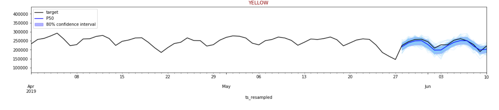
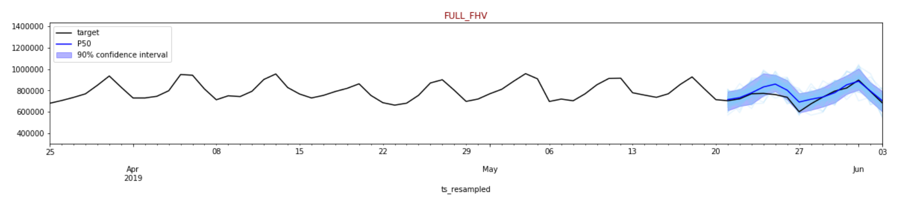
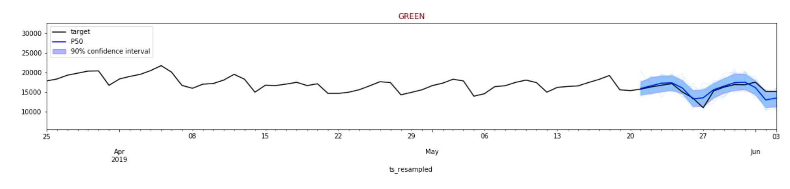

Examine notebook used to visualize results
------------------------------------------

First we will load the endpoint name, training time, prediction length
and seom of the data

.. code:: python3

    %store -r
    print('endpoint name ', endpoint_name)
    print('end training', end_training)
    print('prediction_length', prediction_length)

.. parsed-literal::

    endpoint name  DeepAR-forecast-taxidata-2019-11-30-16-26-45-053
    end training 2019-05-06 00:00:00
    prediction_length 14

Sample data being used:
~~~~~~~~~~~~~~~~~~~~~~~

.. code:: python3

    print('data sample')
    ABB.head(5)

.. parsed-literal::

    data sample

.. raw:: html

    

    
    <table border="1" class="dataframe">
      <thead>
        <tr style="text-align: right;">
          <th></th>
          <th>green</th>
          <th>yellow</th>
          <th>full_fhv</th>
        </tr>
        <tr>
          <th>ts_resampled</th>
          <th></th>
          <th></th>
          <th></th>
        </tr>
      </thead>
      <tbody>
        <tr>
          <th>2018-01-01</th>
          <td>23292</td>
          <td>237118</td>
          <td>702058.0</td>
        </tr>
        <tr>
          <th>2018-01-02</th>
          <td>23222</td>
          <td>238152</td>
          <td>547447.0</td>
        </tr>
        <tr>
          <th>2018-01-03</th>
          <td>26417</td>
          <td>266992</td>
          <td>583735.0</td>
        </tr>
        <tr>
          <th>2018-01-04</th>
          <td>6519</td>
          <td>122222</td>
          <td>354626.0</td>
        </tr>
        <tr>
          <th>2018-01-05</th>
          <td>27453</td>
          <td>265212</td>
          <td>699966.0</td>
        </tr>
      </tbody>
    </table>
    

This next cell creates the predictor using the endpoint_name. Ideally
we’d have the DeepARPredictor in a seperate .py rather than repeated in
the two notebooks.

.. code:: python3

    import sagemaker
    from sagemaker import get_execution_role
    from sagemaker.tuner import HyperparameterTuner
    import numpy as np
    import json
    import pandas as pd

    import warnings
    warnings.simplefilter(action='ignore', category=FutureWarning)

    class DeepARPredictor(sagemaker.predictor.RealTimePredictor):

        def __init__(self, *args, **kwargs):
            super().__init__(*args, content_type=sagemaker.content_types.CONTENT_TYPE_JSON, **kwargs)

        def predict(self, ts, cat=None, dynamic_feat=None,
                    num_samples=100, return_samples=False, quantiles=["0.1", "0.5", "0.9"]):
            """Requests the prediction of for the time series listed in `ts`, each with the (optional)
            corresponding category listed in `cat`.

            ts -- `pandas.Series` object, the time series to predict
            cat -- integer, the group associated to the time series (default: None)
            num_samples -- integer, number of samples to compute at prediction time (default: 100)
            return_samples -- boolean indicating whether to include samples in the response (default: False)
            quantiles -- list of strings specifying the quantiles to compute (default: ["0.1", "0.5", "0.9"])

            Return value: list of `pandas.DataFrame` objects, each containing the predictions
            """
            prediction_time = ts.index[-1] + 1
            quantiles = [str(q) for q in quantiles]
            req = self.__encode_request(ts, cat, dynamic_feat, num_samples, return_samples, quantiles)
            res = super(DeepARPredictor, self).predict(req)
            return self.__decode_response(res, ts.index.freq, prediction_time, return_samples)

        def __encode_request(self, ts, cat, dynamic_feat, num_samples, return_samples, quantiles):
            instance = series_to_dict(ts, cat if cat is not None else None, dynamic_feat if dynamic_feat else None)

            configuration = {
                "num_samples": num_samples,
                "output_types": ["quantiles", "samples"] if return_samples else ["quantiles"],
                "quantiles": quantiles
            }

            http_request_data = {
                "instances": [instance],
                "configuration": configuration
            }

            return json.dumps(http_request_data).encode('utf-8')

        def __decode_response(self, response, freq, prediction_time, return_samples):
            # we only sent one time series so we only receive one in return
            # however, if possible one will pass multiple time series as predictions will then be faster
            predictions = json.loads(response.decode('utf-8'))['predictions'][0]
            prediction_length = len(next(iter(predictions['quantiles'].values())))
            prediction_index = pd.DatetimeIndex(start=prediction_time, freq=freq, periods=prediction_length)
            if return_samples:
                dict_of_samples = {'sample_' + str(i): s for i, s in enumerate(predictions['samples'])}
            else:
                dict_of_samples = {}
            return pd.DataFrame(data={**predictions['quantiles'], **dict_of_samples}, index=prediction_index)

        def set_frequency(self, freq):
            self.freq = freq

    def encode_target(ts):
        return [x if np.isfinite(x) else "NaN" for x in ts]

    def series_to_dict(ts, cat=None, dynamic_feat=None):
        """Given a pandas.Series object, returns a dictionary encoding the time series.

        ts -- a pands.Series object with the target time series
        cat -- an integer indicating the time series category

        Return value: a dictionary
        """
        obj = {"start": str(ts.index[0]), "target": encode_target(ts)}
        if cat is not None:
            obj["cat"] = cat
        if dynamic_feat is not None:
            obj["dynamic_feat"] = dynamic_feat
        return obj

    predictor = DeepARPredictor(endpoint_name)

.. code:: python3

    import matplotlib
    import matplotlib.pyplot as plt

    def plot(
        predictor,
        target_ts,
        cat=None,
        dynamic_feat=None,
        forecast_date=end_training,
        show_samples=False,
        plot_history=7 * 12,
        confidence=80,
        num_samples=100,
        draw_color='blue'
    ):
        print("Calling endpoint to generate {} predictions starting from {} ...".format(target_ts.name, str(forecast_date)))
        assert(confidence > 50 and confidence < 100)
        low_quantile = 0.5 - confidence * 0.005
        up_quantile = confidence * 0.005 + 0.5

        # we first construct the argument to call our model
        args = {
            "ts": target_ts[:forecast_date],
            "return_samples": show_samples,
            "quantiles": [low_quantile, 0.5, up_quantile],
            "num_samples": num_samples
        }

        if dynamic_feat is not None:
            args["dynamic_feat"] = dynamic_feat
            fig = plt.figure(figsize=(20, 6))
            ax = plt.subplot(2, 1, 1)
        else:
            fig = plt.figure(figsize=(20, 3))
            ax = plt.subplot(1,1,1)

        if cat is not None:
            args["cat"] = cat
            ax.text(0.9, 0.9, 'cat = {}'.format(cat), transform=ax.transAxes)

        # call the end point to get the prediction
        prediction = predictor.predict(**args)

        # plot the samples
        mccolor = draw_color
        if show_samples:
            for key in prediction.keys():
                if "sample" in key:
                    prediction[key].asfreq('D').plot(color='lightskyblue', alpha=0.2, label='_nolegend_')

        # the date didn't have a frequency in it, so setting it here.
        new_date = pd.Timestamp(forecast_date, freq='d')
        target_section = target_ts[new_date-plot_history:new_date+prediction_length]
        target_section.asfreq('D').plot(color="black", label='target')
        plt.title(target_ts.name.upper(), color='darkred')

        # plot the confidence interval and the median predicted
        ax.fill_between(
            prediction[str(low_quantile)].index,
            prediction[str(low_quantile)].values,
            prediction[str(up_quantile)].values,
            color=mccolor, alpha=0.3, label='{}% confidence interval'.format(confidence)
        )
        prediction["0.5"].plot(color=mccolor, label='P50')
        ax.legend(loc=2)

        # fix the scale as the samples may change it
        ax.set_ylim(target_section.min() * 0.5, target_section.max() * 1.5)

        if dynamic_feat is not None:
            for i, f in enumerate(dynamic_feat, start=1):
                ax = plt.subplot(len(dynamic_feat) * 2, 1, len(dynamic_feat) + i, sharex=ax)
                feat_ts = pd.Series(
                    index=pd.DatetimeIndex(start=target_ts.index[0], freq=target_ts.index.freq, periods=len(f)),
                    data=f
                )
                feat_ts[forecast_date-plot_history:forecast_date+prediction_length].plot(ax=ax, color='g')

Let’s interact w/ the samples and forecast values now.
~~~~~~~~~~~~~~~~~~~~~~~~~~~~~~~~~~~~~~~~~~~~~~~~~~~~~~

.. code:: python3

    from __future__ import print_function
    from ipywidgets import interact, interactive, fixed, interact_manual
    import ipywidgets as widgets
    from ipywidgets import IntSlider, FloatSlider, Checkbox, RadioButtons
    import datetime

    style = {'description_width': 'initial'}

    @interact_manual(
        series_type=RadioButtons(options=['full_fhv', 'yellow', 'green'], value='yellow', description='Type'),
        forecast_day=IntSlider(min=0, max=100, value=21, style=style),
        confidence=IntSlider(min=60, max=95, value=80, step=5, style=style),
        history_weeks_plot=IntSlider(min=1, max=20, value=4, style=style),
        num_samples=IntSlider(min=100, max=1000, value=100, step=500, style=style),
        show_samples=Checkbox(value=True),
        continuous_update=False
    )

    def plot_interact(series_type, forecast_day, confidence, history_weeks_plot, show_samples, num_samples):
        plot(
            predictor,
            target_ts=ABB[series_type].asfreq(freq='d', fill_value=0),
            forecast_date=end_training + datetime.timedelta(days=forecast_day),
            show_samples=show_samples,
            plot_history=history_weeks_plot * prediction_length,
            confidence=confidence,
            num_samples=num_samples
        )

.. parsed-literal::

    interactive(children=(RadioButtons(description='Type', index=1, options=('full_fhv', 'yellow', 'green'), value…

Testing and Understanding the results
~~~~~~~~~~~~~~~~~~~~~~~~~~~~~~~~~~~~~

You can test the results and see different results. Here are some
examples below:

|sample_result1| |sample_result2| |sample_result3|

