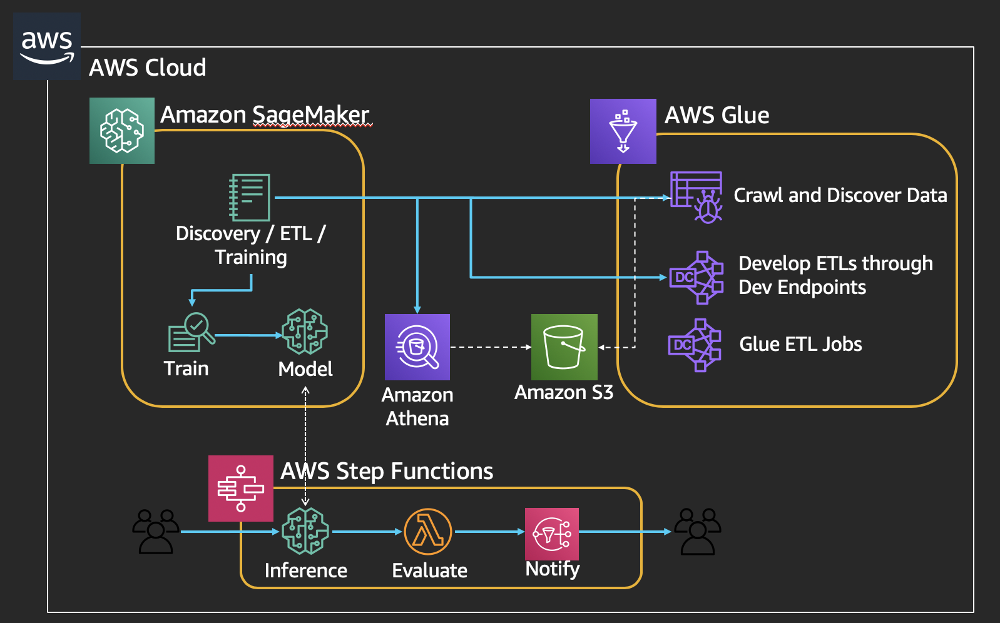

###############################################################
AIM357 - Build an ETL pipeline to analyze customer data
###############################################################

Machine learning involves more than just training models; you need to source and prepare data, engineer features, select algorithms, train and tune models, and then deploy those models and monitor their performance in production. Learn how to set up an ETL pipeline to analyze customer data using Amazon SageMaker, AWS Glue, and AWS Step Functions.

This workshop will be around the ETL and full pipeline to perofrm Time-series forecasting 
using NYC Taxi Dataset.  It includes the following steps:

- Crawl, Discover, and Explore the new datasets in a Data lake
- Perform Extract, Transform, Load (ETL) jobs to clean the data
- Train a Machine Learning model and run inference
- Assess the response
- Send an alert if value is outside specified range

The workshop uses the following architecture:

********
Overview
********

.. toctree::
    :maxdepth: 2

    overview

